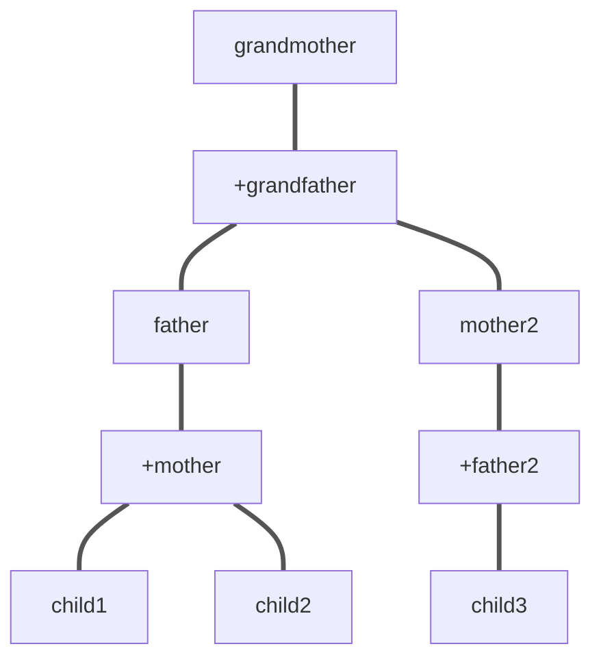
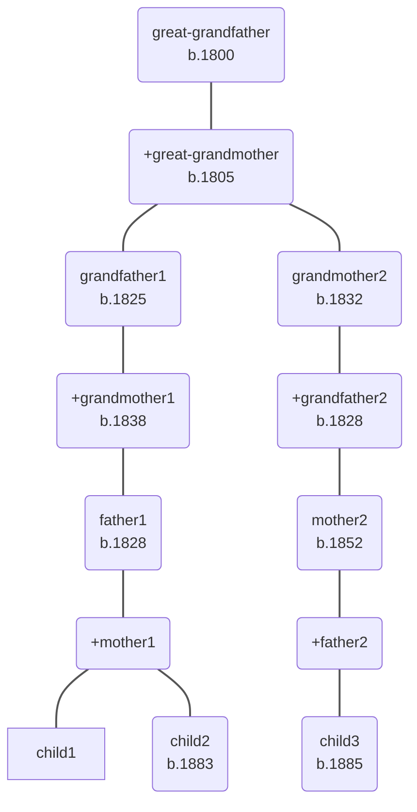

# Mermaid.js

## Description

Mermaid.js is the free, open-source diagramming library that powers text-to-diagram rendering. Mermaid is built on top of it, adding collaboration features, a visual editor, AI assistance, team workspaces, plugins, and enterprise support. It was founded by the creators behind Mermaid.js to bring professional tooling to the Mermaid ecosystem.

Mermaid.js does not natively support responsive family trees with horizontal relationships links as a dedicated diagram type, often resulting in cluttered vertical flowcharts. Users typically create family trees using graph TD (Top-Down) or graph LR (Left-Right) syntax, but this lacks specific pedigree features like connecting spouses horizontally.

## Links

- https://mermaid.ai/open-source/
- https://github.com/mermaid-js/mermaid
- https://github.com/mermaid-js/mermaid/issues/1747
- https://github.com/mermaid-js/mermaid/issues/1589
- Made by: https://mermaid.ai

## Why 

- Diagrams are text-based and live alongside your code, making them easy to version control and integrate into your development workflow.

- Teams can collaborate to maintain consistency across docs, and tool actions create the diagrams.

- Flowchart top to bottom syntax closest to family tree.

### Simple example

### Detailed example

### Syntax logic

- `+` prefix marks parent 2, the incoming parent who carries the subtree.
- Parent 1 connects to parent 2 with exactly one direct link.
- Parent 2 produces the next generation: children or further subtrees.
- Every child receives links from both parents.
- Node IDs are person IDs from branch JSON files, e.g. `1845_thomas_dickerson_smith_tds`.
- Nodes use plain parenthesis () with markdown label text displaying name and birthday on a new line using ` `.
- Edges use `===` and `linkStyle default stroke:#555`.

#### Example with real branch IDs

Using `smith.json` as an example:

| Person | ID | Role |
|--------|----|------|
| Thomas Dickerson Smith | `1845_thomas_dickerson_smith_tds` | parent 1 to Elizabeth Simmonds Soul |
| Elizabeth Simmonds Soul | `+1841_elizabeth_simmonds_soul_ess` | parent 2, carries subtree |
| Joseph Soul Smith | `1875_joseph_soul_smith_jss` | child of both parents |
| Leslie Joseph Soul Smith | `1905_leslie_joseph_soul_smith_ljss` | child, later parent 1 to Hilda Harmer |
| Hilda Elizabeth Harmer | `+1904_hilda_elizabeth_harmer_heh` | parent 2, carries subtree to Ethel |
| Ethel Margaret Smith | `1908_ethel_margaret_smith_ems` | child of both parents |
