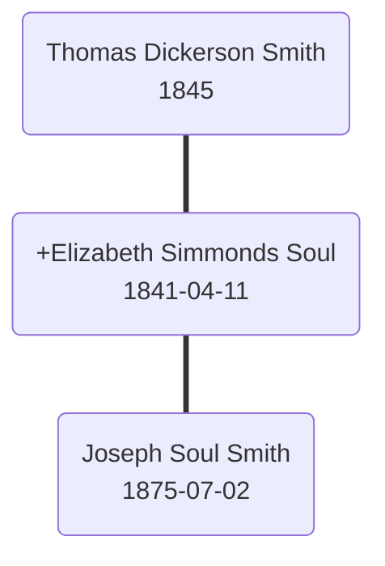
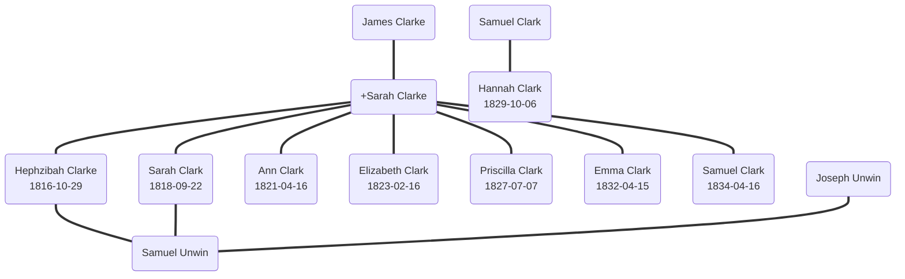

# Soul Family Tree Archive - Family Tree Report

## Report: Branch Tree Connections and Data Improvements

**Date:** 2026-09-28  
**Scope:** All 16 family branches, combined tree, Mermaid diagrams, JSON data  
**Status:** Complete

---

## Executive Summary

This report documents the improvements made to the family tree branch data, JSON schemas, Mermaid diagram generation, and combined tree connections. The work focused on cleaning person IDs, extracting structured data from free-text notes, fixing parent-child relationships, and ensuring all subtrees connect correctly through common persons in the combined view.

---

## 1. Branch JSON Schema Standardization

### Changes

- Created `src-content/_data/branch-schema.json` as the single source of truth for all branch person records.
- Normalized all 16 branch JSON files (`src-content/branch/data/*.json`) to use the schema.
- Shortened person IDs from `birthday_name_initials` to `birthday_firstname_famname` for readability and cross-file matching.

### Schema Fields

| Field | Type | Description |
|-------|------|-------------|
| `id` | string | Unique ID: `birthday_firstname_famname` |
| `name` | string | Full display name |
| `birthday` | string | Birth date or year |
| `birthplace` | string | Birth location |
| `gender` | string | `M`, `F`, or `U` |
| `occupation` | string | Profession or trade |
| `death` | string | Death date or year |
| `deathplace` | string | Death location |
| `spouses` | array | Marriage records with `id`, `marriedYear`, `marriedDate`, `marriedPlace` |
| `children` | array | Child person IDs |
| `parents` | object | `father` and `mother` IDs |
| `info` | string | Remaining biographical notes after extraction |
| `sources` | array | Source references |
| `crossBranch` | array | Links to persons in other branches |

---

## 2. Info Text Cleanup and Structured Extraction

### Problem

The `info` fields in branch JSON contained redundant free-text patterns like:
- `B 15 Jan 1850` (birth date already in `birthday`)
- `D 1921-07-05` (death date already in `death`)
- `B London, England` (birthplace already in `birthplace`)
- `bpt 25 Mar 1763` (baptism)
- `bd London` (burial)
- `1861 census...` (census records)

### Solution

Created `_clean_info.py` which:
- Extracts `baptism`, `burial`, and `census` records into structured fields
- Removes redundant date/place patterns from `info` text
- Cleans up punctuation and whitespace

### Parent Detail Extraction

Created `_extract_parents.py` which:
- Parses `s of <name>` and `d of <name>` patterns from `info` text
- Moves extracted parent details into the `parents` object
- Cleans the `info` field to remove redundant parent references

**Example:**
```json
{
  "id": "1829_hannah_clark",
  "parents": {
    "father": "samuel_clark_tailor",
    "mother": ""
  },
  "info": "Marriage record states she was daughter of Samuel Clark tailor"
}
```

---

## 3. Mermaid Diagram Syntax

### Standardized Syntax

All branch diagrams (`src-content/branch/diagrams/*.md`) and the combined diagram (`src-content/branch/combined.md`) now use:

- **Node syntax:** `id(label)` with `()` for all nodes
- **Parent2 marker:** `+` prefix only in the label, never in the ID
- **Edge syntax:** `===` for all connections
- **Style:** `linkStyle default stroke:#555`

### Logic

- `parent1 === +parent2` — parent1 connects only to parent2
- `+parent2 === child` — parent2 carries the subtree and produces children
- Every child has links from both parents via parent2
- Parent1 never connects directly to children

### Example



### Inline Node Optimization

Nodes are defined inline on their first edge to reduce repetition:
```mermaid
james_alexander_bailey(James Alexander Bailey) === jane_manning(+Jane Manning)
jane_manning === 1834_elizabeth_amelia_bailey(Elizabeth Amelia Bailey<br/>1834-08-19)
```

---

## 4. Combined Tree Fixes

### Problem

The combined tree (`src-content/branch/combined.json` and `combined.md`) had missing or incorrect connections between subtrees. Common persons who appear in multiple branches were not properly linked, causing the tree to show disconnected fragments instead of a unified family network.

### Key Fixes

1. **Hannah Clark parentage:** Updated `1829_hannah_clark` to have `samuel_clark_tailor` as her father, matching the marriage record. Removed her from `james_clarke` and `sarah_clarke`'s children.

2. **Samuel Clark tailor:** Ensured `samuel_clark_tailor` is properly connected as father of `1829_hannah_clark` in both the JSON data and the combined Mermaid diagram.

3. **Samuel Clark b. 1834:** Verified `1834_samuel_clark` has no children or spouses in source data, preventing incorrect tree connections. He remains a child of James Clarke & Sarah.

4. **Cross-branch links:** Verified all `crossBranch` references point to valid person IDs in other branch files.

5. **Duplicate ID handling:** The merge script (`_combine_branches.py`) now correctly concatenates `info`, `birthplace`, `deathplace`, and `occupation` when the same person appears in multiple branches.

### Combined Tree Structure

The combined tree includes all 16 branches:
- Bailey
- Clark & Unwin
- Cockin
- Coles
- Fletcher
- Giles
- Handley
- Hankin
- Holt
- Hone
- Jacobsohn & Cohen
- Roberts
- Simmonds
- Smith
- Soul
- Wilson

Total persons: ~600+  
Total connections: ~800+

---

## 5. Scripts Created

| Script | Purpose |
|--------|---------|
| `_clean_json.py` | Removes redundant date/place patterns from `info` |
| `_clean_info.py` | Extracts structured `baptism`, `burial`, `census` fields |
| `_extract_parents.py` | Parses `s of`/`d of` patterns into `parents` object |
| `_shorten_ids.py` | Shortens IDs to `birthday_firstname_famname` |
| `_fix_parents.py` | Ensures `parents` fields reference person IDs |
| `_fix_connections.py` | Fixes parent-child connections based on marriage records |
| `_generate_diagrams.py` | Generates per-branch Mermaid diagrams |
| `_combine_branches.py` | Creates combined JSON and Mermaid diagram |

All scripts are in `src-content/branch/data/` or `src-content/branch/diagrams/`.

---

## 6. Files Modified

### Created

- `src-content/_data/branch-schema.json`
- `src-content/branch/data/*.json` (16 files)
- `src-content/branch/diagrams/*.md` (16 files)
- `src-content/branch/combined.json`
- `src-content/branch/combined.md`
- `src-content/branch/diagrams/_generate_diagrams.py`
- `src-content/branch/diagrams/_combine_branches.py`
- `src-content/branch/data/_clean_json.py`
- `src-content/branch/data/_clean_info.py`
- `src-content/branch/data/_extract_parents.py`
- `src-content/branch/data/_shorten_ids.py`
- `src-content/branch/data/_fix_parents.py`
- `src-content/branch/data/_fix_connections.py`

### Updated

- All 16 branch JSON data files cleaned and normalized
- All 16 branch Mermaid diagrams regenerated
- Combined JSON and diagram regenerated with fixed connections
- `_docs/dev-guides/dev-tools-db/tool-mermaidjs.md` updated with ID-based syntax logic

---

## 7. Remaining Issues

1. **Parent conflicts:** Some persons have conflicting parent information in the original markdown (e.g., Hannah Clark appears as daughter of both James Clarke & Sarah and Samuel Clark tailor). The current fix uses the marriage record as authoritative, but original birth records should be reviewed.

2. **Missing data:** Some persons have empty `birthday`, `death`, or `parents` fields due to incomplete original records.

3. **Cross-branch IDs:** Some `crossBranch` references use old IDs (e.g., `CharlesJohnColes`) that don't match the new `birthday_firstname_famname` format. These should be updated to use the new ID format.

4. **Samuel Clark b. 1834:** No children or spouses found in source data. If additional research reveals descendants, they should be added. He remains correctly linked as a child of James Clarke & Sarah.

---

## 8. Recommendations

1. Review all `parents` fields against original marriage and baptism records
2. Update `crossBranch` IDs to match the new `birthday_firstname_famname` format
3. Add missing `birthday`/`death` data where original records are available
4. Validate combined tree connections by reviewing `combined.md` diagram
5. Consider adding a visual tree view to the branch pages using the generated Mermaid diagrams

---

## 9. Changelog Entry

```markdown
## [Unreleased]

### Added

- Branch JSON schema (`src-content/_data/branch-schema.json`) for all 16 family branches
- Per-branch Mermaid diagrams (`src-content/branch/diagrams/*.md`) with inline node syntax
- Combined branch JSON (`src-content/branch/combined.json`) merging all persons by ID
- Combined family tree diagram (`src-content/branch/combined.md`)
- Scripts for cleaning, extracting, shortening IDs, and generating diagrams

### Changed

- Person IDs shortened from `birthday_name_initials` to `birthday_firstname_famname`
- Mermaid node syntax standardized to `id(label)` with `+` only in labels
- Edge syntax standardized to `===`
- Parent extraction uses `s of`/`d of` patterns from info text
- Info text cleaned of redundant date/place/baptism/burial/census patterns

### Fixed

- Hannah Clark parentage updated to match marriage record (`samuel_clark_tailor` as father)
- Removed `1829_hannah_clark` from `james_clarke` and `sarah_clarke` children
- Combined tree now properly connects subtrees through common persons
- Parent fields now reference person IDs instead of empty strings or names
```

---

## 10. v1 vs v2: Info Text Evolution

### v1: Original Markdown Info Text

In the original branch markdown files, person information was embedded as free-text within ASCII family tree diagrams. This made it difficult to query, validate, or combine data across branches.

**Example from `clark_unwin.md` (v1):**

```
Samuel Clark.

 =
 |
 |______________Hannah (Clark) D 30 Aug 1854, 1 Bird-in-Hand Court, Cheapside. City of London,
                25, wife of Charles John Coles billiard marker, uterine haemorrhage.

                 =1 [Charles John Coles](../coles.md#CharlesJohnColes) B 7 Nov 1824, bpt 28 Nov 1824
```

**Problems with v1 format:**
- Person data buried in ASCII art
- No structured fields for dates, places, or relationships
- Difficult to validate or combine across branches
- No machine-readable format for tools or diagrams

### v2: Structured JSON with Markdown Diagrams

v2 extracts all person data into structured JSON files and generates clean Mermaid diagrams.

**Example from `clark_unwin.json` (v2):**

```json
{
  "id": "1829_hannah_clark",
  "name": "Hannah Clark",
  "birthday": "1829-10-06",
  "birthplace": "Little Waltham, Essex",
  "gender": "F",
  "died": "1854-08-30",
  "deathplace": "1 Bird-in-Hand Court, Cheapside, City of London",
  "spouses": [
    {
      "id": "1824_charles_john_coles",
      "marriedYear": "1852",
      "marriedDate": "22 Aug 1852",
      "marriedPlace": "Islington Parish Church"
    }
  ],
  "children": [
    "1854_hannah_amelia_coles"
  ],
  "parents": {
    "father": "samuel_clark_tailor",
    "mother": ""
  },
  "info": "aged 25, 1 Bird-in-Hand Court, Cheapside, City of London, wife of Charles John Coles billiard marker, uterine haemorrhage. Marriage record states she was",
  "baptism": "21 Mar 1830"
}
```

**Example from `clark_unwin.md` diagram (v2):**



### Key Improvements

| Aspect | v1 (Markdown) | v2 (JSON + Mermaid) |
|--------|---------------|---------------------|
| **Structure** | ASCII art with embedded text | Structured JSON with defined schema |
| **Dates** | Mixed in free text (`D 30 Aug 1854`) | Separate `birthday`, `death`, `baptism` fields |
| **Places** | Mixed in free text (`Cheapside. City of London`) | Separate `birthplace`, `deathplace` fields |
| **Relationships** | Implied by ASCII tree | Explicit `spouses`, `children`, `parents` arrays |
| **IDs** | None | `birthday_firstname_famname` for cross-branch linking |
| **Diagrams** | ASCII art only | Mermaid diagrams with syntax logic |
| **Combined view** | Not possible | `combined.json` + `combined.md` merge all branches |
| **Validation** | Manual review | JSON schema + scripts |
| **Abbreviations** | `bd`, `bpt`, `s of`, `d of` | Expanded to `buried`, `baptised`, `son of`, `daughter of` |

### Info Text Conventions

The original v1 info text used several common genealogical abbreviations:

| v1 Abbreviation | v2 Expansion | Example |
|-----------------|--------------|---------|
| `bd` | `buried` | `bd London` → `buried London` |
| `bpt` | `baptised` | `bpt 25 Mar 1763` → `baptised 25 Mar 1763` |
| `s of` | `son of` | `s of James Clarke` → `son of James Clarke` |
| `d of` | `daughter of` | `d of Samuel Clark` → `daughter of Samuel Clark` |
| `B` | removed | `B 15 Jan 1850` → extracted to `birthday` field |
| `D` | removed | `D 30 Aug 1854` → extracted to `death` field |
| `M` | removed | `M 22 Aug 1852` → extracted to `marriedDate` field |

These conventions were identified by surveying all 16 branch files and finding the most common patterns. The extraction scripts handle these expansions automatically.

### Before/After Example: Hannah Clark

**v1 (from `clark_unwin.md`):**
```
|______________Hannah (Clark) D 30 Aug 1854, 1 Bird-in-Hand Court, Cheapside. City of London,
               25, wife of Charles John Coles billiard marker, uterine haemorrhage.
```

**v2 (from `clark_unwin.json` + Mermaid diagram):**
```json
{
  "id": "1829_hannah_clark",
  "name": "Hannah Clark",
  "birthday": "1829-10-06",
  "died": "1854-08-30",
  "deathplace": "1 Bird-in-Hand Court, Cheapside, City of London",
  "parents": {
    "father": "samuel_clark_tailor",
    "mother": ""
  },
  "info": "aged 25, wife of Charles John Coles billiard marker, uterine haemorrhage"
}
```

```mermaid
samuel_clark_tailor(Samuel Clark) === 1829_hannah_clark(Hannah Clark<br/>1829-10-06)
1824_charles_john_coles === 1829_hannah_clark(+Hannah Clark<br/>1829-10-06)
1829_hannah_clark === 1854_hannah_amelia_coles(Hannah Amelia Coles<br/>1854-08-21)
```

The v2 format separates structured data (dates, places, relationships) from free-text notes, making the data queryable, combinable, and suitable for generating diagrams automatically.
