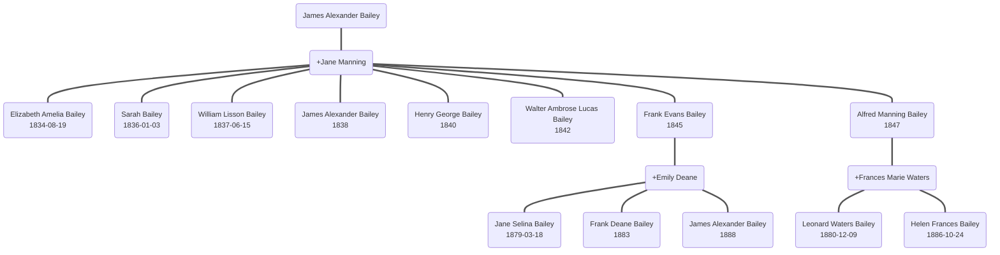

# Bailey Family Tree - Simplified Diagram

```mermaid
flowchart TD
    james_bailey(James Alexander Bailey) === jane_manning(+Jane Manning)
    jane_manning === 1834_elizabeth_bailey(Elizabeth Amelia Bailey<br/>1834-08-19)
    jane_manning === 1836_sarah_bailey(Sarah Bailey<br/>1836-01-03)
    jane_manning === 1837_william_bailey(William Lisson Bailey<br/>1837-06-15)
    jane_manning === 1838_james_bailey(James Alexander Bailey<br/>1838)
    jane_manning === 1840_henry_bailey(Henry George Bailey<br/>1840)
    jane_manning === 1842_walter_bailey(Walter Ambrose Lucas Bailey<br/>1842)
    jane_manning === 1845_frank_bailey(Frank Evans Bailey<br/>1845)
    jane_manning === 1847_alfred_bailey(Alfred Manning Bailey<br/>1847)
    1845_frank_bailey === emily_deane(+Emily Deane)
    emily_deane === 1879_jane_bailey(Jane Selina Bailey<br/>1879-03-18)
    emily_deane === 1883_frank_bailey(Frank Deane Bailey<br/>1883)
    emily_deane === 1888_james_bailey(James Alexander Bailey<br/>1888)
    1847_alfred_bailey === frances_waters(+Frances Marie Waters)
    frances_waters === 1880_leonard_bailey(Leonard Waters Bailey<br/>1880-12-09)
    frances_waters === 1886_helen_bailey(Helen Frances Bailey<br/>1886-10-24)

    linkStyle default stroke:#555
```
