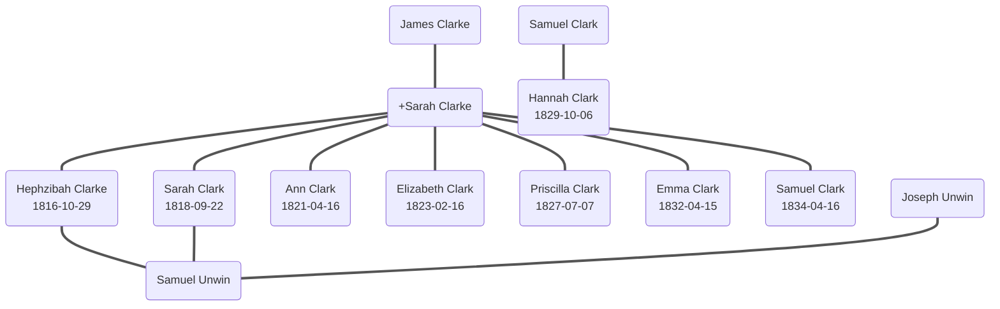

# Clark Unwin Family Tree - Simplified Diagram

```mermaid
flowchart TD
    james_clarke(James Clarke) === sarah_clarke(+Sarah Clarke)
    sarah_clarke === 1816_hephzibah_clarke(Hephzibah Clarke<br/>1816-10-29)
    sarah_clarke === 1818_sarah_clark(Sarah Clark<br/>1818-09-22)
    sarah_clarke === 1821_ann_clark(Ann Clark<br/>1821-04-16)
    sarah_clarke === 1823_elizabeth_clark(Elizabeth Clark<br/>1823-02-16)
    sarah_clarke === 1827_priscilla_clark(Priscilla Clark<br/>1827-07-07)
    sarah_clarke === 1832_emma_clark(Emma Clark<br/>1832-04-15)
    sarah_clarke === 1834_samuel_clark(Samuel Clark<br/>1834-04-16)
    1816_hephzibah_clarke === samuel_unwin(+Samuel Unwin)
    1818_sarah_clark === samuel_unwin(+Samuel Unwin)
    samuel_clark_tailor(Samuel Clark) === 1829_hannah_clark(Hannah Clark<br/>1829-10-06)
    joseph_unwin(Joseph Unwin) === samuel_unwin(Samuel Unwin)

    linkStyle default stroke:#555
```
