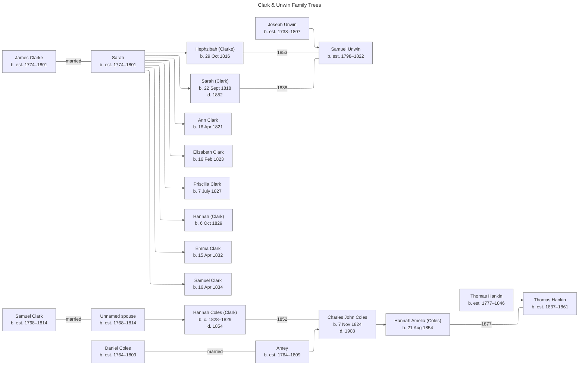

# Clark Unwin Family Tree

```mermaid
---
title: Clark & Unwin Family Trees
config:
  flowchart:
    defaultRenderer: elk
---
flowchart LR
    %% Source: James Clarke = Sarah. Marriage documented; date unknown.
    %% James also appears as Clark; retain the heading's Clarke spelling.
    %% Parent estimates use provisional ages 15–60.
    %% Both parents: intersect [C-60,C-15] for all eight children.
    %% Latest child 1834 minus 60 = 1774;
    %% earliest child 1816 minus 15 = 1801.
    1774-1801_james_clarke["James Clarke<br/>b. est. 1774–1801"]:::person
    1774-1801_sarah_unknown["Sarah<br/>b. est. 1774–1801"]:::person

    1816_hephzibah__clarke["Hephzibah (Clarke)<br/>b. 29 Oct 1816"]:::person
    1818_sarah__clark["Sarah (Clark)<br/>b. 22 Sept 1818<br/>d. 1852"]:::person
    1821_ann_clark["Ann Clark<br/>b. 16 Apr 1821"]:::person
    1823_elizabeth_clark["Elizabeth Clark<br/>b. 16 Feb 1823"]:::person
    1827_priscilla_clark["Priscilla Clark<br/>b. 7 July 1827"]:::person
    1829_hannah__clark["Hannah (Clark)<br/>b. 6 Oct 1829"]:::person
    1832_emma_clark["Emma Clark<br/>b. 15 Apr 1832"]:::person
    1834_samuel_clark["Samuel Clark<br/>b. 16 Apr 1834"]:::person

    %% Samuel's earliest documented marriage: 1838 q1.
    %% Marriage-age assumption 16–40: [1838-40,1838-16] = 1798–1822.
    %% Documented widower in 1853: he may be older than this assumed range.
    1798-1822_samuel_unwin["Samuel Unwin<br/>b. est. 1798–1822"]:::person
    %% Joseph: [1798-60,1822-15] = 1738–1807.
    %% Depends on Samuel's marriage-based estimate; no circular feedback.
    1738-1807_joseph_unwin["Joseph Unwin<br/>b. est. 1738–1807"]:::person

    1774-1801_james_clarke ---|married| 1774-1801_sarah_unknown
    1774-1801_sarah_unknown --> 1816_hephzibah__clarke
    1774-1801_sarah_unknown --> 1818_sarah__clark
    1774-1801_sarah_unknown --> 1821_ann_clark
    1774-1801_sarah_unknown --> 1823_elizabeth_clark
    1774-1801_sarah_unknown --> 1827_priscilla_clark
    1774-1801_sarah_unknown --> 1829_hannah__clark
    1774-1801_sarah_unknown --> 1832_emma_clark
    1774-1801_sarah_unknown --> 1834_samuel_clark

    %% Source marks Sarah's union with Samuel =1; marriage 1838 q1.
    1818_sarah__clark ---|1838| 1798-1822_samuel_unwin
    %% Source marks Hephzibah's union with Samuel =2; marriage 21 Mar 1853.
    %% Hephzibah a spinster; Samuel a widower.
    1816_hephzibah__clarke ---|1853| 1798-1822_samuel_unwin
    1738-1807_joseph_unwin --> 1798-1822_samuel_unwin

    %% Separate source heading: Samuel Clark = an unnamed spouse.
    %% Do not merge this Samuel with Samuel born in 1834.
    %% Hannah died 30 Aug 1854 aged 25: birth interval 1828–1829.
    %% Each parent's estimate: [1828-60,1829-15] = 1768–1814.
    %% These depend on Hannah's age evidence.
    1768-1814_samuel_clark["Samuel Clark<br/>b. est. 1768–1814"]:::person
    1768-1814_unnamed_unknown["Unnamed spouse<br/>b. est. 1768–1814"]:::person
    1828-1829_hannah__clark["Hannah Coles (Clark)<br/>b. c. 1828–1829<br/>d. 1854"]:::person

    %% Charles's explicit birth takes priority over census ages.
    %% Recorded ages 36 in 1861 and 66 in 1891 are compatible.
    1824_charles_coles["Charles John Coles<br/>b. 7 Nov 1824<br/>d. 1908"]:::person
    %% Both parents: [1824-60,1824-15] = 1764–1809.
    1764-1809_daniel_coles["Daniel Coles<br/>b. est. 1764–1809"]:::person
    1764-1809_amey_unknown["Amey<br/>b. est. 1764–1809"]:::person
    1854_hannah__coles["Hannah Amelia (Coles)<br/>b. 21 Aug 1854"]:::person

    %% Thomas's earliest documented marriage: 14 Mar 1877.
    %% Marriage-age assumption 16–40: [1877-40,1877-16] = 1837–1861.
    1837-1861_thomas_hankin["Thomas Hankin<br/>b. est. 1837–1861"]:::person
    %% Father: [1837-60,1861-15] = 1777–1846.
    %% Depends on son's marriage-based estimate; no circular feedback.
    %% Father deceased by 14 Mar 1877; death year unknown.
    1777-1846_thomas_hankin["Thomas Hankin<br/>b. est. 1777–1846"]:::person

    %% Equals sign documents marriage; unnamed spouse is second-listed.
    1768-1814_samuel_clark ---|married| 1768-1814_unnamed_unknown
    1768-1814_unnamed_unknown --> 1828-1829_hannah__clark

    %% Hannah's union with Charles =1; marriage 22 Aug 1852.
    %% Heading order: Hannah first, Charles second.
    1828-1829_hannah__clark ---|1852| 1824_charles_coles
    1824_charles_coles --> 1854_hannah__coles

    %% Source identifies Charles as son of Daniel Coles and Amey.
    %% Marriage connector follows the user's interpretation of that wording;
    %% the source supplies no marriage date or surname for Amey.
    %% Daniel is first-listed; Amey second-listed.
    1764-1809_daniel_coles ---|married| 1764-1809_amey_unknown
    1764-1809_amey_unknown --> 1824_charles_coles

    %% Hannah Amelia Coles and Thomas Hankin: marriage 14 Mar 1877.
    1854_hannah__coles ---|1877| 1837-1861_thomas_hankin
    1777-1846_thomas_hankin --> 1837-1861_thomas_hankin

    classDef person stroke:#666666;
    linkStyle default stroke:#555
```
