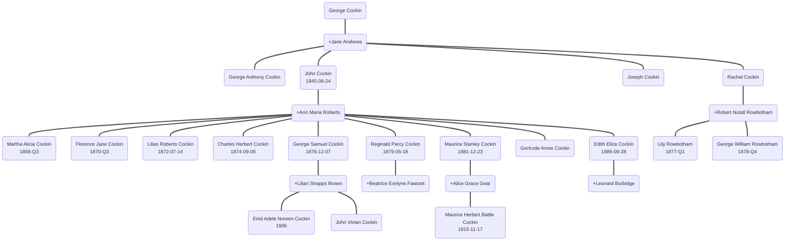

# Cockin Family Tree - Simplified Diagram

```mermaid
flowchart TD
    george_cockin(George Cockin) === jane_andrews(+Jane Andrews)
    jane_andrews === george_anthony_cockin(George Anthony Cockin)
    jane_andrews === 1845_john_cockin(John Cockin<br/>1845-08-24)
    jane_andrews === joseph_cockin(Joseph Cockin)
    jane_andrews === rachel_cockin(Rachel Cockin)
    1845_john_cockin === 1842_ann_maria_roberts(+Ann Maria Roberts)
    1842_ann_maria_roberts === 1868_martha_alicia_cockin(Martha Alicia Cockin<br/>1868-Q3)
    1842_ann_maria_roberts === 1870_florence_jane_cockin(Florence Jane Cockin<br/>1870-Q3)
    1842_ann_maria_roberts === 1872_lilias_roberts_cockin(Lilias Roberts Cockin<br/>1872-07-14)
    1842_ann_maria_roberts === 1874_charles_herbert_cockin(Charles Herbert Cockin<br/>1874-09-06)
    1842_ann_maria_roberts === 1876_george_samuel_cockin(George Samuel Cockin<br/>1876-12-07)
    1842_ann_maria_roberts === 1879_reginald_percy_cockin(Reginald Percy Cockin<br/>1879-05-18)
    1842_ann_maria_roberts === 1881_maurice_stanley_cockin(Maurice Stanley Cockin<br/>1881-12-23)
    1842_ann_maria_roberts === 1885_gertrude_annie_cockin(Gertrude Annie Cockin)
    1842_ann_maria_roberts === 1886_edith_eliza_cockin(Edith Eliza Cockin<br/>1886-09-28)
    1876_george_samuel_cockin === lilian_strapps_brown(+Lilian Strapps Brown)
    lilian_strapps_brown === 1906_enid_adele_noreen_cockin(Enid Adele Noreen Cockin<br/>1906)
    lilian_strapps_brown === john_vivian_cockin(John Vivian Cockin)
    1879_reginald_percy_cockin === beatrice_evelyne_fawcett(+Beatrice Evelyne Fawcett)
    1881_maurice_stanley_cockin === alice_grace_gear(+Alice Grace Gear)
    alice_grace_gear === 1915_maurice_herbert_battle_cockin(Maurice Herbert Battle Cockin<br/>1915-11-17)
    1886_edith_eliza_cockin === leonard_burbidge(+Leonard Burbidge)
    rachel_cockin === robert_nutall_rowbotham(+Robert Nutall Rowbotham)
    robert_nutall_rowbotham === 1877_lily_rowbotham(Lily Rowbotham<br/>1877-Q1)
    robert_nutall_rowbotham === 1878_george_william_rowbotham(George William Rowbotham<br/>1878-Q4)

    linkStyle default stroke:#555
```
