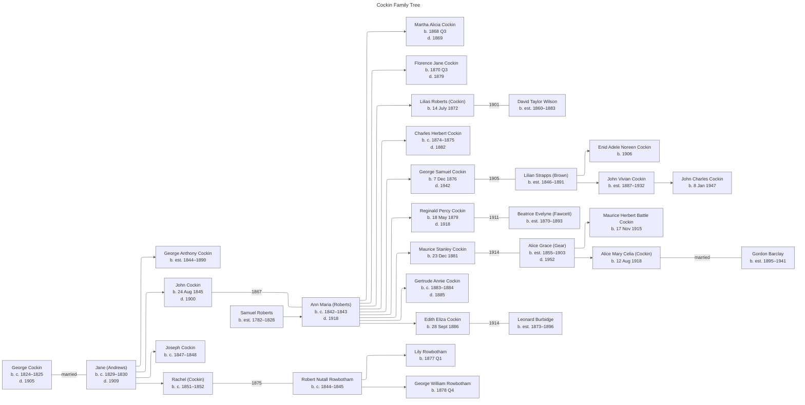

# Cockin Family Tree

```mermaid
---
title: Cockin Family Tree
config:
  flowchart:
    defaultRenderer: elk
---
flowchart LR
    %% Source: supplied cockin.md, interpreted with its headings and ASCII branches.
    %% c. indicates an age-derived range; est. indicates provisional modelling.
    %% Modelled intervals are not historical facts or guaranteed bounds.
    %% Explicit birth dates and registration quarters override age estimates.

    %% George: 1881 age 56 => [1881-56-1,1881-56] = [1824,1825].
    1824-1825_george_cockin["George Cockin<br/>b. c. 1824–1825<br/>d. 1905"]:::person
    %% Jane: 1881 age 51 => [1829,1830]. Widowhood documented in George's probate.
    1829-1830_jane__andrews["Jane (Andrews)<br/>b. c. 1829–1830<br/>d. 1909"]:::person

    %% George Anthony: no individual birth or age evidence.
    %% Retained reverse parenthood model using Jane's full birth interval:
    %% [1829+15,1830+60] = [1844,1890], assuming parental ages 15–60.
    %% This is not inferred from sibling order or the date of George's will.
    1844-1890_george_cockin["George Anthony Cockin<br/>b. est. 1844–1890"]:::person
    1845_john_cockin["John Cockin<br/>b. 24 Aug 1845<br/>d. 1900"]:::person

    %% Ann Maria: age 24 in 1867, 28 in 1871, and 38 in 1881
    %% each support [1842,1843]. Widowhood documented in John's probate.
    1842-1843_ann__roberts["Ann Maria (Roberts)<br/>b. c. 1842–1843<br/>d. 1918"]:::person
    %% Samuel: Ann Maria [1842,1843], provisional parental ages 15–60.
    %% [1842-60,1843-15] = [1782,1828].
    %% Marriage witnesses with the same name are not added as separate relatives.
    1782-1828_samuel_roberts["Samuel Roberts<br/>b. est. 1782–1828"]:::person

    1868_martha_cockin["Martha Alicia Cockin<br/>b. 1868 Q3<br/>d. 1869"]:::person
    %% Florence's explicit registration quarter overrides age-derived alternatives.
    1870_florence_cockin["Florence Jane Cockin<br/>b. 1870 Q3<br/>d. 1879"]:::person
    1872_lilias__cockin["Lilias Roberts (Cockin)<br/>b. 14 July 1872"]:::person

    %% David: marriage 12 Feb 1901; provisional completed marriage ages 18–40.
    %% Birth-year envelope [1901-41,1901-18] = [1860,1883].
    %% The extra year allows for a birthday after the marriage date.
    1860-1883_david_wilson["David Taylor Wilson<br/>b. est. 1860–1883"]:::person

    %% Charles: 1881 age 6 => [1874,1875]. Baptised 6 Sept 1874.
    %% The 1875 alternative conflicts with birth before that baptism.
    %% Preserve the full age-derived interval and flag the conflict, not narrow it away.
    1874-1875_charles_cockin["Charles Herbert Cockin<br/>b. c. 1874–1875<br/>d. 1882"]:::person
    1876_george_cockin["George Samuel Cockin<br/>b. 7 Dec 1876<br/>d. 1942"]:::person

    %% Lilian: Enid's explicit birth [1906,1906], provisional parental ages 15–60.
    %% [1906-60,1906-15] = [1846,1891].
    %% Do not recursively propagate John Vivian's modelled birth interval.
    1846-1891_lilian__brown["Lilian Strapps (Brown)<br/>b. est. 1846–1891"]:::person
    %% Source repeats Cockin; removed once as explicitly corrected by the user.
    %% Enid's death is recorded without a year, so no death year is displayed.
    1906_enid_cockin["Enid Adele Noreen Cockin<br/>b. 1906"]:::person

    %% John Vivian: John Charles [1947,1947], provisional parental ages 15–60.
    %% [1947-60,1947-15] = [1887,1932]. His unnamed spouse is not invented.
    1887-1932_john_cockin["John Vivian Cockin<br/>b. est. 1887–1932"]:::person
    1947_john_cockin["John Charles Cockin<br/>b. 8 Jan 1947"]:::person
    1879_reginald_cockin["Reginald Percy Cockin<br/>b. 18 May 1879<br/>d. 1918"]:::person

    %% Beatrice: marriage 30 May 1911; provisional completed marriage ages 18–40.
    %% [1911-41,1911-18] = [1870,1893].
    1870-1893_beatrice__fawcett["Beatrice Evelyne (Fawcett)<br/>b. est. 1870–1893"]:::person
    1881_maurice_cockin["Maurice Stanley Cockin<br/>b. 23 Dec 1881"]:::person

    %% Alice Grace: provisional parental ages 15–60.
    %% Maurice's 1915 birth gives [1915-60,1915-15] = [1855,1900].
    %% Alice Mary Celia's 1918 birth gives [1858,1903].
    %% Preserve the wider envelope [1855,1903], not the intersection.
    1855-1903_alice__gear["Alice Grace (Gear)<br/>b. est. 1855–1903<br/>d. 1952"]:::person
    1915_maurice_cockin["Maurice Herbert Battle Cockin<br/>b. 17 Nov 1915"]:::person
    1918_alice__cockin["Alice Mary Celia (Cockin)<br/>b. 12 Aug 1918"]:::person

    %% Gordon: user-requested spouse model, assuming BOTH spouses had
    %% completed ages 18–40 at their undated marriage.
    %% Their exact age difference can approach 23 years.
    %% Alice's 1918 birth gives [1918-23,1918+23] = [1895,1941].
    %% No actual marriage year or birth evidence is supplied for Gordon.
    1895-1941_gordon_barclay["Gordon Barclay<br/>b. est. 1895–1941"]:::person

    %% Gertrude: death in 1885 aged 1 => [1883,1884].
    1883-1884_gertrude_cockin["Gertrude Annie Cockin<br/>b. c. 1883–1884<br/>d. 1885"]:::person
    1886_edith_cockin["Edith Eliza Cockin<br/>b. 28 Sept 1886"]:::person

    %% Leonard: marriage 24 Feb 1914; provisional completed marriage ages 18–40.
    %% [1914-41,1914-18] = [1873,1896].
    1873-1896_leonard_burbidge["Leonard Burbidge<br/>b. est. 1873–1896"]:::person

    %% Joseph: 1881 age 33 => [1847,1848].
    1847-1848_joseph_cockin["Joseph Cockin<br/>b. c. 1847–1848"]:::person
    %% Rachel: 1881 age 29 => [1851,1852].
    1851-1852_rachel__cockin["Rachel (Cockin)<br/>b. c. 1851–1852"]:::person
    %% Robert: 1881 age 36 => [1844,1845].
    1844-1845_robert_rowbotham["Robert Nutall Rowbotham<br/>b. c. 1844–1845"]:::person
    1877_lily_rowbotham["Lily Rowbotham<br/>b. 1877 Q1"]:::person
    1878_george_rowbotham["George William Rowbotham<br/>b. 1878 Q4"]:::person

    %% Jane's age-derived interval permits an age below 15 at John's birth.
    %% Preserve the explicit birth, age evidence, and documented relationship;
    %% a modelling assumption must not override them.
    %% George and Jane: marriage documented by source structure; year unknown.
    1824-1825_george_cockin ---|married| 1829-1830_jane__andrews
    1829-1830_jane__andrews --> 1844-1890_george_cockin
    1829-1830_jane__andrews --> 1845_john_cockin
    1829-1830_jane__andrews --> 1847-1848_joseph_cockin
    1829-1830_jane__andrews --> 1851-1852_rachel__cockin

    %% Ann Maria's only named parent.
    1782-1828_samuel_roberts --> 1842-1843_ann__roberts

    %% John and Ann Maria: marriage 23 Apr 1867; source parent order retained.
    1845_john_cockin ---|1867| 1842-1843_ann__roberts
    1842-1843_ann__roberts --> 1868_martha_cockin
    1842-1843_ann__roberts --> 1870_florence_cockin
    1842-1843_ann__roberts --> 1872_lilias__cockin
    1842-1843_ann__roberts --> 1874-1875_charles_cockin
    1842-1843_ann__roberts --> 1876_george_cockin
    1842-1843_ann__roberts --> 1879_reginald_cockin
    1842-1843_ann__roberts --> 1881_maurice_cockin
    1842-1843_ann__roberts --> 1883-1884_gertrude_cockin
    1842-1843_ann__roberts --> 1886_edith_cockin

    %% Lilias and David: marriage 12 Feb 1901.
    1872_lilias__cockin ---|1901| 1860-1883_david_wilson

    %% George Samuel and Lilian: marriage 4 Jan 1905.
    1876_george_cockin ---|1905| 1846-1891_lilian__brown
    1846-1891_lilian__brown --> 1906_enid_cockin
    1846-1891_lilian__brown --> 1887-1932_john_cockin
    1887-1932_john_cockin --> 1947_john_cockin

    %% Reginald and Beatrice: marriage 30 May 1911.
    1879_reginald_cockin ---|1911| 1870-1893_beatrice__fawcett

    %% Maurice Stanley and Alice Grace: marriage 12 Oct 1914.
    1881_maurice_cockin ---|1914| 1855-1903_alice__gear
    1855-1903_alice__gear --> 1915_maurice_cockin
    1855-1903_alice__gear --> 1918_alice__cockin

    %% The right-hand source branch pairs Alice Mary Celia with Gordon,
    %% separately from the left-hand Edith and Leonard branch.
    1918_alice__cockin ---|married| 1895-1941_gordon_barclay

    %% Edith and Leonard: marriage 24 Feb 1914.
    1886_edith_cockin ---|1914| 1873-1896_leonard_burbidge

    %% Rachel and Robert: marriage 1875 Q4; Robert is parent2.
    1851-1852_rachel__cockin ---|1875| 1844-1845_robert_rowbotham
    1844-1845_robert_rowbotham --> 1877_lily_rowbotham
    1844-1845_robert_rowbotham --> 1878_george_rowbotham

    classDef person stroke:#666666;
    linkStyle default stroke:#555
```
