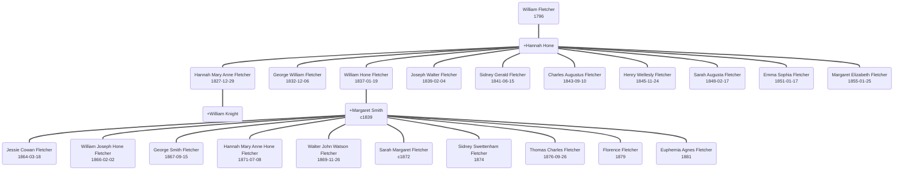

# Fletcher Family Tree - Simplified Diagram

```mermaid
flowchart TD
    1796_william_fletcher(William Fletcher<br/>1796) === 1800_hannah_hone(+Hannah Hone)
    1800_hannah_hone === 1827_hannah_mary_anne_fletcher(Hannah Mary Anne Fletcher<br/>1827-12-29)
    1800_hannah_hone === 1832_george_william_fletcher(George William Fletcher<br/>1832-12-06)
    1800_hannah_hone === 1837_william_hone_fletcher(William Hone Fletcher<br/>1837-01-19)
    1800_hannah_hone === 1839_joseph_walter_fletcher(Joseph Walter Fletcher<br/>1839-02-04)
    1800_hannah_hone === 1841_sidney_gerald_fletcher(Sidney Gerald Fletcher<br/>1841-06-15)
    1800_hannah_hone === 1843_charles_augustus_fletcher(Charles Augustus Fletcher<br/>1843-09-10)
    1800_hannah_hone === 1845_henry_wellesly_fletcher(Henry Wellesly Fletcher<br/>1845-11-24)
    1800_hannah_hone === 1848_sarah_augusta_fletcher(Sarah Augusta Fletcher<br/>1848-02-17)
    1800_hannah_hone === 1851_emma_sophia_fletcher(Emma Sophia Fletcher<br/>1851-01-17)
    1800_hannah_hone === 1855_margaret_elizabeth_fletcher(Margaret Elizabeth Fletcher<br/>1855-01-25)
    1827_hannah_mary_anne_fletcher === william_knight(+William Knight)
    1837_william_hone_fletcher === margaret_smith(+Margaret Smith<br/>c1839)
    margaret_smith === 1864_jessie_cowan_fletcher(Jessie Cowan Fletcher<br/>1864-03-18)
    margaret_smith === 1866_william_joseph_hone_fletcher(William Joseph Hone Fletcher<br/>1866-02-02)
    margaret_smith === 1867_george_smith_fletcher(George Smith Fletcher<br/>1867-09-15)
    margaret_smith === 1871_hannah_mary_anne_hone_fletcher(Hannah Mary Anne Hone Fletcher<br/>1871-07-08)
    margaret_smith === 1869_walter_john_watson_fletcher(Walter John Watson Fletcher<br/>1869-11-26)
    margaret_smith === 1872_sarah_margaret_fletcher(Sarah Margaret Fletcher<br/>c1872)
    margaret_smith === 1874_sidney_swettenham_fletcher(Sidney Swettenham Fletcher<br/>1874)
    margaret_smith === 1876_thomas_charles_fletcher(Thomas Charles Fletcher<br/>1876-09-26)
    margaret_smith === 1879_florence_fletcher(Florence Fletcher<br/>1879)
    margaret_smith === 1881_euphemia_agnes_fletcher(Euphemia Agnes Fletcher<br/>1881)

    linkStyle default stroke:#555
```
