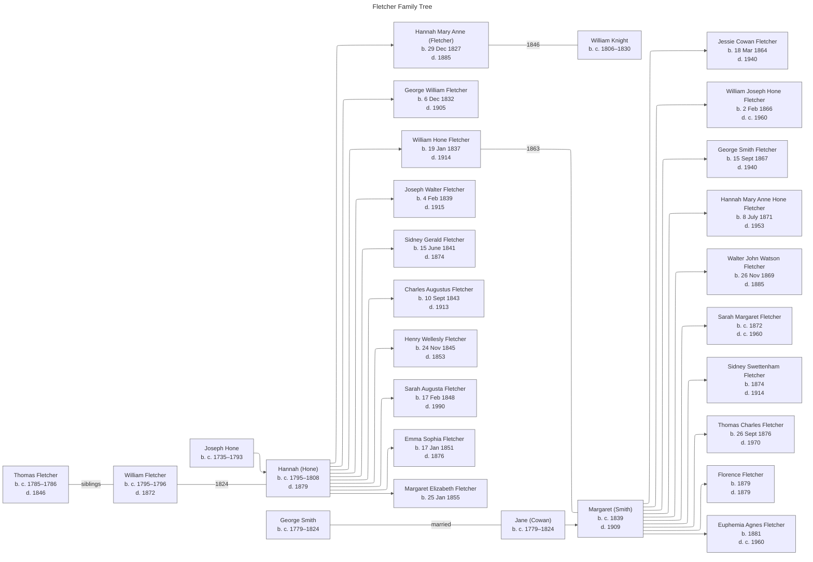

# Fletcher Family Tree

```mermaid

---
title: Fletcher Family Tree
config:
  flowchart:
    defaultRenderer: elk
---
flowchart LR
    %% Completed age 60 in 1846: [1846-60-1,1846-60] = [1785,1786].
    1785-1786_thomas_fletcher["Thomas Fletcher<br/>b. c. 1785–1786<br/>d. 1846"]:::person

    %% Completed age 76 in 1872: [1872-76-1,1872-76] = [1795,1796].
    1795-1796_william_fletcher["William Fletcher<br/>b. c. 1795–1796<br/>d. 1872"]:::person

    %% Hannah has no explicit birth or usable age evidence.
    %% Provisional parental ages 15-60 give these child-based intervals:
    %% 1827: [1767,1812]; 1832: [1772,1817]; 1837: [1777,1822];
    %% 1839: [1779,1824]; 1841: [1781,1826]; 1843: [1783,1828];
    %% 1845: [1785,1830]; 1848: [1788,1833]; 1851: [1791,1836];
    %% 1855: [1795,1840]. Their intersection is [1795,1812].
    %% Marriage fallback, assuming ages 16-40 in 1824: [1784,1808].
    %% Combined fallback intersection: [1795,1808].
    %% These assumptions are not historical facts or guaranteed bounds.
    1795-1808_hannah__hone["Hannah (Hone)<br/>b. c. 1795–1808<br/>d. 1879"]:::person

    %% Joseph has no birth or usable age evidence.
    %% From Hannah's entire estimated interval, assuming parental ages 15-60:
    %% [1795-60,1808-15] = [1735,1793].
    %% Depends on Hannah's provisional estimate; do not propagate back into Hannah.
    1735-1793_joseph_hone["Joseph Hone<br/>b. c. 1735–1793"]:::person

    1827_hannah__fletcher["Hannah Mary Anne (Fletcher)<br/>b. 29 Dec 1827<br/>d. 1885"]:::person

    %% William Knight: marriage fallback, assuming ages 16-40 in 1846.
    %% [1846-40,1846-16] = [1806,1830]; not documented birth bounds.
    1806-1830_william_knight["William Knight<br/>b. c. 1806–1830"]:::person

    1832_george_fletcher["George William Fletcher<br/>b. 6 Dec 1832<br/>d. 1905"]:::person
    1837_william_fletcher["William Hone Fletcher<br/>b. 19 Jan 1837<br/>d. 1914"]:::person

    %% Source gives Margaret's birth as c. 1839 and baptism on 17 Mar 1838.
    %% Baptism implies birth by that date but provides no finite earliest year.
    %% Preserve the explicit approximate birth; the discrepancy remains unresolved.
    %% Do not invent a closed interval or treat baptism as an exact birth date.
    1839_margaret__smith["Margaret (Smith)<br/>b. c. 1839<br/>d. 1909"]:::person

    %% George and Jane lack explicit birth and usable age evidence.
    %% Conditional on Margaret's supplied c. 1839 birth, parental ages 15-60 give
    %% [1839-60,1839-15] = [1779,1824] for each parent.
    %% These provisional estimates inherit her approximation and unresolved
    %% baptism discrepancy; they are not bounds covering an unknown earlier birth.
    %% No marriage year is supplied. Do not feed these estimates back into Margaret.
    1779-1824_george_smith["George Smith<br/>b. c. 1779–1824"]:::person
    1779-1824_jane__cowan["Jane (Cowan)<br/>b. c. 1779–1824"]:::person

    1839_joseph_fletcher["Joseph Walter Fletcher<br/>b. 4 Feb 1839<br/>d. 1915"]:::person
    1841_sidney_fletcher["Sidney Gerald Fletcher<br/>b. 15 June 1841<br/>d. 1874"]:::person
    1843_charles_fletcher["Charles Augustus Fletcher<br/>b. 10 Sept 1843<br/>d. 1913"]:::person

    %% Source omits B before 24 Nov 1845. Retain the existing birth interpretation
    %% from its position in the entry, while flagging the missing marker.
    1845_henry_fletcher["Henry Wellesly Fletcher<br/>b. 24 Nov 1845<br/>d. 1853"]:::person

    %% Source records death on 9 Jan 1990; retain without correction.
    1848_sarah_fletcher["Sarah Augusta Fletcher<br/>b. 17 Feb 1848<br/>d. 1990"]:::person
    1851_emma_fletcher["Emma Sophia Fletcher<br/>b. 17 Jan 1851<br/>d. 1876"]:::person
    1855_margaret_fletcher["Margaret Elizabeth Fletcher<br/>b. 25 Jan 1855"]:::person

    1864_jessie_fletcher["Jessie Cowan Fletcher<br/>b. 18 Mar 1864<br/>d. 1940"]:::person
    1866_william_fletcher["William Joseph Hone Fletcher<br/>b. 2 Feb 1866<br/>d. c. 1960"]:::person
    1867_george_fletcher["George Smith Fletcher<br/>b. 15 Sept 1867<br/>d. 1940"]:::person
    1871_hannah_fletcher["Hannah Mary Anne Hone Fletcher<br/>b. 8 July 1871<br/>d. 1953"]:::person
    1869_walter_fletcher["Walter John Watson Fletcher<br/>b. 26 Nov 1869<br/>d. 1885"]:::person
    1872_sarah_fletcher["Sarah Margaret Fletcher<br/>b. c. 1872<br/>d. c. 1960"]:::person
    1874_sidney_fletcher["Sidney Swettenham Fletcher<br/>b. 1874<br/>d. 1914"]:::person
    1876_thomas_fletcher["Thomas Charles Fletcher<br/>b. 26 Sept 1876<br/>d. 1970"]:::person
    1879_florence_fletcher["Florence Fletcher<br/>b. 1879<br/>d. 1879"]:::person
    1881_euphemia_fletcher["Euphemia Agnes Fletcher<br/>b. 1881<br/>d. c. 1960"]:::person

    %% User confirms Thomas and William as root siblings.
    %% No shared parent or artificial junction is invented.
    1785-1786_thomas_fletcher ---|siblings| 1795-1796_william_fletcher

    %% Marriage: William Fletcher and Hannah Hone, 28 Dec 1824.
    %% Source order: parent1 William, parent2 Hannah.
    1795-1796_william_fletcher ---|1824| 1795-1808_hannah__hone
    1735-1793_joseph_hone --> 1795-1808_hannah__hone

    1795-1808_hannah__hone --> 1827_hannah__fletcher
    1795-1808_hannah__hone --> 1832_george_fletcher
    1795-1808_hannah__hone --> 1837_william_fletcher
    1795-1808_hannah__hone --> 1839_joseph_fletcher
    1795-1808_hannah__hone --> 1841_sidney_fletcher
    1795-1808_hannah__hone --> 1843_charles_fletcher
    1795-1808_hannah__hone --> 1845_henry_fletcher
    1795-1808_hannah__hone --> 1848_sarah_fletcher
    1795-1808_hannah__hone --> 1851_emma_fletcher
    1795-1808_hannah__hone --> 1855_margaret_fletcher

    %% Marriage: Hannah Mary Anne Fletcher and William Knight, 13 June 1846.
    1827_hannah__fletcher ---|1846| 1806-1830_william_knight

    %% George Smith and Jane Cowan: marriage confirmed by user; date unknown.
    %% Source order: parent1 George, parent2 Jane.
    1779-1824_george_smith ---|married| 1779-1824_jane__cowan
    1779-1824_jane__cowan --> 1839_margaret__smith

    %% Marriage: William Hone Fletcher and Margaret Smith, 1 June 1863.
    %% Source order: parent1 William, parent2 Margaret.
    %% Both parents are supported regardless of displayed arrows.
    %% All children have explicit birth evidence; do not alter it using assumptions.
    %% Source listing order does not itself establish birth order.
    1837_william_fletcher ---|1863| 1839_margaret__smith
    1839_margaret__smith --> 1864_jessie_fletcher
    1839_margaret__smith --> 1866_william_fletcher
    1839_margaret__smith --> 1867_george_fletcher
    1839_margaret__smith --> 1871_hannah_fletcher
    1839_margaret__smith --> 1869_walter_fletcher
    1839_margaret__smith --> 1872_sarah_fletcher
    1839_margaret__smith --> 1874_sidney_fletcher
    1839_margaret__smith --> 1876_thomas_fletcher
    1839_margaret__smith --> 1879_florence_fletcher
    1839_margaret__smith --> 1881_euphemia_fletcher

    classDef person stroke:#666666;
    linkStyle default stroke:#555
```
