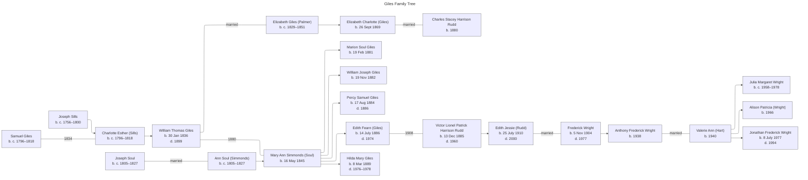

# Giles Family Tree

```mermaid

---
title: Giles Family Tree
config:
  flowchart:
    defaultRenderer: elk
---
flowchart LR
    1796-1818_samuel_giles["Samuel Giles<br/>b. c. 1796–1818"]:::person
    1796-1818_charlotte__sills["Charlotte Esther (Sills)<br/>b. c. 1796–1818"]:::person
    1756-1800_joseph_sills["Joseph Sills<br/>b. c. 1756–1800"]:::person
    1836_william_giles["William Thomas Giles<br/>b. 30 Jan 1836<br/>d. 1899"]:::person
    1829-1851_elizabeth__palmer["Elizabeth Giles (Palmer)<br/>b. c. 1829–1851"]:::person
    1869_elizabeth__giles["Elizabeth Charlotte (Giles)<br/>b. 26 Sept 1869"]:::person
    1880_charles_rudd["Charles Stacey Harrison Rudd<br/>b. 1880"]:::person
    1845_mary__soul["Mary Ann Simmonds (Soul)<br/>b. 16 May 1845"]:::person
    1805-1827_joseph_soul["Joseph Soul<br/>b. c. 1805–1827"]:::person
    1805-1827_ann__simmonds["Ann Soul (Simmonds)<br/>b. c. 1805–1827"]:::person
    1881_marion_giles["Marion Soul Giles<br/>b. 19 Feb 1881"]:::person
    1882_william_giles["William Joseph Giles<br/>b. 19 Nov 1882"]:::person
    1884_percy_giles["Percy Samuel Giles<br/>b. 17 Aug 1884<br/>d. 1886"]:::person
    1886_edith__giles["Edith Fearn (Giles)<br/>b. 14 July 1886<br/>d. 1974"]:::person
    1885_victor_rudd["Victor Lionel Patrick Harrison Rudd<br/>b. 13 Dec 1885<br/>d. 1960"]:::person
    1910_edith__rudd["Edith Jessie (Rudd)<br/>b. 25 July 1910<br/>d. 2000"]:::person
    1904_frederick_wright["Frederick Wright<br/>b. 5 Nov 1904<br/>d. 1977"]:::person
    1938_anthony_wright["Anthony Frederick Wright<br/>b. 1938"]:::person
    1940_valerie__hart["Valerie Ann (Hart)<br/>b. 1940"]:::person
    1958-1978_julia_wright["Julia Margaret Wright<br/>b. c. 1958–1978"]:::person
    1966_alison__wright["Alison Patricia (Wright)<br/>b. 1966"]:::person
    1977_jonathan_wright["Jonathan Frederick Wright<br/>b. 8 July 1977<br/>d. 1994"]:::person
    1889_hilda_giles["Hilda Mary Giles<br/>b. 8 Mar 1889<br/>d. 1976–1978"]:::person

    %% Marriage: 10 Feb 1834; Samuel first-listed, Charlotte second-listed.
    1796-1818_samuel_giles ---|1834| 1796-1818_charlotte__sills
    1756-1800_joseph_sills --> 1796-1818_charlotte__sills
    1796-1818_charlotte__sills --> 1836_william_giles

    %% William's marriage 1: Elizabeth Palmer; date not given.
    1836_william_giles ---|married| 1829-1851_elizabeth__palmer
    1829-1851_elizabeth__palmer --> 1869_elizabeth__giles
    1869_elizabeth__giles ---|married| 1880_charles_rudd

    %% William's marriage 2: Mary Ann Simmonds Soul; 6 May 1880.
    1836_william_giles ---|1880| 1845_mary__soul
    1805-1827_joseph_soul ---|married| 1805-1827_ann__simmonds
    1805-1827_ann__simmonds --> 1845_mary__soul
    1845_mary__soul --> 1881_marion_giles
    1845_mary__soul --> 1882_william_giles
    1845_mary__soul --> 1884_percy_giles
    1845_mary__soul --> 1886_edith__giles
    1845_mary__soul --> 1889_hilda_giles

    %% Marriage: Islington, 1908; Edith first-listed, Victor second-listed.
    1886_edith__giles ---|1908| 1885_victor_rudd
    1885_victor_rudd --> 1910_edith__rudd

    1910_edith__rudd ---|married| 1904_frederick_wright
    1904_frederick_wright --> 1938_anthony_wright

    1938_anthony_wright ---|married| 1940_valerie__hart
    1940_valerie__hart --> 1958-1978_julia_wright
    1940_valerie__hart --> 1966_alison__wright
    1940_valerie__hart --> 1977_jonathan_wright

    %% Fallback estimates only: no documented birth dates are changed.
    %% Samuel and Charlotte: marriage gives 1794–1818;
    %% William's birth gives 1796–1818; intersection is 1796–1818.
    %% Joseph Sills: Charlotte's estimated interval gives 1756–1800.
    %% Elizabeth Palmer: child's 1869 birth gives 1829–1851.
    %% Joseph Soul and Ann Simmonds: Mary's 1845 birth gives 1805–1827.
    %% Julia: intersect Anthony's 1956–1978 with Valerie's 1958–1980.
    %% Parenthood after 40 does not invalidate documented births.

    classDef person stroke:#666666;
    linkStyle default stroke:#555
```
