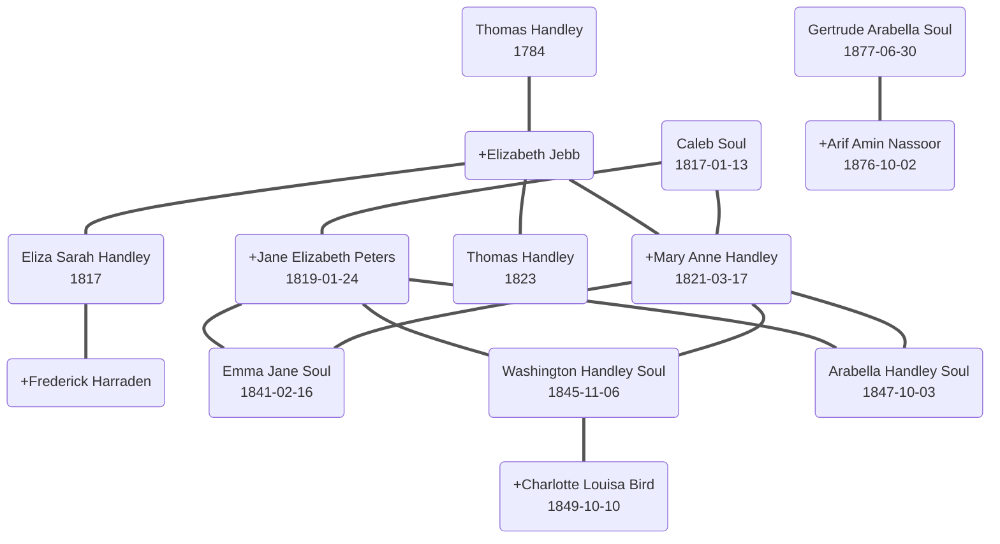

# Handley Family Tree - Simplified Diagram

```mermaid
flowchart TD
    1784_thomas_handley(Thomas Handley<br/>1784) === elizabeth_jebb(+Elizabeth Jebb)
    elizabeth_jebb === 1817_eliza_sarah_handley(Eliza Sarah Handley<br/>1817)
    elizabeth_jebb === 1821_mary_anne_handley(Mary Anne Handley<br/>1821-03-17)
    elizabeth_jebb === 1823_thomas_handley(Thomas Handley<br/>1823)
    1817_eliza_sarah_handley === frederick_harraden(+Frederick Harraden)
    1787_caleb_soul(Caleb Soul<br/>1817-01-13) === jane_elizabeth_peters(+Jane Elizabeth Peters<br/>1819-01-24)
    jane_elizabeth_peters === 1841_emma_jane_soul(Emma Jane Soul<br/>1841-02-16)
    jane_elizabeth_peters === 1845_washington_handley_soul(Washington Handley Soul<br/>1845-11-06)
    jane_elizabeth_peters === 1847_arabella_handley_soul(Arabella Handley Soul<br/>1847-10-03)
    1787_caleb_soul === 1821_mary_anne_handley(+Mary Anne Handley<br/>1821-03-17)
    1821_mary_anne_handley === 1841_emma_jane_soul
    1821_mary_anne_handley === 1845_washington_handley_soul
    1821_mary_anne_handley === 1847_arabella_handley_soul
    1845_washington_handley_soul === charlotte_louisa_bird(+Charlotte Louisa Bird<br/>1849-10-10)
    1877_gertrude_arabella_soul(Gertrude Arabella Soul<br/>1877-06-30) === arif_amin_nassoor(+Arif Amin Nassoor<br/>1876-10-02)

    linkStyle default stroke:#555
```
