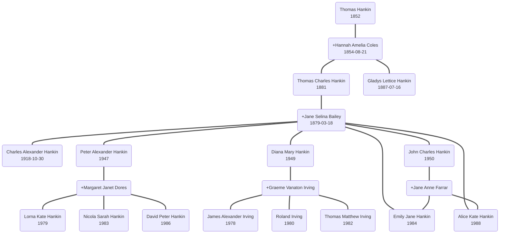

# Hankin Family Tree - Simplified Diagram

```mermaid
flowchart TD
    1852_thomas_hankin_jr(Thomas Hankin<br/>1852) === 1854_hannah_amelia_coles(+Hannah Amelia Coles<br/>1854-08-21)
    1854_hannah_amelia_coles === 1881_thomas_charles_hankin(Thomas Charles Hankin<br/>1881)
    1854_hannah_amelia_coles === 1887_gladys_lettice_hankin(Gladys Lettice Hankin<br/>1887-07-16)
    1881_thomas_charles_hankin === 1879_jane_selina_bailey(+Jane Selina Bailey<br/>1879-03-18)
    1879_jane_selina_bailey === 1918_charles_alexander_hankin(Charles Alexander Hankin<br/>1918-10-30)
    1879_jane_selina_bailey === 1947_peter_alexander_hankin(Peter Alexander Hankin<br/>1947)
    1879_jane_selina_bailey === 1949_diana_mary_hankin(Diana Mary Hankin<br/>1949)
    1879_jane_selina_bailey === 1950_john_charles_hankin(John Charles Hankin<br/>1950)
    1879_jane_selina_bailey === 1984_emily_jane_hankin(Emily Jane Hankin<br/>1984)
    1879_jane_selina_bailey === 1988_alice_kate_hankin(Alice Kate Hankin<br/>1988)
    1947_peter_alexander_hankin === margaret_janet_dores(+Margaret Janet Dores)
    margaret_janet_dores === 1979_lorna_kate_hankin(Lorna Kate Hankin<br/>1979)
    margaret_janet_dores === 1983_nicola_sarah_hankin(Nicola Sarah Hankin<br/>1983)
    margaret_janet_dores === 1986_david_peter_hankin(David Peter Hankin<br/>1986)
    1949_diana_mary_hankin === graeme_vanaton_irving(+Graeme Vanaton Irving)
    graeme_vanaton_irving === 1978_james_alexander_irving(James Alexander Irving<br/>1978)
    graeme_vanaton_irving === 1980_roland_irving(Roland Irving<br/>1980)
    graeme_vanaton_irving === 1982_thomas_matthew_irving(Thomas Matthew Irving<br/>1982)
    1950_john_charles_hankin === jane_anne_farrar(+Jane Anne Farrar)
    jane_anne_farrar === 1984_emily_jane_hankin
    jane_anne_farrar === 1988_alice_kate_hankin

    linkStyle default stroke:#555
```
