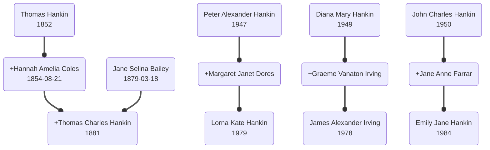

# Hankin Family Tree

```mermaid
flowchart TD
    1852_thomas_hankin(Thomas Hankin<br/>1852) ==o 1854_hannah_coles(+Hannah Amelia Coles<br/>1854-08-21)
    1854_hannah_coles ==o 1881_thomas_hankin(Thomas Charles Hankin<br/>1881)
    1879_jane_bailey(Jane Selina Bailey<br/>1879-03-18) ==o 1881_thomas_hankin(+Thomas Charles Hankin<br/>1881)
    1947_peter_hankin(Peter Alexander Hankin<br/>1947) ==o xxxx_margaret_dores(+Margaret Janet Dores)
    xxxx_margaret_dores ==o 1979_lorna_hankin(Lorna Kate Hankin<br/>1979)
    1949_diana_hankin(Diana Mary Hankin<br/>1949) ==o xxxx_graeme_irving(+Graeme Vanaton Irving)
    xxxx_graeme_irving ==o 1978_james_irving(James Alexander Irving<br/>1978)
    1950_john_hankin(John Charles Hankin<br/>1950) ==o xxxx_jane_farrar(+Jane Anne Farrar)
    xxxx_jane_farrar ==o 1984_emily_hankin(Emily Jane Hankin<br/>1984)

    linkStyle default stroke:#555
```
