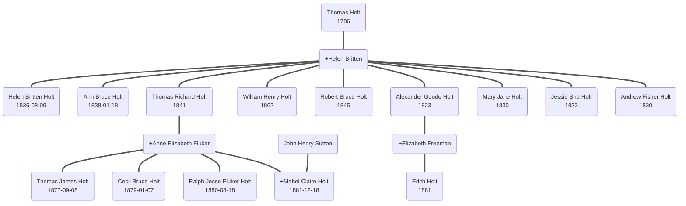

# Holt Family Tree - Simplified Diagram

```mermaid
flowchart TD
    1786_thomas_holt(Thomas Holt<br/>1786) === helen_britten(+Helen Britten)
    helen_britten === 1836_helen_britten_holt(Helen Britten Holt<br/>1836-08-09)
    helen_britten === 1838_ann_bruce_holt(Ann Bruce Holt<br/>1838-01-18)
    helen_britten === 1841_thomas_richard_holt(Thomas Richard Holt<br/>1841)
    helen_britten === 1862_william_henry_holt(William Henry Holt<br/>1862)
    helen_britten === 1845_robert_bruce_holt(Robert Bruce Holt<br/>1845)
    helen_britten === 1823_alexander_goode_holt(Alexander Goode Holt<br/>1823)
    helen_britten === 1830_mary_jane_holt(Mary Jane Holt<br/>1830)
    helen_britten === 1833_jessie_bird_holt(Jessie Bird Holt<br/>1833)
    helen_britten === 1830_andrew_fisher_holt(Andrew Fisher Holt<br/>1830)
    1841_thomas_richard_holt === anne_elizabeth_fluker(+Anne Elizabeth Fluker)
    anne_elizabeth_fluker === 1877_thomas_james_holt(Thomas James Holt<br/>1877-09-08)
    anne_elizabeth_fluker === 1879_cecil_bruce_holt(Cecil Bruce Holt<br/>1879-01-07)
    anne_elizabeth_fluker === 1880_ralph_jesse_fluker_holt(Ralph Jesse Fluker Holt<br/>1880-08-18)
    anne_elizabeth_fluker === 1881_mabel_claire_holt(Mabel Claire Holt<br/>1881-12-18)
    john_henry_sutton(John Henry Sutton) === 1881_mabel_claire_holt(+Mabel Claire Holt<br/>1881-12-18)
    1823_alexander_goode_holt === elizabeth_freeman(+Elizabeth Freeman)
    elizabeth_freeman === 1881_edith_holt(Edith Holt<br/>1881)

    linkStyle default stroke:#555
```
