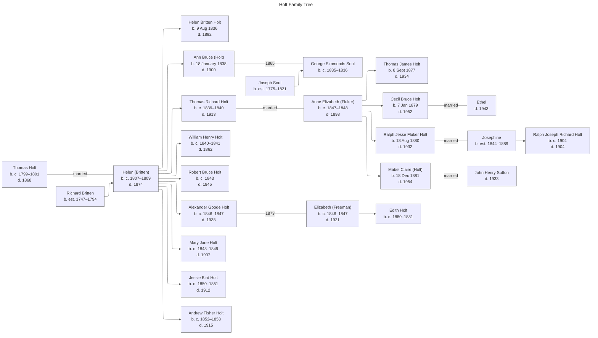

# Holt Family Tree

```mermaid

---
title: Holt Family Tree
config:
  flowchart:
    defaultRenderer: elk
---
flowchart LR
    1799-1801_thomas_holt["Thomas Holt<br/>b. c. 1799–1801<br/>d. 1868"]:::person
    1807-1809_helen__britten["Helen (Britten)<br/>b. c. 1807–1809<br/>d. 1874"]:::person
    1747-1794_richard_britten["Richard Britten<br/>b. est. 1747–1794"]:::person

    %% Thomas and Helen's children: sorted by earliest, then latest birth year.
    1836_helen_holt["Helen Britten Holt<br/>b. 9 Aug 1836<br/>d. 1892"]:::person
    1838_ann__holt["Ann Bruce (Holt)<br/>b. 18 January 1838<br/>d. 1900"]:::person
    1839-1840_thomas_holt["Thomas Richard Holt<br/>b. c. 1839–1840<br/>d. 1913"]:::person
    1840-1841_william_holt["William Henry Holt<br/>b. c. 1840–1841<br/>d. 1862"]:::person
    1843_robert_holt["Robert Bruce Holt<br/>b. c. 1843<br/>d. 1845"]:::person
    1846-1847_alexander_holt["Alexander Goode Holt<br/>b. c. 1846–1847<br/>d. 1938"]:::person
    1848-1849_mary_holt["Mary Jane Holt<br/>b. c. 1848–1849<br/>d. 1907"]:::person
    1850-1851_jessie_holt["Jessie Bird Holt<br/>b. c. 1850–1851<br/>d. 1912"]:::person
    1852-1853_andrew_holt["Andrew Fisher Holt<br/>b. c. 1852–1853<br/>d. 1915"]:::person

    1835-1836_george_soul["George Simmonds Soul<br/>b. c. 1835–1836"]:::person
    1775-1821_joseph_soul["Joseph Soul<br/>b. est. 1775–1821"]:::person
    1847-1848_anne__fluker["Anne Elizabeth (Fluker)<br/>b. c. 1847–1848<br/>d. 1898"]:::person

    %% Thomas Richard and Anne Elizabeth's children: birth-year order.
    1877_thomas_holt["Thomas James Holt<br/>b. 8 Sept 1877<br/>d. 1934"]:::person
    1879_cecil_holt["Cecil Bruce Holt<br/>b. 7 Jan 1879<br/>d. 1952"]:::person
    1880_ralph_holt["Ralph Jesse Fluker Holt<br/>b. 18 Aug 1880<br/>d. 1932"]:::person
    1881_mabel__holt["Mabel Claire (Holt)<br/>b. 18 Dec 1881<br/>d. 1954"]:::person

    xxx_ethel_unknown["Ethel<br/>d. 1943"]:::person
    1844-1889_josephine_unknown["Josephine<br/>b. est. 1844–1889"]:::person
    1904_ralph_holt["Ralph Joseph Richard Holt<br/>b. c. 1904<br/>d. 1904"]:::person
    xxx_john_sutton["John Henry Sutton<br/>d. 1933"]:::person
    1846-1847_elizabeth__freeman["Elizabeth (Freeman)<br/>b. c. 1846–1847<br/>d. 1921"]:::person
    1880-1881_edith_holt["Edith Holt<br/>b. c. 1880–1881"]:::person

    %% Known single parents; no other parent is identified in this source.
    1747-1794_richard_britten --> 1807-1809_helen__britten
    1775-1821_joseph_soul --> 1835-1836_george_soul

    %% Source '=' documents marriage; date unknown.
    %% Thomas first-listed; Helen second-listed.
    %% Helen is explicitly a widow in the 1871 census.
    1799-1801_thomas_holt ---|married| 1807-1809_helen__britten
    1807-1809_helen__britten --> 1836_helen_holt
    1807-1809_helen__britten --> 1838_ann__holt
    1807-1809_helen__britten --> 1839-1840_thomas_holt
    1807-1809_helen__britten --> 1840-1841_william_holt
    1807-1809_helen__britten --> 1843_robert_holt
    1807-1809_helen__britten --> 1846-1847_alexander_holt
    1807-1809_helen__britten --> 1848-1849_mary_holt
    1807-1809_helen__britten --> 1850-1851_jessie_holt
    1807-1809_helen__britten --> 1852-1853_andrew_holt

    %% Marriage: 9 Nov 1865; Ann first-listed, George second-listed.
    %% Ann is recorded as a spinster and George as a bachelor.
    1838_ann__holt ---|1865| 1835-1836_george_soul

    %% Source '=' documents marriage; date unknown.
    %% Thomas Richard first-listed; Anne Elizabeth second-listed.
    1839-1840_thomas_holt ---|married| 1847-1848_anne__fluker
    1847-1848_anne__fluker --> 1877_thomas_holt
    1847-1848_anne__fluker --> 1879_cecil_holt
    1847-1848_anne__fluker --> 1880_ralph_holt
    1847-1848_anne__fluker --> 1881_mabel__holt

    %% Source '=' documents marriage; date unknown.
    1879_cecil_holt ---|married| xxx_ethel_unknown

    %% Source '=' documents marriage; date unknown.
    %% Ralph Jesse Fluker first-listed; Josephine second-listed.
    1880_ralph_holt ---|married| 1844-1889_josephine_unknown
    1844-1889_josephine_unknown --> 1904_ralph_holt

    %% Source '=' documents marriage; date unknown.
    1881_mabel__holt ---|married| xxx_john_sutton

    %% Marriage registration: 1873 Q2, Islington.
    %% Alexander first-listed; Elizabeth second-listed.
    1846-1847_alexander_holt ---|1873| 1846-1847_elizabeth__freeman
    1846-1847_elizabeth__freeman --> 1880-1881_edith_holt

    %% AGE-DERIVED BIRTHS: completed age A in year Y -> Y-A-1 to Y-A.
    %% Thomas: 60 in 1861 -> 1800–1801; 68 in 1868 -> 1799–1800.
    %% Retain covering interval 1799–1801, not intersection 1800.
    %% Helen: 62 in 1871 -> 1808–1809; 66 in 1874 -> 1807–1808.
    %% Retain covering interval 1807–1809, not intersection 1808.
    %% These differing age-derived ranges overlap; disagreement is not conclusive.
    %% George: 29 at marriage in 1865 -> 1835–1836.
    %% Thomas Richard: 21 in 1861 and 73 in 1913 -> 1839–1840.
    %% Anne Elizabeth: 50 at death in 1898 -> 1847–1848.
    %% William: 21 at death in 1862 -> 1840–1841.
    %% Robert: 18 months at death on 14 Feb 1845 -> birth within 1843.
    %% Alexander: 24 in 1871, 34 in 1881, 54 in 1901, 91 in 1938
    %% each support 1846–1847.
    %% Elizabeth: 34 in 1881 and 54 in 1901 -> 1846–1847.
    %% Edith: 11 months in 1881, without a supplied census day -> 1880–1881;
    %% age 20 in 1901 also supports 1880–1881.
    %% Mary: 58 at death in 1907 -> 1848–1849.
    %% Jessie: 20 in 1871 and 61 in 1912 -> 1850–1851.
    %% Andrew: 18 in 1871 and 62 in 1915 -> 1852–1853.
    %% Ralph Joseph Richard: 8 months at death on 14 Dec 1904 -> birth in 1904.
    %% Single-year month-age estimates remain marked c.; no birth day is invented.

    %% EXPLICIT BIRTH EVIDENCE:
    %% All documented birth dates are preserved unchanged.
    %% Helen Britten Holt: explicit birth 9 Aug 1836 makes her 55 at death
    %% on 28 June 1892 and burial on 2 July 1892, conflicting with burial age 56.
    %% The recorded age supports 1835–1836; explicit birth evidence takes priority.
    %% Ann's age 27 at marriage and 61 at death are compatible with her birth date.

    %% FALLBACK ESTIMATES: parent age 15–60 is a provisional modelling assumption,
    %% not a historical fact, biological limit, or guaranteed bound.
    %% Richard: child Helen's age-derived interval 1807–1809 gives
    %% [1807-60,1809-15] = 1747–1794. This depends on an age-derived child birth.
    %% Joseph: child George's age-derived interval 1835–1836 gives
    %% [1835-60,1836-15] = 1775–1821. This depends on an age-derived child birth.
    %% Josephine: child's age-derived birth 1904 gives
    %% [1904-60,1904-15] = 1844–1889. This depends on an age-derived child birth.
    %% No dependent estimate is fed back into the supporting child's birth.
    %% None has a documented marriage year or another applicable finite interval.
    %% Other people have explicit birth or usable age evidence, so fallback
    %% marriage/parenthood assumptions do not modify their dates.

    %% REMOVED PREVIOUS SPOUSE-AGE-GAP ESTIMATES:
    %% The current rules do not infer birth intervals from a spouse's birth alone.
    %% Ethel and John have undated marriages and no documented children here.
    %% Their death dates supply only one-sided birth bounds, not finite intervals.
    %% Births therefore remain unknown; no marriage year is invented.
    %% Josephine retains only the supported child-based fallback estimate.
    %% Unknown surnames use _unknown in IDs, without adding surnames to labels.

    %% RELATIONSHIPS AND PRESENTATION:
    %% All displayed marriages are documented by '=' or explicit marriage details;
    %% no additional census-based marriage inference is needed for this source.
    %% Child declarations and arrows are sorted by birth interval, not asserted
    %% biological birth order. Automatic rendering may change visual positions.
    %% George Herbert Soul is named as a nephew in probate, but his parents
    %% are not specified; no parent-child relationship is inferred for him.

    classDef person stroke:#666666;
    linkStyle default stroke:#555
```
