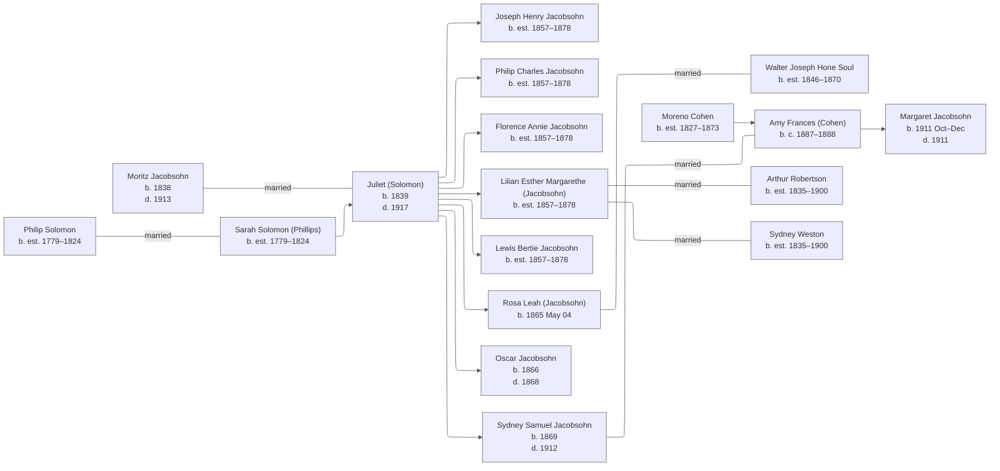

# Jacobsohn Cohen Family Tree

```mermaid
---
config:
  flowchart:
    defaultRenderer: elk
---
flowchart LR
    1838_moritz_jacobsohn["Moritz Jacobsohn<br/>b. 1838<br/>d. 1913"]:::person
    1839_juliet__solomon["Juliet (Solomon)<br/>b. 1839<br/>d. 1917"]:::person
    1779-1824_philip_solomon["Philip Solomon<br/>b. est. 1779–1824"]:::person
    1779-1824_sarah__phillips["Sarah Solomon (Phillips)<br/>b. est. 1779–1824"]:::person

    %% Presentation order does not establish actual sibling birth order.
    1857-1878_joseph_jacobsohn["Joseph Henry Jacobsohn<br/>b. est. 1857–1878"]:::person
    1857-1878_philip_jacobsohn["Philip Charles Jacobsohn<br/>b. est. 1857–1878"]:::person
    1857-1878_florence_jacobsohn["Florence Annie Jacobsohn<br/>b. est. 1857–1878"]:::person
    1857-1878_lilian__jacobsohn["Lilian Esther Margarethe (Jacobsohn)<br/>b. est. 1857–1878"]:::person
    1857-1878_lewis_jacobsohn["Lewis Bertie Jacobsohn<br/>b. est. 1857–1878"]:::person
    1865_rosa__jacobsohn["Rosa Leah (Jacobsohn)<br/>b. 1865 May 04"]:::person
    1866_oscar_jacobsohn["Oscar Jacobsohn<br/>b. 1866<br/>d. 1868"]:::person
    1869_sydney_jacobsohn["Sydney Samuel Jacobsohn<br/>b. 1869<br/>d. 1912"]:::person

    1846-1870_walter_soul["Walter Joseph Hone Soul<br/>b. est. 1846–1870"]:::person
    1887-1888_amy__cohen["Amy Frances (Cohen)<br/>b. c. 1887–1888"]:::person
    1827-1873_moreno_cohen["Moreno Cohen<br/>b. est. 1827–1873"]:::person
    1911_margaret_jacobsohn["Margaret Jacobsohn<br/>b. 1911 Oct–Dec<br/>d. 1911"]:::person
    1835-1900_arthur_robertson["Arthur Robertson<br/>b. est. 1835–1900"]:::person
    1835-1900_sydney_weston["Sydney Weston<br/>b. est. 1835–1900"]:::person

    %% Source names Philip and Sarah as Juliet's parents; no marriage date supplied.
    1779-1824_philip_solomon ---|married| 1779-1824_sarah__phillips
    1779-1824_sarah__phillips --> 1839_juliet__solomon

    1838_moritz_jacobsohn ---|married| 1839_juliet__solomon
    1839_juliet__solomon --> 1857-1878_joseph_jacobsohn
    1839_juliet__solomon --> 1857-1878_philip_jacobsohn
    1839_juliet__solomon --> 1857-1878_florence_jacobsohn
    1839_juliet__solomon --> 1857-1878_lilian__jacobsohn
    1839_juliet__solomon --> 1857-1878_lewis_jacobsohn
    1839_juliet__solomon --> 1865_rosa__jacobsohn
    1839_juliet__solomon --> 1866_oscar_jacobsohn
    1839_juliet__solomon --> 1869_sydney_jacobsohn

    %% Documented marriage: 1886 Aug 04, South Africa.
    1865_rosa__jacobsohn ---|married| 1846-1870_walter_soul

    %% Documented marriage: 1910 Sep 06, St George's Hanover Square.
    1869_sydney_jacobsohn ---|married| 1887-1888_amy__cohen
    1887-1888_amy__cohen --> 1911_margaret_jacobsohn
    1827-1873_moreno_cohen --> 1887-1888_amy__cohen

    %% Lilian's first marriage: Arthur Robertson.
    1857-1878_lilian__jacobsohn ---|married| 1835-1900_arthur_robertson
    %% Lilian's second marriage: Sydney Weston.
    %% Remarriage is documented; widowhood is not specified.
    %% The second marriage may have occurred after age 40.
    1857-1878_lilian__jacobsohn ---|married| 1835-1900_sydney_weston

    %% Markers: c. = age-derived; est. = assumption-based.
    %% All estimated intervals are provisional, not documented bounds.
    %% All marriage edges display married without dates.
    %% Documented and estimated marriage dates remain in comments.

    %% NEW spouse-based model: both spouses marry at ages 18–40.
    %% Birth interval [a,b] gives marriage interval [a+18,b+40].
    %% Where both spouses have independently supported birth intervals,
    %% intersect their modelled marriage windows, not their birth evidence.
    %% For an otherwise unknown spouse, marriage interval [u,v] gives
    %% birth interval [u-40,v-18], using this same 18–40 model.
    %% Do not apply the separate 16–40 documented-marriage fallback here.

    %% Philip and Sarah: each birth est. [1779,1824], derived from Juliet.
    %% Each gives marriage [1779+18,1824+40] = [1797,1864].
    %% Their overlapping modelled marriage interval is est. 1797–1864.
    %% Dependency: Juliet's documented birth -> estimated parental births
    %% -> estimated marriage. No documented marriage year is introduced.

    %% Moritz: birth 1838 -> marriage [1856,1878].
    %% Juliet: birth 1839 -> marriage [1857,1879].
    %% Overlap = est. [1857,1878]. No existing births are revised.

    %% Lilian: existing estimated birth [1857,1878].
    %% Each undated marriage: [1857+18,1878+40] = [1875,1918].
    %% Arthur: [1875-40,1918-18] = [1835,1900].
    %% Sydney Weston: same calculation = [1835,1900].
    %% Dependencies: Moritz and Juliet's documented births -> Lilian's
    %% assumption-based birth -> assumption-based marriage windows
    %% -> assumption-based spouse births. These are not independent evidence.
    %% Shared windows do not imply the marriages occurred simultaneously.
    %% First/second marriage order remains as documented in the source.
    %% Remarriage may exceed age 40, so Lilian's second window and Sydney
    %% Weston's dependent birth estimate may exclude real possibilities.
    %% No inferred spouse birth is fed back to narrow Lilian or a marriage.
    %% Updated both former xxx spouse IDs throughout; no xxx IDs remain.

    %% Existing evidence and calculations retained:
    %% Amy: age 22 on 1910 Sep 06 -> birth 1887 Sep 07–1888 Sep 06;
    %% retain full year range c. 1887–1888.
    %% Sydney Jacobsohn's explicit 1869 birth is compatible with age 40.
    %% Margaret's birth AND death are supplied as last quarter of 1911;
    %% birth quarter is retained; existing death label remains year-only.

    %% Parent-from-child assumption: ages 15–60.
    %% Philip and Sarah: Juliet born 1839 -> [1839-60,1839-15]
    %% = [1779,1824] for each parent.
    %% Moreno: Amy's entire AGE-DERIVED [1887,1888] interval
    %% -> [1887-60,1888-15] = [1827,1873]; label est.
    %% Moreno was deceased by 1910 Sep 06; no death year supplied.

    %% Existing child-from-parent estimates are unchanged in this update.
    %% Moritz 1838 + ages 18–40 -> [1856,1878].
    %% Juliet 1839 + ages 18–40 -> [1857,1879].
    %% Model overlap [1857,1878] supports the five existing child estimates.
    %% These assumptions are not documented birth bounds.

    %% Separate fallback for a DOCUMENTED marriage year: ages 16–40.
    %% Walter: earliest documented marriage 1886
    %% -> [1886-40,1886-16] = [1846,1870].
    %% No remarriage or widowhood is specified for Walter.
    %% Do not replace direct birth or usable age evidence with assumptions.

    %% Sydney Jacobsohn fathered Margaret at age 41–42: an exception to
    %% the former 18–40 parenthood assumption, not a date conflict.
    %% Preserve conflicting source evidence rather than intersecting it away.
    %% IDs use lowercase first given names, full birth intervals, and
    %% maiden-name __ or family-name _ suffixes; omit c. and est.
    classDef person stroke:#666666;
    linkStyle default stroke:#555
```
