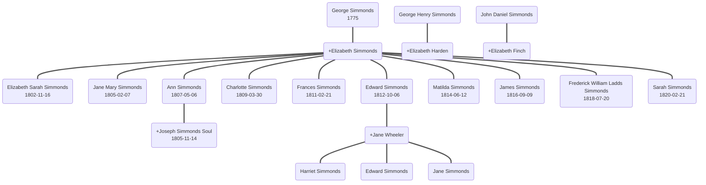

# Simmonds Family Tree - Simplified Diagram

```mermaid
flowchart TD
    1775_george_simmonds(George Simmonds<br/>1775) === elizabeth_simmonds(+Elizabeth Simmonds)
    elizabeth_simmonds === 1802_elizabeth_simmonds(Elizabeth Sarah Simmonds<br/>1802-11-16)
    elizabeth_simmonds === 1805_jane_simmonds(Jane Mary Simmonds<br/>1805-02-07)
    elizabeth_simmonds === 1807_ann_simmonds(Ann Simmonds<br/>1807-05-06)
    elizabeth_simmonds === 1809_charlotte_simmonds(Charlotte Simmonds<br/>1809-03-30)
    elizabeth_simmonds === 1811_frances_simmonds(Frances Simmonds<br/>1811-02-21)
    elizabeth_simmonds === 1812_edward_simmonds(Edward Simmonds<br/>1812-10-06)
    elizabeth_simmonds === 1814_matilda_simmonds(Matilda Simmonds<br/>1814-06-12)
    elizabeth_simmonds === 1816_james_simmonds(James Simmonds<br/>1816-09-09)
    elizabeth_simmonds === 1818_frederick_simmonds(Frederick William Ladds Simmonds<br/>1818-07-20)
    elizabeth_simmonds === 1820_sarah_simmonds(Sarah Simmonds<br/>1820-02-21)
    1807_ann_simmonds === joseph_simmonds_soul(+Joseph Simmonds Soul<br/>1805-11-14)
    1812_edward_simmonds === jane_wheeler(+Jane Wheeler)
    jane_wheeler === harriet_simmonds(Harriet Simmonds)
    jane_wheeler === edward_simmonds(Edward Simmonds)
    jane_wheeler === jane_simmonds(Jane Simmonds)
    george_simmonds(George Henry Simmonds) === elizabeth_harden(+Elizabeth Harden)
    john_simmonds(John Daniel Simmonds) === elizabeth_finch(+Elizabeth Finch)

    linkStyle default stroke:#555
```
