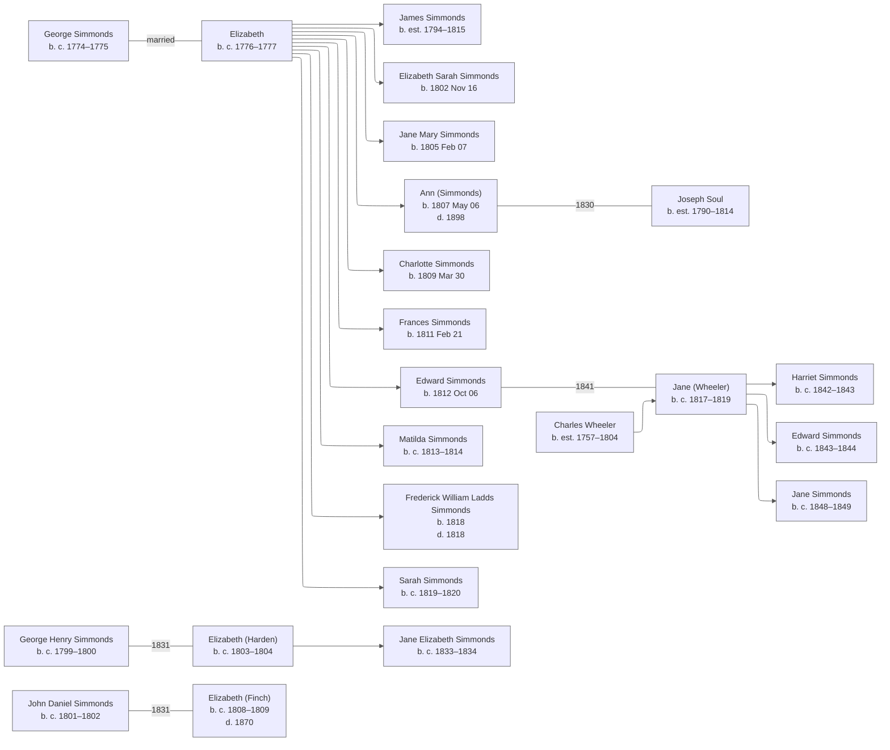

# Simmonds Family Tree

```mermaid
---
config:
  flowchart:
    defaultRenderer: elk
---
flowchart LR
    %% Relationships follow the original source, not previous assistant statements.
    %% The source does not establish kinship between the three Simmonds family groups.
    %% Witness status and shared surnames alone do not establish relationships.
    %% All spouse links below are documented by = in the source;
    %% no census-based marriage inference is needed.
    %% Parent1 is first-listed; only parent2 points to shared children.
    %% Charles Wheeler is the sole identified parent of Jane Wheeler.
    %% Approximate age-derived births use c.; assumption-based births use est.
    %% Child declarations and arrows are sorted by earliest, then latest birth year.
    %% Sorting overlapping intervals does not establish actual birth order.

    %% George: 1841 census age 66 => [1841-66-1, 1841-66] = [1774, 1775].
    %% Elizabeth: 1841 census age 64 => [1776, 1777].
    %% The 1818 poll is not George's birth evidence.
    1774-1775_george_simmonds["George Simmonds<br/>b. c. 1774–1775"]:::person
    1776-1777_elizabeth_unknown["Elizabeth<br/>b. c. 1776–1777"]:::person

    %% James: no explicit birth or usable age; baptized 1816 Sep 09.
    %% Child-from-parent fallback now uses provisional parental ages 18–40.
    %% Dependencies: both parents' complete AGE-DERIVED birth intervals.
    %% George [1774,1775] => [1774+18,1775+40] = [1792,1815].
    %% Elizabeth [1776,1777] => [1776+18,1777+40] = [1794,1817].
    %% Intersection = [1794,1815]; baptism upper bound 1816 does not narrow it.
    %% Final assumption-based estimate = [1794,1815], not a guaranteed bound.
    %% No infant baptism or birth order is assumed; no circular dependencies.
    1794-1815_james_simmonds["James Simmonds<br/>b. est. 1794–1815"]:::person

    %% Explicit birth dates take priority over age-derived or assumed dates.
    1802_elizabeth_simmonds["Elizabeth Sarah Simmonds<br/>b. 1802 Nov 16"]:::person
    1805_jane_simmonds["Jane Mary Simmonds<br/>b. 1805 Feb 07"]:::person
    1807_ann__simmonds["Ann (Simmonds)<br/>b. 1807 May 06<br/>d. 1898"]:::person
    1809_charlotte_simmonds["Charlotte Simmonds<br/>b. 1809 Mar 30"]:::person
    1811_frances_simmonds["Frances Simmonds<br/>b. 1811 Feb 21"]:::person
    1812_edward_simmonds["Edward Simmonds<br/>b. 1812 Oct 06"]:::person

    %% Ann: died 1898 Apr 16, recorded age 90; explicit birth retained.
    %% Charlotte: 1841 age 32 => [1808,1809], consistent with explicit birth.
    %% Edward: 1841 age 28 and 1851 age 38 => [1812,1813];
    %% 1881 age 69 => [1811,1812]. Retain explicit birth 1812 Oct 06.
    %% No explicit birth is widened merely to match these broader age intervals.

    %% Matilda: 1841 age 27 => [1813,1814]; baptized 1814 Jun 12.
    1813-1814_matilda_simmonds["Matilda Simmonds<br/>b. c. 1813–1814"]:::person

    %% Frederick: baptized 1818 Jul 20; died aged 6 days; buried 1818 Jul 28.
    %% Combined baptism and age-at-death evidence places birth and death in 1818.
    %% The death year is not inferred from burial alone; no exact day is invented.
    1818_frederick_simmonds["Frederick William Ladds Simmonds<br/>b. 1818<br/>d. 1818"]:::person

    %% Sarah: 1841 age 21 => [1819,1820]; baptized 1820 Feb 21.
    1819-1820_sarah_simmonds["Sarah Simmonds<br/>b. c. 1819–1820"]:::person

    %% George and Elizabeth: documented marriage, date not supplied.
    1774-1775_george_simmonds ---|married| 1776-1777_elizabeth_unknown
    1776-1777_elizabeth_unknown --> 1794-1815_james_simmonds
    1776-1777_elizabeth_unknown --> 1802_elizabeth_simmonds
    1776-1777_elizabeth_unknown --> 1805_jane_simmonds
    1776-1777_elizabeth_unknown --> 1807_ann__simmonds
    1776-1777_elizabeth_unknown --> 1809_charlotte_simmonds
    1776-1777_elizabeth_unknown --> 1811_frances_simmonds
    1776-1777_elizabeth_unknown --> 1812_edward_simmonds
    1776-1777_elizabeth_unknown --> 1813-1814_matilda_simmonds
    1776-1777_elizabeth_unknown --> 1818_frederick_simmonds
    1776-1777_elizabeth_unknown --> 1819-1820_sarah_simmonds

    %% Joseph: no explicit birth or usable age.
    %% Earliest documented marriage: 1830 May 06, St Bride's Fleet Street.
    %% Provisional marriage ages 16–40: [1830-40,1830-16] = [1790,1814].
    %% Dependency: marriage year only; no source-supported children are supplied here.
    %% Ann was a spinster and Joseph a bachelor; witnesses John Daniel Simmonds
    %% and Elizabeth Finch do not acquire additional kinship links from this event.
    1790-1814_joseph_soul["Joseph Soul<br/>b. est. 1790–1814"]:::person
    1807_ann__simmonds ---|1830| 1790-1814_joseph_soul

    %% Jane Wheeler: 1851 age 32 => [1818,1819];
    %% 1881 age 63 => [1817,1818].
    %% Differing age records: retain covering interval [1817,1819],
    %% not their intersection of 1818. Do not adjust using assumed marriage ages.
    1817-1819_jane__wheeler["Jane (Wheeler)<br/>b. c. 1817–1819"]:::person

    %% Charles Wheeler is explicitly Jane's father; no mother is identified.
    %% Charles has no explicit birth, usable age, or dated marriage evidence.
    %% Parent-from-child fallback uses provisional parental ages 15–60.
    %% Dependency: Jane's entire AGE-DERIVED interval [1817,1819].
    %% Calculation: [1817-60,1819-15] = [1757,1804].
    %% This is an assumption-based estimate, not a historical or biological bound.
    1757-1804_charles_wheeler["Charles Wheeler<br/>b. est. 1757–1804"]:::person
    1757-1804_charles_wheeler --> 1817-1819_jane__wheeler

    %% Edward and Jane married 1841 Jun 27, St Bride's Fleet Street.
    %% Both of full age; bachelor and spinster; witness Sarah Simmonds.
    %% Direct birth and age evidence takes priority over fallback estimates.
    1812_edward_simmonds ---|1841| 1817-1819_jane__wheeler

    %% 1851 census: Harriet age 8 => [1842,1843];
    %% Edward age 7 => [1843,1844]; Jane age 2 => [1848,1849].
    1842-1843_harriet_simmonds["Harriet Simmonds<br/>b. c. 1842–1843"]:::person
    1843-1844_edward_simmonds["Edward Simmonds<br/>b. c. 1843–1844"]:::person
    1848-1849_jane_simmonds["Jane Simmonds<br/>b. c. 1848–1849"]:::person
    1817-1819_jane__wheeler --> 1842-1843_harriet_simmonds
    1817-1819_jane__wheeler --> 1843-1844_edward_simmonds
    1817-1819_jane__wheeler --> 1848-1849_jane_simmonds

    %% 1851 census: George Henry age 51 => [1799,1800];
    %% Elizabeth Harden age 47 => [1803,1804];
    %% Jane Elizabeth age 17 => [1833,1834].
    %% The 1846 directory entry is not birth evidence.
    1799-1800_george_simmonds["George Henry Simmonds<br/>b. c. 1799–1800"]:::person
    1803-1804_elizabeth__harden["Elizabeth (Harden)<br/>b. c. 1803–1804"]:::person
    1833-1834_jane_simmonds["Jane Elizabeth Simmonds<br/>b. c. 1833–1834"]:::person
    %% Married 1831 May 19, St Bride's Fleet Street: widower and spinster.
    %% George Henry's widowhood is documented; no earlier spouse is identified.
    %% No marriage numbering is supplied and none is assigned.
    %% Witnesses George Simmonds and Elizabeth Simmonds do not establish parentage.
    %% George Henry has usable age evidence, so no marriage-age fallback is applied.
    1799-1800_george_simmonds ---|1831| 1803-1804_elizabeth__harden
    1803-1804_elizabeth__harden --> 1833-1834_jane_simmonds

    %% 1851 census: John Daniel age 49 => [1801,1802];
    %% Elizabeth Finch age 42 => [1808,1809].
    1801-1802_john_simmonds["John Daniel Simmonds<br/>b. c. 1801–1802"]:::person
    1808-1809_elizabeth__finch["Elizabeth (Finch)<br/>b. c. 1808–1809<br/>d. 1870"]:::person
    %% Married 1831 May 19, St Bride's Fleet Street: bachelor and spinster.
    %% Witnesses Zachariah Finch and Jane Finch; no kinship inferred.
    %% Elizabeth died 1870 Jul 16; administration 1870 Aug 23 is not death evidence.
    1801-1802_john_simmonds ---|1831| 1808-1809_elizabeth__finch

    %% George and Elizabeth's later children document parenthood after 40.
    %% This is an exception to the child-estimation ages 18–40, not a date conflict.
    %% Never alter documented births, age-derived ranges, or relationships to fit assumptions.
    %% All fallback estimates trace to source evidence; none uses a dependent estimate circularly.
    classDef person stroke:#666666;
    linkStyle default stroke:#555
```
