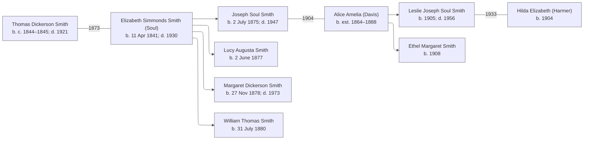

# Smith Family Tree

```mermaid
---
config:
  flowchart:
    defaultRenderer: elk
---
flowchart LR
    %% Thomas: completed age 56 in the 1901 census gives 1844–1845.
    1844-1845_thomas_smith["Thomas Dickerson Smith<br/>b. c. 1844–1845; d. 1921"]:::person
    1841_elizabeth__soul["Elizabeth Simmonds Smith (Soul)<br/>b. 11 Apr 1841; d. 1930"]:::person

    1875_joseph_smith["Joseph Soul Smith<br/>b. 2 July 1875; d. 1947"]:::person
    %% Alice has neither birth nor usable age evidence.
    %% Latest instruction uses provisional parental ages 15–60, not 18–40.
    %% Child Leslie, b. 1905: Alice's provisional interval = 1845–1890.
    %% Child Ethel, b. 1908: Alice's provisional interval = 1848–1893.
    %% Marriage in 1904, assumed ages 16–40: interval = 1864–1888.
    %% Intersection of all applicable fallback intervals = 1864–1888.
    %% This estimate uses documented child births and marriage, not another estimate.
    1864-1888_alice__davis["Alice Amelia (Davis)<br/>b. est. 1864–1888"]:::person
    1877_lucy_smith["Lucy Augusta Smith<br/>b. 2 June 1877"]:::person
    1878_margaret_smith["Margaret Dickerson Smith<br/>b. 27 Nov 1878; d. 1973"]:::person
    %% William's death is reported in the source, but no death year is supplied.
    1880_william_smith["William Thomas Smith<br/>b. 31 July 1880"]:::person

    1905_leslie_smith["Leslie Joseph Soul Smith<br/>b. 1905; d. 1956"]:::person
    1904_hilda__harmer["Hilda Elizabeth (Harmer)<br/>b. 1904"]:::person
    1908_ethel_smith["Ethel Margaret Smith<br/>b. 1908"]:::person

    %% Thomas and Elizabeth: marriage Q1 1873, Hackney.
    %% Elizabeth is explicitly described as Thomas's widow in his probate record.
    1844-1845_thomas_smith ---|1873| 1841_elizabeth__soul
    %% Source order: Thomas is parent1; Elizabeth is parent2.
    1841_elizabeth__soul --> 1875_joseph_smith
    1841_elizabeth__soul --> 1877_lucy_smith
    1841_elizabeth__soul --> 1878_margaret_smith
    1841_elizabeth__soul --> 1880_william_smith

    %% Joseph and Alice: marriage 1904, Stroud.
    1875_joseph_smith ---|1904| 1864-1888_alice__davis
    %% Source order: Joseph is parent1; Alice is parent2.
    1864-1888_alice__davis --> 1905_leslie_smith
    1864-1888_alice__davis --> 1908_ethel_smith

    %% Leslie and Hilda: marriage 1933, Rodborough, Gloucestershire.
    1905_leslie_smith ---|1933| 1904_hilda__harmer

    classDef person stroke:#666666;
    linkStyle default stroke:#555
```
