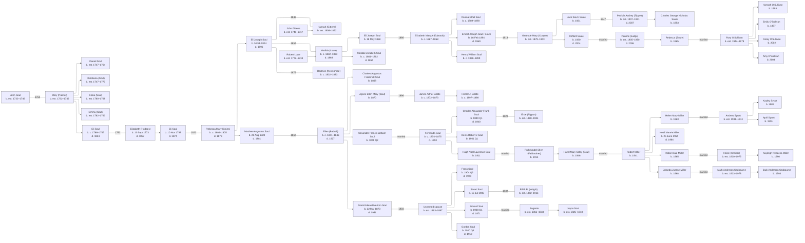

# Soul Family Tree

```mermaid

---
config:
  flowchart:
    defaultRenderer: elk
---
flowchart LR
    %% PART 2: Eli Joseph Soul and Matthew Augustus Soul, root to source-listed leaves.
    %% Other root siblings are collapsed; Eli and Rebecca's other children are in Part 3.
    %% Child definitions and arrows are sorted by ascending birth year.
    %% Intervals sort by earliest year, then latest; ties retain source order.
    %% Sorting overlapping estimates is presentation order, not established birth order.
    %% est. = assumption-based interval; c. = age-derived interval.
    %% Parent from child: ages 15–60. Child from parent: ages 18–40.
    %% Marriage fallback: ages 16–40. Dependent estimates are not fed back.

    %% ROOT FAMILY
    %% Root marriage 1762 gives each founder 1722–1746.
    1722-1746_john_soul["John Soul<br/>b. est. 1722–1746"]:::person
    1722-1746_mary__palmer["Mary (Palmer)<br/>b. est. 1722–1746"]:::person
    %% Daniel: marriage 1787 gives 1747–1771; baptism caps at 1764.
    1747-1764_daniel_soul["Daniel Soul<br/>b. est. 1747–1764"]:::person
    %% Christiana: marriage 1787 gives 1747–1771; baptism caps at 1770.
    1747-1770_christiana__soul["Christiana (Soul)<br/>b. est. 1747–1770"]:::person
    %% Kezia: marriage 1800 gives 1760–1784; baptism caps at 1768.
    1760-1768_kezia__soul["Kezia (Soul)<br/>b. est. 1760–1768"]:::person
    %% Emma: marriage 1802 gives 1762–1786; baptism caps at 1763.
    1762-1763_emma__soul["Emma (Soul)<br/>b. est. 1762–1763"]:::person
    %% Eli: age 57 in 1824 gives 1766–1767; baptised 4 May 1766.
    1766-1767_eli_soul["Eli Soul<br/>b. c. 1766–1767<br/>d. 1824"]:::person
    1773_elizabeth__hodges["Elizabeth (Hodges)<br/>b. 10 Sept 1773<br/>d. 1857"]:::person
    %% Marriage: 8 July 1762, Eastington.
    1722-1746_john_soul ---|1762| 1722-1746_mary__palmer
    1722-1746_mary__palmer --> 1747-1764_daniel_soul
    1722-1746_mary__palmer --> 1747-1770_christiana__soul
    1722-1746_mary__palmer --> 1760-1768_kezia__soul
    1722-1746_mary__palmer --> 1762-1763_emma__soul
    1722-1746_mary__palmer --> 1766-1767_eli_soul
    %% Marriage: 12 Oct 1793, Hanwell.
    1766-1767_eli_soul ---|1793| 1773_elizabeth__hodges

    %% CONNECTING PARENTS
    1798_eli_soul["Eli Soul<br/>b. 10 Nov 1798<br/>d. 1874"]:::person
    %% Ages 70 in 1871 and 74 at death in 1874 imply 1800–1801
    %% and 1799–1800; retain Eli's explicit birth date.
    %% Rebecca: age 56 in 1861 gives 1804–1805.
    1804-1805_rebecca__gains["Rebecca Mary (Gains)<br/>b. c. 1804–1805<br/>d. 1878"]:::person
    1773_elizabeth__hodges --> 1798_eli_soul
    %% Marriage: 11 March 1823, St Leonard's Shoreditch; Rebecca was a minor.
    1798_eli_soul ---|1823| 1804-1805_rebecca__gains
    1824_eli_soul["Eli Joseph Soul<br/>b. 5 Feb 1824<br/>d. 1896"]:::person
    1828_matthew_soul["Matthew Augustus Soul<br/>b. 28 Aug 1828<br/>d. 1881"]:::person
    1804-1805_rebecca__gains --> 1824_eli_soul
    1804-1805_rebecca__gains --> 1828_matthew_soul

    %% ELI JOSEPH SOUL: THREE MARRIAGES
    %% Hannah: marriage 1848 gives 1808–1832.
    1808-1832_hannah__gittens["Hannah (Gittens)<br/>b. est. 1808–1832"]:::person
    %% John depends on Hannah's estimate: 1808-60 to 1832-15.
    1748-1817_john_gittens["John Gittens<br/>b. est. 1748–1817"]:::person
    %% Matilda: age 35 in 1868 gives 1832–1833.
    1832-1833_matilda__lowe["Matilda (Lowe)<br/>b. c. 1832–1833<br/>d. 1868"]:::person
    %% Robert from Matilda's age-derived interval: 1832-60 to 1833-15.
    1772-1818_robert_lowe["Robert Lowe<br/>b. est. 1772–1818"]:::person
    %% Beatrice: age 48 in 1881 gives 1832–1833.
    1832-1833_beatrice__newcombe["Beatrice (Newcombe)<br/>b. c. 1832–1833"]:::person
    1748-1817_john_gittens --> 1808-1832_hannah__gittens
    1772-1818_robert_lowe --> 1832-1833_matilda__lowe
    %% Marriage 1: 21 Oct 1848, St John-the-Baptist Hoxton.
    1824_eli_soul ---|1848| 1808-1832_hannah__gittens
    %% Marriage 2: 16 Aug 1857, St John-the-Baptist Hoxton; Eli was a widower.
    1824_eli_soul ---|1857| 1832-1833_matilda__lowe
    %% Marriage 3: 1876 Q1, Hackney.
    1824_eli_soul ---|1876| 1832-1833_beatrice__newcombe

    1858_eli_soul["Eli Joseph Soul<br/>b. 18 May 1858"]:::person
    %% Matilda Elizabeth: age 2 in 1864 gives 1861–1862.
    1861-1862_matilda_soul["Matilda Elizabeth Soul<br/>b. c. 1861–1862<br/>d. 1864"]:::person
    1832-1833_matilda__lowe --> 1858_eli_soul
    1832-1833_matilda__lowe --> 1861-1862_matilda_soul
    %% Elizabeth: age 33 in 1901 gives 1867–1868.
    1867-1868_elizabeth__edwards["Elizabeth Mary A (Edwards)<br/>b. c. 1867–1868"]:::person
    %% Marriage: 1886 Q1, St Saviour.
    1858_eli_soul ---|1886| 1867-1868_elizabeth__edwards
    %% Rosina age 11 and Henry age 2 in 1901.
    1889-1890_rosina_soul["Rosina Ethel Soul<br/>b. c. 1889–1890"]:::person
    1894_ernest_soul["Ernest Joseph Soul / Soule<br/>b. 16 Feb 1894<br/>d. 1969"]:::person
    1898-1899_henry_soul["Henry William Soul<br/>b. c. 1898–1899"]:::person
    1867-1868_elizabeth__edwards --> 1889-1890_rosina_soul
    1867-1868_elizabeth__edwards --> 1894_ernest_soul
    1867-1868_elizabeth__edwards --> 1898-1899_henry_soul

    %% Gertrude: marriage 1919 gives 1879–1903; children's births do not narrow it.
    1879-1903_gertrude__cooper["Gertrude Mary (Cooper)<br/>b. est. 1879–1903"]:::person
    %% Marriage: 1919, Gravesend.
    1894_ernest_soul ---|1919| 1879-1903_gertrude__cooper
    1921_jack_soul["Jack Soul / Soule<br/>b. 1921"]:::person
    1930_clifford_soule["Clifford Soule<br/>b. 1930<br/>d. 2004"]:::person
    1879-1903_gertrude__cooper --> 1921_jack_soul
    1879-1903_gertrude__cooper --> 1930_clifford_soule
    %% Patricia: marriage 1947 gives 1907–1931; child's birth does not narrow it.
    1907-1931_patricia__tippett["Patricia Audrey (Tippett)<br/>b. est. 1907–1931<br/>d. 2007"]:::person
    1953_charles_soule["Charles George Nicholas Soule<br/>b. 1953"]:::person
    %% Marriage: 1947, Radstock, Somerset.
    1921_jack_soul ---|1947| 1907-1931_patricia__tippett
    1907-1931_patricia__tippett --> 1953_charles_soule
    %% Pauline: child born 1965 gives 1965-60 to 1965-15 = 1905–1950.
    1905-1950_pauline__judge["Pauline (Judge)<br/>b. est. 1905–1950<br/>d. 2006"]:::person
    1965_rebecca__soule["Rebecca (Soule)<br/>b. 1965"]:::person
    1930_clifford_soule ---|married| 1905-1950_pauline__judge
    1905-1950_pauline__judge --> 1965_rebecca__soule
    %% Rory: parental intervals from children born 1993–2004 intersect at 1944–1978.
    1944-1978_rory_osullivan["Rory O'Sullivan<br/>b. est. 1944–1978"]:::person
    1993_hannah_osullivan["Hannah O'Sullivan<br/>b. 1993"]:::person
    1997_emily_osullivan["Emily O'Sullivan<br/>b. 1997"]:::person
    2002_finley_osullivan["Finley O'Sullivan<br/>b. 2002"]:::person
    2004_amy_osullivan["Amy O'Sullivan<br/>b. 2004"]:::person
    1965_rebecca__soule ---|married| 1944-1978_rory_osullivan
    1944-1978_rory_osullivan --> 1993_hannah_osullivan
    1944-1978_rory_osullivan --> 1997_emily_osullivan
    1944-1978_rory_osullivan --> 2002_finley_osullivan
    1944-1978_rory_osullivan --> 2004_amy_osullivan

    %% MATTHEW AUGUSTUS SOUL AND ELLEN BETHELL
    %% Ellen's ages imply 1841–1842, 1843–1844, and 1845–1846.
    %% Retain covering interval 1841–1846.
    1841-1846_ellen__bethell["Ellen (Bethell)<br/>b. c. 1841–1846<br/>d. 1927"]:::person
    %% Marriage: 18 Nov 1867, Register Office, John St, Southwark.
    1828_matthew_soul ---|1867| 1841-1846_ellen__bethell
    1868_charles_soul["Charles Augustus Frederick Soul<br/>b. 1868"]:::person
    1870_agnes__soul["Agnes Ellen Mary (Soul)<br/>b. 1870"]:::person
    %% Source's 1771 census reference for Agnes is not used as birth evidence.
    1871_alexander_soul["Alexander Francis William Soul<br/>b. 1871 Q2"]:::person
    %% Alexander's age 31 in 1901 implies 1869–1870;
    %% retain his explicit birth registration, 1871 Q2.
    1873_frank_soul["Frank Edward Meriton Soul<br/>b. 22 Mar 1873<br/>d. 1951"]:::person
    1841-1846_ellen__bethell --> 1868_charles_soul
    1841-1846_ellen__bethell --> 1870_agnes__soul
    1841-1846_ellen__bethell --> 1871_alexander_soul
    1841-1846_ellen__bethell --> 1873_frank_soul

    %% AGNES AND THE LIDDLE BRANCH
    %% James age 28 and Hector age 3 in 1901.
    1872-1873_james_liddle["James Arthur Liddle<br/>b. c. 1872–1873"]:::person
    1897-1898_hector_liddle["Hector J. Liddle<br/>b. c. 1897–1898"]:::person
    %% Marriage: 1896 Q3, Lambeth.
    1870_agnes__soul ---|1896| 1872-1873_james_liddle
    1872-1873_james_liddle --> 1897-1898_hector_liddle

    %% ALEXANDER AND FERNANDA
    %% Fernanda: age 26 in 1901 gives 1874–1875.
    %% Source also spells her name Femanda; Soul is explicitly documented there.
    1874-1875_fernanda_soul["Fernanda Soul<br/>b. c. 1874–1875<br/>d. 1953"]:::person
    1899_charles_soul["Charles Alexander Frank Soul<br/>b. 1899 Q1<br/>d. 1940"]:::person
    %% Recorded age 40 in May 1940 differs from explicit birth; retain birth.
    1901_denis_soul["Denis Robert J Soul<br/>b. 1901 Q1"]:::person
    1911_hugh_soul["Hugh Noel Lawrence Soul<br/>b. 1911"]:::person
    1871_alexander_soul ---|married| 1874-1875_fernanda_soul
    1874-1875_fernanda_soul --> 1899_charles_soul
    1874-1875_fernanda_soul --> 1901_denis_soul
    1874-1875_fernanda_soul --> 1911_hugh_soul
    %% Elsie: marriage 1920 gives 1880–1904.
    1880-1904_elsie__rippon["Elsie (Rippon)<br/>b. est. 1880–1904"]:::person
    %% Marriage: 1920 Q4.
    1899_charles_soul ---|1920| 1880-1904_elsie__rippon

    %% HUGH AND THE MILLER BRANCH
    1914_ruth__fairbrother["Ruth Mabel Ellen (Fairbrother)<br/>b. 1914"]:::person
    1946_hazel__soul["Hazel Mary Selby (Soul)<br/>b. 1946"]:::person
    1911_hugh_soul ---|married| 1914_ruth__fairbrother
    1914_ruth__fairbrother --> 1946_hazel__soul
    1941_robert_miller["Robert Miller<br/>b. 1941"]:::person
    1946_hazel__soul ---|married| 1941_robert_miller
    1963_helen_miller["Helen Mary Miller<br/>b. 1963"]:::person
    1964_heidi_miller["Heidi Mare'e Miller<br/>b. 25 June 1964<br/>d. 1964"]:::person
    1965_robin_miller["Robin Dale Miller<br/>b. 1965"]:::person
    1968_jolanda_miller["Jolanda Justine Miller<br/>b. 1968"]:::person
    1941_robert_miller --> 1963_helen_miller
    1941_robert_miller --> 1964_heidi_miller
    1941_robert_miller --> 1965_robin_miller
    1941_robert_miller --> 1968_jolanda_miller
    %% Andrew: children born 1989 and 1991 give intersection 1931–1974.
    1931-1974_andrew_syratt["Andrew Syratt<br/>b. est. 1931–1974"]:::person
    1989_kayley_syratt["Kayley Syratt<br/>b. 1989"]:::person
    1991_april_syratt["April Syratt<br/>b. 1991"]:::person
    1963_helen_miller ---|married| 1931-1974_andrew_syratt
    1931-1974_andrew_syratt --> 1989_kayley_syratt
    1931-1974_andrew_syratt --> 1991_april_syratt
    %% Heike: child born 1990 gives 1930–1975.
    1930-1975_heike__greiner["Heike (Greiner)<br/>b. est. 1930–1975"]:::person
    1990_kayleigh_miller["Kayleigh Rebecca Miller<br/>b. 1990"]:::person
    1965_robin_miller ---|married| 1930-1975_heike__greiner
    1930-1975_heike__greiner --> 1990_kayleigh_miller
    %% Mark: child born 1993 gives 1933–1978.
    1933-1978_mark_seabourne["Mark Anderson Seabourne<br/>b. est. 1933–1978"]:::person
    1993_jack_seabourne["Jack Anderson Seabourne<br/>b. 1993"]:::person
    1968_jolanda_miller ---|married| 1933-1978_mark_seabourne
    1933-1978_mark_seabourne --> 1993_jack_seabourne

    %% FRANK EDWARD MERITON SOUL'S BRANCH
    %% Documented unnamed spouse: marriage 1903 gives 1863–1887.
    %% Children's births do not narrow it; unknown is an ID-only placeholder.
    1863-1887_unnamed_unknown["Unnamed spouse<br/>b. est. 1863–1887"]:::person
    %% Marriage: 1903 Q2.
    1873_frank_soul ---|1903| 1863-1887_unnamed_unknown
    1904_frank_soul["Frank Soul<br/>b. 1904 Q2<br/>d. 1970"]:::person
    1906_stuart_soul["Stuart Soul<br/>b. 15 Jul 1906"]:::person
    1908_edward_soul["Edward Soul<br/>b. 1908 Q1<br/>d. 1971"]:::person
    1910_gordon_soul["Gordon Soul<br/>b. 1910 Q3<br/>d. 1912"]:::person
    1863-1887_unnamed_unknown --> 1904_frank_soul
    1863-1887_unnamed_unknown --> 1906_stuart_soul
    1863-1887_unnamed_unknown --> 1908_edward_soul
    1863-1887_unnamed_unknown --> 1910_gordon_soul
    %% Edith: marriage 1932 gives 1892–1916.
    1892-1916_edith__wright["Edith R. (Wright)<br/>b. est. 1892–1916"]:::person
    %% Marriage: 1932 Q2, Willesden.
    1906_stuart_soul ---|1932| 1892-1916_edith__wright
    %% Joyce: documented father born 1908 plus ages 18–40 gives 1926–1948.
    1926-1948_joyce_soul["Joyce Soul<br/>b. est. 1926–1948"]:::person
    %% Eugenie depends on Joyce's estimate: 1926-60 to 1948-15 = 1866–1933.
    %% No surname supplied; do not feed this estimate back into Joyce's.
    1866-1933_eugenie_unknown["Eugenie<br/>b. est. 1866–1933"]:::person
    %% Marriage 2 for Edward; date and first spouse not supplied.
    1908_edward_soul ---|married| 1866-1933_eugenie_unknown
    1866-1933_eugenie_unknown --> 1926-1948_joyce_soul

    classDef person stroke:#666666;
    linkStyle default stroke:#555
```
