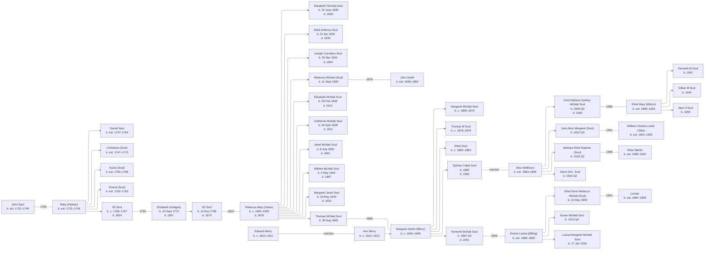

# Soul Family Tree

```mermaid
---
config:
  flowchart:
    defaultRenderer: elk
---
flowchart LR
    %% PART 3: Eli and Rebecca's remaining ten children and their recorded descendants.
    %% Eli Joseph and Matthew Augustus and their descendants are in Part 2.
    %% Children are declared and linked by ascending birth year.
    %% Intervals sort by earliest year, then latest; ties retain source order.
    %% Overlapping intervals do not establish actual birth order.
    %% est. = assumption-based interval; c. = age-derived interval.
    %% Parent from child: ages 15–60; child from parent: ages 18–40.
    %% Marriage fallback: ages 16–40. Baptisms are not birth dates.

    %% ROOT FAMILY: same IDs and sorting as Part 2.
    %% Marriage 1762 gives each founder 1722–1746.
    1722-1746_john_soul["John Soul<br/>b. est. 1722–1746"]:::person
    1722-1746_mary__palmer["Mary (Palmer)<br/>b. est. 1722–1746"]:::person
    %% Daniel: marriage 1787 gives 1747–1771; baptism caps at 1764.
    1747-1764_daniel_soul["Daniel Soul<br/>b. est. 1747–1764"]:::person
    %% Christiana: marriage 1787 gives 1747–1771; baptism caps at 1770.
    1747-1770_christiana__soul["Christiana (Soul)<br/>b. est. 1747–1770"]:::person
    %% Kezia: marriage 1800 gives 1760–1784; baptism caps at 1768.
    1760-1768_kezia__soul["Kezia (Soul)<br/>b. est. 1760–1768"]:::person
    %% Emma: marriage 1802 gives 1762–1786; baptism caps at 1763.
    1762-1763_emma__soul["Emma (Soul)<br/>b. est. 1762–1763"]:::person
    %% Eli: age 57 in 1824 gives 1766–1767; baptised 4 May 1766.
    1766-1767_eli_soul["Eli Soul<br/>b. c. 1766–1767<br/>d. 1824"]:::person
    1773_elizabeth__hodges["Elizabeth (Hodges)<br/>b. 10 Sept 1773<br/>d. 1857"]:::person

    %% Marriage: 8 July 1762, Eastington.
    1722-1746_john_soul ---|1762| 1722-1746_mary__palmer
    1722-1746_mary__palmer --> 1747-1764_daniel_soul
    1722-1746_mary__palmer --> 1747-1770_christiana__soul
    1722-1746_mary__palmer --> 1760-1768_kezia__soul
    1722-1746_mary__palmer --> 1762-1763_emma__soul
    1722-1746_mary__palmer --> 1766-1767_eli_soul
    %% Marriage: 12 Oct 1793, Hanwell.
    1766-1767_eli_soul ---|1793| 1773_elizabeth__hodges

    %% CONNECTING PARENTS
    1798_eli_soul["Eli Soul<br/>b. 10 Nov 1798<br/>d. 1874"]:::person
    %% Eli's ages 70 in 1871 and 74 at death in 1874 imply 1800–1801
    %% and 1799–1800; retain his explicit birth date.
    %% Rebecca: age 56 in 1861 gives 1804–1805.
    1804-1805_rebecca__gains["Rebecca Mary (Gains)<br/>b. c. 1804–1805<br/>d. 1878"]:::person
    1773_elizabeth__hodges --> 1798_eli_soul
    %% Marriage: 11 March 1823, St Leonard's Shoreditch; Rebecca was a minor.
    1798_eli_soul ---|1823| 1804-1805_rebecca__gains

    %% TEN CHILDREN NOT EXPANDED IN PART 2
    1830_elizabeth_soul["Elizabeth Florinda Soul<br/>b. 22 June 1830<br/>d. 1832"]:::person
    1832_mark_soul["Mark Anthony Soul<br/>b. 21 Apr 1832<br/>d. 1833"]:::person
    1834_joseph_soul["Joseph Cornelius Soul<br/>b. 25 Mar 1834<br/>d. 1834"]:::person
    1835_rebecca__soul["Rebecca McNab (Soul)<br/>b. 11 Sept 1835"]:::person
    1838_elizabeth_soul["Elizabeth McNab Soul<br/>b. 28 Feb 1838<br/>d. 1912"]:::person
    1839_catherine_soul["Catherine McNab Soul<br/>b. 24 April 1839<br/>d. 1911"]:::person
    1840_janet_soul["Janet McNab Soul<br/>b. 8 July 1840<br/>d. 1841"]:::person
    1842_william_soul["William McNab Soul<br/>b. 4 May 1842<br/>d. 1897"]:::person
    1844_margaret_soul["Margaret Janet Soul<br/>b. 18 May 1844<br/>d. 1924"]:::person
    1848_thomas_soul["Thomas McNab Soul<br/>b. 30 Aug 1848"]:::person
    %% William's death age 54 in 1897 implies 1842–1843; retain explicit birth.
    1804-1805_rebecca__gains --> 1830_elizabeth_soul
    1804-1805_rebecca__gains --> 1832_mark_soul
    1804-1805_rebecca__gains --> 1834_joseph_soul
    1804-1805_rebecca__gains --> 1835_rebecca__soul
    1804-1805_rebecca__gains --> 1838_elizabeth_soul
    1804-1805_rebecca__gains --> 1839_catherine_soul
    1804-1805_rebecca__gains --> 1840_janet_soul
    1804-1805_rebecca__gains --> 1842_william_soul
    1804-1805_rebecca__gains --> 1844_margaret_soul
    1804-1805_rebecca__gains --> 1848_thomas_soul

    %% REBECCA McNAB SOUL AND JOHN SMITH
    %% John: marriage 1878 gives 1878-40 to 1878-16 = 1838–1862.
    1838-1862_john_smith["John Smith<br/>b. est. 1838–1862"]:::person
    %% Marriage: 1878 Q3, Camberwell.
    1835_rebecca__soul ---|1878| 1838-1862_john_smith

    %% THOMAS McNAB SOUL AND MARGARET SARAH MERRY
    %% Margaret: ages 35 in 1881 and 55 in 1901 give 1845–1846.
    1845-1846_margaret__merry["Margaret Sarah (Merry)<br/>b. c. 1845–1846"]:::person
    %% Edward age 70 and Ann age 68 in the same 1881 household.
    %% The original source names Ann Merry, not Mary.
    1810-1811_edward_merry["Edward Merry<br/>b. c. 1810–1811"]:::person
    1812-1813_ann_merry["Ann Merry<br/>b. c. 1812–1813"]:::person
    %% User-authorised inferred marriage, not a separately recorded event:
    %% shared surname, father-in-law and mother-in-law roles, same household
    %% with Thomas and Margaret; no contrary evidence or marriage date supplied.
    1810-1811_edward_merry ---|married| 1812-1813_ann_merry
    %% Edward is first-listed; only second-listed Ann points to their daughter.
    1812-1813_ann_merry --> 1845-1846_margaret__merry
    %% Marriage: 9 June 1868, St Mark's Old St.
    1848_thomas_soul ---|1868| 1845-1846_margaret__merry

    %% Margaret McNab: ages 1 in 1871 and 11 in 1881 give 1869–1870.
    1869-1870_margaret_soul["Margaret McNab Soul<br/>b. c. 1869–1870"]:::person
    %% Thomas M: age 2 in 1881 gives 1878–1879.
    1878-1879_thomas_soul["Thomas M Soul<br/>b. c. 1878–1879"]:::person
    %% Ethel: age 18 in 1901 gives 1882–1883.
    1882-1883_ethel_soul["Ethel Soul<br/>b. c. 1882–1883"]:::person
    1885_sydney_soul["Sydney Caleb Soul<br/>b. 1885<br/>d. 1960"]:::person
    1887_kenneth_soul["Kenneth McNab Soul<br/>b. 1887 Q4<br/>d. 1941"]:::person
    %% Kenneth's military record gives 1884 and age 30 years 2 months in
    %% December 1915, suggesting approximately 1885; retain explicit 1887 Q4.
    1845-1846_margaret__merry --> 1869-1870_margaret_soul
    1845-1846_margaret__merry --> 1878-1879_thomas_soul
    1845-1846_margaret__merry --> 1882-1883_ethel_soul
    1845-1846_margaret__merry --> 1885_sydney_soul
    1845-1846_margaret__merry --> 1887_kenneth_soul

    %% SYDNEY CALEB SOUL AND ALICE WILLISON
    %% Alice: children born 1909, 1912, 1918, 1923 give parental intervals
    %% 1849–1894, 1852–1897, 1858–1903, 1863–1908; intersection 1863–1894.
    1863-1894_alice__willison["Alice (Willison)<br/>b. est. 1863–1894"]:::person
    1885_sydney_soul ---|married| 1863-1894_alice__willison
    1909_cecil_soul["Cecil Alpheus Sydney McNab Soul<br/>b. 1909 Q3<br/>d. 1949"]:::person
    1912_joan__soul["Joan Alice Margaret (Soul)<br/>b. 1912 Q3"]:::person
    1918_barbara__soul["Barbara Ethel Daphne (Soul)<br/>b. 1918 Q2"]:::person
    1923_denis_soul["Denis W.K. Soul<br/>b. 1923 Q2"]:::person
    1863-1894_alice__willison --> 1909_cecil_soul
    1863-1894_alice__willison --> 1912_joan__soul
    1863-1894_alice__willison --> 1918_barbara__soul
    1863-1894_alice__willison --> 1923_denis_soul

    %% Ethel Mary: marriage 1939 gives 1899–1923.
    %% Children's parental intervals intersect at 1889–1926; no narrowing.
    1899-1923_ethel__wilcox["Ethel Mary (Wilcox)<br/>b. est. 1899–1923"]:::person
    %% Marriage: 1939 Q4.
    1909_cecil_soul ---|1939| 1899-1923_ethel__wilcox
    1941_kenneth_soul["Kenneth M Soul<br/>b. 1941"]:::person
    1944_gillian_soul["Gillian M Soul<br/>b. 1944"]:::person
    1949_alan_soul["Alan H Soul<br/>b. 1949"]:::person
    1899-1923_ethel__wilcox --> 1941_kenneth_soul
    1899-1923_ethel__wilcox --> 1944_gillian_soul
    1899-1923_ethel__wilcox --> 1949_alan_soul

    %% William: marriage 1941 gives 1901–1925.
    1901-1925_william_clifton["William Charles Leslie Clifton<br/>b. est. 1901–1925"]:::person
    %% Marriage: 1941 Q2.
    1912_joan__soul ---|1941| 1901-1925_william_clifton
    %% Peter: marriage 1948 gives 1908–1932.
    1908-1932_peter_martin["Peter Martin<br/>b. est. 1908–1932"]:::person
    %% Marriage: 1948 Q4.
    1918_barbara__soul ---|1948| 1908-1932_peter_martin

    %% KENNETH McNAB SOUL AND EMMA LOUISA BILLING
    %% Emma: marriage 1908 gives 1868–1892.
    %% Children's parental intervals intersect at 1856–1894; no narrowing.
    %% Administration calls her Emmie Louisa; retain the marriage-entry name.
    1868-1892_emma__billing["Emma Louisa (Billing)<br/>b. est. 1868–1892"]:::person
    %% Marriage: 8 July 1908, St James's Portsmouth.
    1887_kenneth_soul ---|1908| 1868-1892_emma__billing
    1909_ethel__soul["Ethel Doris Rebecca McNab (Soul)<br/>b. 15 May 1909"]:::person
    1913_susan_soul["Susan McNab Soul<br/>b. 1913 Q4"]:::person
    1916_louisa_soul["Louisa Margaret McNab Soul<br/>b. 17 Jan 1916"]:::person
    1868-1892_emma__billing --> 1909_ethel__soul
    1868-1892_emma__billing --> 1913_susan_soul
    1868-1892_emma__billing --> 1916_louisa_soul
    %% Leman: only surname supplied; unknown is an ID-only given-name placeholder.
    %% Marriage 1924 gives 1884–1908.
    1884-1908_unknown_leman["Leman<br/>b. est. 1884–1908"]:::person
    %% Marriage: 1924 Q2, Paddington.
    1909_ethel__soul ---|1924| 1884-1908_unknown_leman

    classDef person stroke:#666666;
    linkStyle default stroke:#555
```
