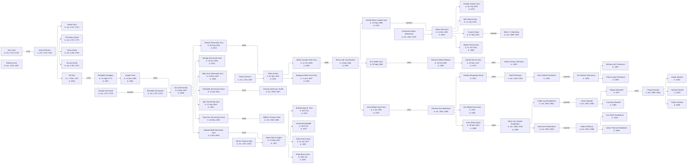

# Soul Family Tree

```mermaid
---
config:
  flowchart:
    defaultRenderer: elk
---
flowchart LR
    %% Part 4. George Simmonds Soul's descendants are reserved for Part 5.
    %% est.: provisional assumptions; c.: age-derived interval.
    %% Parent from child: 15–60; child from parent: 18–40; dated marriage: 16–40.
    %% Children sort by earliest birth year, then latest; ties retain source order.

    1722-1746_john_soul["John Soul<br/>b. est. 1722–1746"]:::person
    1722-1746_mary__palmer["Mary (Palmer)<br/>b. est. 1722–1746"]:::person
    1747-1764_daniel_soul["Daniel Soul<br/>b. est. 1747–1764"]:::person
    1747-1770_christiana__soul["Christiana (Soul)<br/>b. est. 1747–1770"]:::person
    1760-1768_kezia__soul["Kezia (Soul)<br/>b. est. 1760–1768"]:::person
    1762-1763_emma__soul["Emma (Soul)<br/>b. est. 1762–1763"]:::person
    1766-1767_eli_soul["Eli Soul<br/>b. c. 1766–1767<br/>d. 1824"]:::person
    1773_elizabeth__hodges["Elizabeth (Hodges)<br/>b. 10 Sept 1773<br/>d. 1857"]:::person
    %% Founders: 1762-40 to 1762-16. Children: marriage fallbacks capped by baptisms.
    %% Eli: age 57 in 1824 gives 1766–1767; baptism is not a birth date.
    %% Marriage: 8 July 1762, Eastington.
    1722-1746_john_soul ---|1762| 1722-1746_mary__palmer
    1722-1746_mary__palmer --> 1747-1764_daniel_soul & 1747-1770_christiana__soul & 1760-1768_kezia__soul & 1762-1763_emma__soul & 1766-1767_eli_soul
    %% Marriage: 12 Oct 1793, Hanwell.
    1766-1767_eli_soul ---|1793| 1773_elizabeth__hodges

    1805_joseph_soul["Joseph Soul<br/>b. 14 Nov 1805<br/>d. 1881"]:::person
    1807_ann__simmonds["Ann (Simmonds)<br/>b. 6 May 1807<br/>d. 1898"]:::person
    1747-1792_george_simmonds["George Simmonds<br/>b. est. 1747–1792"]:::person
    1747-1792_elizabeth_simmonds["Elizabeth Simmonds<br/>b. est. 1747–1792"]:::person
    %% Ann's parents: 1807-60 to 1807-15. Marriage inferred under user rule:
    %% shared documented surname and explicitly identified parents of Ann.
    1747-1792_george_simmonds ---|married| 1747-1792_elizabeth_simmonds
    1747-1792_elizabeth_simmonds --> 1807_ann__simmonds
    1773_elizabeth__hodges --> 1805_joseph_soul
    %% Marriage: 6 May 1830, St Bride's Fleet Street.
    1805_joseph_soul ---|1830| 1807_ann__simmonds

    1833_joseph_soul["Joseph Simmonds Soul<br/>b. 26 Aug 1833<br/>d. 1913"]:::person
    1836_george_soul["George Simmonds Soul<br/>b. 25 Jan 1836<br/>d. 1921"]:::person
    1837_mary_soul["Mary Ann Simmonds Soul<br/>b. 19 Dec 1837<br/>d. 1840"]:::person
    1841_elizabeth__soul["Elizabeth Simmonds (Soul)<br/>b. 11 Apr 1841"]:::person
    1843_john_soul["John Simmonds Soul<br/>b. 12 Aug 1843<br/>d. 1843"]:::person
    1845_mary__soul["Mary Ann Simmonds (Soul)<br/>b. 16 May 1845"]:::person
    1848_edward_soul["Edward Miall Simmonds Soul<br/>b. 4 Nov 1848"]:::person
    1807_ann__simmonds --> 1833_joseph_soul & 1836_george_soul & 1837_mary_soul & 1841_elizabeth__soul & 1843_john_soul & 1845_mary__soul & 1848_edward_soul

    1822_ellen__hone["Ellen (Hone)<br/>b. 31 Mar 1822<br/>d. 1910"]:::person
    1762-1807_william_hone["William Hone<br/>b. est. 1762–1807"]:::person
    1762-1807_sarah_johnson["Sarah Johnson<br/>b. est. 1762–1807"]:::person
    %% Ellen's parents: 1822-60 to 1822-15. No qualifying marriage evidence;
    %% William is retained unlinked; second-listed Sarah points to Ellen.
    1762-1807_sarah_johnson --> 1822_ellen__hone
    %% Marriage: 23 Jan 1855, Barnsbury Chapel, Islington.
    1833_joseph_soul ---|1855| 1822_ellen__hone
    1855_walter_soul["Walter Joseph Hone Soul<br/>b. 12 Oct 1855<br/>d. 1903"]:::person
    1857_margarita_soul["Margarita Ellen Hone Soul<br/>b. 5 June 1857<br/>d. 1951"]:::person
    1822_ellen__hone --> 1855_walter_soul & 1857_margarita_soul

    1865_rosa__jacobsohn["Rosa Leah (Jacobsohn)<br/>b. 4 May 1865<br/>d. 1915"]:::person
    %% Marriage: 4 Aug 1886, South Africa.
    1855_walter_soul ---|1886| 1865_rosa__jacobsohn
    1886_harold_soul["Harold Moritz Joseph Soul<br/>b. 19 May 1886<br/>d. 1941"]:::person
    1888_eric_soul["Eric Walter Soul<br/>b. 29 Sept 1888"]:::person
    1891_alan_soul["Alan William Hone Soul<br/>b. 4 Jan 1891<br/>d. 1937"]:::person
    %% Harold's 1901 age differs from his explicit birth; explicit birth retained.
    1865_rosa__jacobsohn --> 1886_harold_soul & 1888_eric_soul & 1891_alan_soul

    1891_marie__johnson["Marie (Johnson)<br/>b. 11 Dec 1891<br/>d. 1984"]:::person
    1831-1876_unnamed__ellesfrud["Unnamed mother (Ellesfrud)<br/>b. est. 1831–1876"]:::person
    %% Marie's unnamed mother: 1891-60 to 1891-15; maiden surname documented.
    1831-1876_unnamed__ellesfrud --> 1891_marie__johnson
    1886_harold_soul ---|married| 1891_marie__johnson
    1916_donald_soul["Donald Jocelyn Soul<br/>b. 30 July 1916<br/>d. 1973"]:::person
    1918_alan_soul["Alan Mayne Soul<br/>b. 13 July 1918"]:::person
    1921_yvonne__soul["Yvonne (Soul)<br/>b. 27 May 1921"]:::person
    1921_walter_soul["Walter Forrest Soul<br/>b. 21 Oct 1921<br/>d. 1988"]:::person
    1891_marie__johnson --> 1916_donald_soul & 1918_alan_soul & 1921_yvonne__soul & 1921_walter_soul
    %% Undated marriage: Yvonne 1921 +18/+40 gives 1939–1961;
    %% Milon: 1939-40 to 1961-18 = 1899–1943. No feedback to Yvonne.
    1899-1943_milon_machosky["Milon C. Machosky<br/>b. est. 1899–1943"]:::person
    1921_yvonne__soul ---|married| 1899-1943_milon_machosky

    1897_florence__wilson["Florence Mabel (Wilson)<br/>b. 10 Feb 1897<br/>d. 1982"]:::person
    %% Marriage: 20 Dec 1916.
    1888_eric_soul ---|1916| 1897_florence__wilson
    1917_harold_soul["Harold Vernon Soul<br/>b. 20 Nov 1917<br/>d. 1974"]:::person
    1897_florence__wilson --> 1917_harold_soul
    1926_audrey__johnson["Audrey Tamar (Johnson)<br/>b. 1926"]:::person
    %% Marriage: 1967.
    1917_harold_soul ---|1967| 1926_audrey__johnson

    %% Florence: 1921-40 to 1921-16; children's intervals do not narrow it.
    1881-1905_florence__beeston["Florence Ann (Beeston)<br/>b. est. 1881–1905"]:::person
    %% Marriage: 17 Aug 1921, Queensland.
    1891_alan_soul ---|1921| 1881-1905_florence__beeston
    1922_dorothy__soul["Dorothy Margarita (Soul)<br/>b. 1922"]:::person
    1924_eric_soul["Eric Walter Hone Soul<br/>b. 1924<br/>d. 1926"]:::person
    1925_leah__soul["Leah Emily (Soul)<br/>b. 26 Nov 1925<br/>d. 1996"]:::person
    1881-1905_florence__beeston --> 1922_dorothy__soul & 1924_eric_soul & 1925_leah__soul
    %% Noel: 1950-40 to 1950-16; child's interval does not narrow it.
    1910-1934_noel_pentecost["Noel Pentecost<br/>b. est. 1910–1934"]:::person
    %% Marriage: 1950.
    1922_dorothy__soul ---|1950| 1910-1934_noel_pentecost
    1953_alan_pentecost["Alan Herbert Pentecost<br/>b. 1953"]:::person
    1910-1934_noel_pentecost --> 1953_alan_pentecost
    1954_ann__hormann["Ann Denise (Hormann)<br/>b. 1954"]:::person
    1953_alan_pentecost ---|married| 1954_ann__hormann
    1987_bethany_pentecost["Bethany Ann Pentecost<br/>b. 1987"]:::person
    1989_claire_pentecost["Claire Louise Pentecost<br/>b. 1989"]:::person
    1954_ann__hormann --> 1987_bethany_pentecost & 1989_claire_pentecost

    %% Denis: 1949-40 to 1949-16.
    1909-1933_denis_roobottom["Denis Joy Joseph Roobottom<br/>b. est. 1909–1933<br/>d. 1980"]:::person
    %% Marriage: 1949.
    1925_leah__soul ---|1949| 1909-1933_denis_roobottom
    %% Mother gives 1943–1965; estimated father gives 1927–1973.
    %% Judith's children give 1924–1962; Alan's give 1924–1968.
    %% Final intersections below; do not feed these estimates back into Denis.
    1943-1962_judith__roobottom["Judith Joy (Roobottom)<br/>b. est. 1943–1962"]:::person
    1943-1965_alan_roobottom["Alan Denis Roobottom<br/>b. est. 1943–1965"]:::person
    1909-1933_denis_roobottom --> 1943-1962_judith__roobottom & 1943-1965_alan_roobottom
    %% Owen: intersect 1977-60 to 1977-15 with 1984-60 to 1984-15.
    1924-1962_owen_maxwell["Owen Maxwell<br/>b. est. 1924–1962"]:::person
    1943-1962_judith__roobottom ---|married| 1924-1962_owen_maxwell
    1977_regan__maxwell["Regan (Maxwell)<br/>b. 1977"]:::person
    1984_courtney_maxwell["Courtney Maxwell<br/>b. 1984"]:::person
    1924-1962_owen_maxwell --> 1977_regan__maxwell & 1984_courtney_maxwell
    %% Fergus: 2000-40 to 2000-16; children's intervals do not narrow it.
    1960-1984_fergus_mackie["Fergus Mackie<br/>b. est. 1960–1984"]:::person
    %% Marriage: 2000.
    1977_regan__maxwell ---|2000| 1960-1984_fergus_mackie
    2002_jordan_mackie["Jordan Mackie<br/>b. 2002"]:::person
    2004_hudson_mackie["Hudson Mackie<br/>b. 2004"]:::person
    2006_peyton_mackie["Peyton Mackie<br/>b. 2006"]:::person
    1960-1984_fergus_mackie --> 2002_jordan_mackie & 2004_hudson_mackie & 2006_peyton_mackie
    %% Helen: intersect 1983-60 to 1983-15 with 1984-60 to 1984-15.
    1924-1968_helen__perkins["Helen (Perkins)<br/>b. est. 1924–1968"]:::person
    1943-1965_alan_roobottom ---|married| 1924-1968_helen__perkins
    1983_kris_roobottom["Kris Denis Roobottom<br/>b. 1983"]:::person
    1984_adam_roobottom["Adam Thomas Roobottom<br/>b. 1984"]:::person
    1924-1968_helen__perkins --> 1983_kris_roobottom & 1984_adam_roobottom

    %% Other children of Joseph and Ann; external linked descendants not supplied.
    1833-1857_thomas_smith["Thomas Dickerson Smith<br/>b. est. 1833–1857"]:::person
    %% Marriage: 1873, Hackney; estimate 1873-40 to 1873-16.
    1841_elizabeth__soul ---|1873| 1833-1857_thomas_smith
    1840-1864_william_giles["William Thomas Giles<br/>b. est. 1840–1864"]:::person
    %% Marriage: 6 May 1880; estimate 1880-40 to 1880-16.
    %% Source =2 retained unassigned; remarriage may mean an older birth.
    1845_mary__soul ---|1880| 1840-1864_william_giles

    1847_naomi__ager["Naomi Bruce (Ager)<br/>b. 31 May 1847<br/>d. 1927"]:::person
    1787-1832_james_ager["James Thomas Ager<br/>b. est. 1787–1832"]:::person
    %% James: 1847-60 to 1847-15.
    1787-1832_james_ager --> 1847_naomi__ager
    %% Marriage: 6 March 1873, St Mark's Clerkenwell.
    1848_edward_soul ---|1873| 1847_naomi__ager
    1874_edward_soul["Edward Ager B. Soul<br/>b. 1874 Q1<br/>d. 1875"]:::person
    1875_unnamed_soul["Unnamed daughter<br/>b. 1875 Q1<br/>d. 1875"]:::person
    1877_arthur_soul["Arthur Bruce Soul<br/>b. 24 Jan 1877<br/>d. 1887"]:::person
    1887_philip_soul["Philip Bruce Soul<br/>b. 1887 Q4<br/>d. 1887"]:::person
    1847_naomi__ager --> 1874_edward_soul & 1875_unnamed_soul & 1877_arthur_soul & 1887_philip_soul

    classDef person stroke:#666666;
    linkStyle default stroke:#555
```
