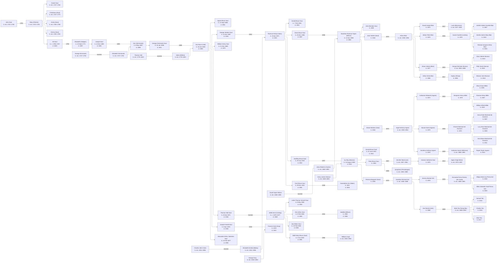

# Soul Family Tree

```mermaid
---
config:
  flowchart:
    defaultRenderer: elk
---
flowchart LR
    %% PART 5: George Simmonds Soul's complete source-listed branch.
    %% est. = provisional assumption-based interval; c. = age-derived interval.
    %% Parent from child: ages 15–60; child from parent: ages 18–40.
    %% Dated marriage fallback: M-40 to M-16. No circular estimates.
    %% Children sort by earliest birth year, then latest; ties retain source order.

    1722-1746_john_soul["John Soul<br/>b. est. 1722–1746"]:::person
    1722-1746_mary__palmer["Mary (Palmer)<br/>b. est. 1722–1746"]:::person
    1747-1764_daniel_soul["Daniel Soul<br/>b. est. 1747–1764"]:::person
    1747-1770_christiana__soul["Christiana (Soul)<br/>b. est. 1747–1770"]:::person
    1760-1768_kezia__soul["Kezia (Soul)<br/>b. est. 1760–1768"]:::person
    1762-1763_emma__soul["Emma (Soul)<br/>b. est. 1762–1763"]:::person
    1766-1767_eli_soul["Eli Soul<br/>b. c. 1766–1767<br/>d. 1824"]:::person
    1773_elizabeth__hodges["Elizabeth (Hodges)<br/>b. 10 Sept 1773<br/>d. 1857"]:::person
    %% Founders: 1762-40 to 1762-16; children's marriage fallbacks capped by baptisms.
    %% Eli: age 57 in 1824 gives 1766–1767; baptisms are not birth dates.
    %% Marriage: 8 July 1762, Eastington.
    1722-1746_john_soul ---|1762| 1722-1746_mary__palmer
    1722-1746_mary__palmer --> 1747-1764_daniel_soul & 1747-1770_christiana__soul & 1760-1768_kezia__soul & 1762-1763_emma__soul & 1766-1767_eli_soul
    %% Marriage: 12 Oct 1793, Hanwell.
    1766-1767_eli_soul ---|1793| 1773_elizabeth__hodges

    1805_joseph_soul["Joseph Soul<br/>b. 14 Nov 1805<br/>d. 1881"]:::person
    1807_ann__simmonds["Ann (Simmonds)<br/>b. 6 May 1807<br/>d. 1898"]:::person
    1747-1792_george_simmonds["George Simmonds<br/>b. est. 1747–1792"]:::person
    1747-1792_elizabeth_simmonds["Elizabeth Simmonds<br/>b. est. 1747–1792"]:::person
    %% Ann's parents: 1807-60 to 1807-15.
    %% User-authorised inferred marriage: shared surname and named parents of Ann.
    1747-1792_george_simmonds ---|married| 1747-1792_elizabeth_simmonds
    1747-1792_elizabeth_simmonds --> 1807_ann__simmonds
    1773_elizabeth__hodges --> 1805_joseph_soul
    %% Marriage: 6 May 1830, St Bride's Fleet Street.
    1805_joseph_soul ---|1830| 1807_ann__simmonds

    1836_george_soul["George Simmonds Soul<br/>b. 25 Jan 1836<br/>d. 1921"]:::person
    1838_ann__holt["Ann Bruce (Holt)<br/>b. 18 Jan 1838<br/>d. 1900"]:::person
    1807_ann__simmonds --> 1836_george_soul
    1778-1823_thomas_holt["Thomas Holt<br/>b. est. 1778–1823"]:::person
    1778-1823_helen__britten["Helen (Britten)<br/>b. est. 1778–1823"]:::person
    %% Ann's parents: 1838-60 to 1838-15.
    %% User-authorised inferred marriage: named parents and shared documented Holt surname.
    1778-1823_thomas_holt ---|married| 1778-1823_helen__britten
    1778-1823_helen__britten --> 1838_ann__holt
    %% Marriage: 9 Nov 1865, Barnsbury Chapel, Islington.
    1836_george_soul ---|1865| 1838_ann__holt

    1866_agnes_soul["Agnes Bruce Soul<br/>b. 11 Sept 1866<br/>d. 1951"]:::person
    1867_george_soul["George Herbert Soul<br/>b. 12 Dec 1867<br/>d. 1944"]:::person
    1869_william_soul["William Henry Soul<br/>b. 21 Dec 1869<br/>d. 1872"]:::person
    1871_thomas_soul["Thomas Holt Soul<br/>b. 20 Apr 1871<br/>d. 1946"]:::person
    1876_joseph_soul["Joseph Harold Soul<br/>b. 5 Apr 1876<br/>d. 1945"]:::person
    1877_alexander_soul["Alexander Arthur Valentine Soul<br/>b. 14 Feb 1877<br/>d. 1950"]:::person
    1838_ann__holt --> 1866_agnes_soul & 1867_george_soul & 1869_william_soul & 1871_thomas_soul & 1876_joseph_soul & 1877_alexander_soul

    1871_florence__coles["Florence Emily (Coles)<br/>b. 15 Apr 1871<br/>d. 1921"]:::person
    1811-1856_charles_coles["Charles John Coles<br/>b. est. 1811–1856"]:::person
    1811-1856_elizabeth__bailey["Elizabeth Amelia (Bailey)<br/>b. est. 1811–1856"]:::person
    %% Florence's parents: 1871-60 to 1871-15.
    %% User-authorised inferred marriage: named parents and shared documented Coles surname.
    1811-1856_charles_coles ---|married| 1811-1856_elizabeth__bailey
    1811-1856_elizabeth__bailey --> 1871_florence__coles
    %% Marriage: 5 June 1902, St George's Tufnell Park.
    1867_george_soul ---|1902| 1871_florence__coles
    1904_gerald_soul["Gerald Bruce Soul<br/>b. 7 Feb 1904<br/>d. 1904"]:::person
    1906_denis_soul["Denis Bruce Soul<br/>b. 25 Dec 1906<br/>d. 1997"]:::person
    1910_geoffrey_soul["Geoffrey Bruce Soul<br/>b. 29 July 1910<br/>d. 2002"]:::person
    1911_cecil_soul["Cecil Bruce Soul<br/>b. 29 Dec 1911<br/>d. 1991"]:::person
    1871_florence__coles --> 1904_gerald_soul & 1906_denis_soul & 1910_geoffrey_soul & 1911_cecil_soul

    1908_dorothea__wilson["Dorothea Florence Taylor (Wilson)<br/>b. 11 Nov 1908<br/>d. 1983"]:::person
    1848-1893_david_wilson["David Taylor Wilson<br/>b. est. 1848–1893"]:::person
    1848-1893_lilias__cockin["Lilias Roberts (Cockin)<br/>b. est. 1848–1893"]:::person
    %% Dorothea's parents: 1908-60 to 1908-15.
    %% User-authorised inferred marriage: named parents and shared documented Wilson surname.
    1848-1893_david_wilson ---|married| 1848-1893_lilias__cockin
    1848-1893_lilias__cockin --> 1908_dorothea__wilson
    %% Marriage: 23 July 1938, St Lawrence's Bidborough.
    1906_denis_soul ---|1938| 1908_dorothea__wilson
    1939_john_soul["John Brendan Soul<br/>b. 1939"]:::person
    1946_joan__soul["Joan Valerie (Soul)<br/>b. 1946"]:::person
    1946_elaine__soul["Elaine Barbara (Soul)<br/>b. 1946"]:::person
    %% Joan and Elaine are twins; source order breaks the equal-year tie.
    1908_dorothea__wilson --> 1939_john_soul & 1946_joan__soul & 1946_elaine__soul

    %% Arthur: marriage 1970 gives 1930–1954; children's births do not narrow it.
    1930-1954_arthur_blair["Arthur Blair<br/>b. est. 1930–1954"]:::person
    %% Marriage: 1970, St Wilfrid's Bognor Regis.
    1946_joan__soul ---|1970| 1930-1954_arthur_blair
    1973_david_blair["David Joseph Blair<br/>b. 1973"]:::person
    1975_adrian_blair["Adrian Peter Blair<br/>b. 1975"]:::person
    1977_alison__blair["Alison Valerie (Blair)<br/>b. 1977"]:::person
    1985_arthur_blair["Arthur Denis Blair<br/>b. 1985"]:::person
    1930-1954_arthur_blair --> 1973_david_blair & 1975_adrian_blair & 1977_alison__blair & 1985_arthur_blair
    %% Lucie: 2017-40 to 2017-16.
    1977-2001_lucie__beranova["Lucie (Beranova)<br/>b. est. 1977–2001"]:::person
    %% Marriage: 2017, Prague.
    1973_david_blair ---|2017| 1977-2001_lucie__beranova
    1975_aurore__leclerq["Aurore Suzette (Leclerq)<br/>b. 1975"]:::person
    %% Marriage: 2006, Antibes and St-Jean-Cap-Ferrat.
    1975_adrian_blair ---|2006| 1975_aurore__leclerq
    2007_juliette_blair["Juliette Valerie Suzette Blair<br/>b. 2007"]:::person
    2010_amelie_blair["Amelie Janine Mary Blair<br/>b. 2010"]:::person
    2015_richard_blair["Richard Jacques Arthur Blair<br/>b. 2015"]:::person
    1975_aurore__leclerq --> 2007_juliette_blair & 2010_amelie_blair & 2015_richard_blair
    %% George: marriage 2004 gives 1964–1988; children's births do not narrow it.
    1964-1988_george_munson["George Nicholas Munson<br/>b. est. 1964–1988"]:::person
    %% Marriage: 2004, Hawkwell House Hotel, Iffley.
    1977_alison__blair ---|2004| 1964-1988_george_munson
    2013_clara_munson["Clara Valerie Munson<br/>b. 2013"]:::person
    2015_polly_munson["Polly Sarah Munson<br/>b. 2015"]:::person
    2018_eleanor_munson["Eleanor Jane Munson<br/>b. 2018"]:::person
    1964-1988_george_munson --> 2013_clara_munson & 2015_polly_munson & 2018_eleanor_munson
    1985_hayley__sharp["Hayley (Sharp)<br/>b. 1985"]:::person
    %% Marriage: 2017, Bath.
    1985_arthur_blair ---|2017| 1985_hayley__sharp

    %% Nigel: marriage 1970 gives 1930–1954; children's births do not narrow it.
    1930-1954_nigel_ingram["Nigel Anthony Ingram<br/>b. est. 1930–1954"]:::person
    %% Marriage: 1970, St Wilfrid's Bognor Regis.
    1946_elaine__soul ---|1970| 1930-1954_nigel_ingram
    1972_katharine__ingram["Katharine Deborah (Ingram)<br/>b. 1972"]:::person
    1975_nicola__ingram["Nicola Claire (Ingram)<br/>b. 1975"]:::person
    1976_jonathan_ingram["Jonathan Anthony Ingram<br/>b. 1976"]:::person
    1930-1954_nigel_ingram --> 1972_katharine__ingram & 1975_nicola__ingram & 1976_jonathan_ingram
    1972_benjamin_miller["Benjamin Henry Miller<br/>b. 1972"]:::person
    %% Marriage: 2004, Christchurch Portswood, Highfield Church, Southampton.
    1972_katharine__ingram ---|2004| 1972_benjamin_miller
    2005_olivia_miller["Olivia Grace Miller<br/>b. 2005"]:::person
    2007_florence_miller["Florence Mary Miller<br/>b. 2007"]:::person
    2010_william_miller["William Alfred Miller<br/>b. 2010"]:::person
    1972_benjamin_miller --> 2005_olivia_miller & 2007_florence_miller & 2010_william_miller
    1972_vincent_macharddegramont["Vincent Machard de Gramont<br/>b. 1972"]:::person
    %% Marriage: 2006, Christchurch Portswood, Highfield Church, Southampton.
    1975_nicola__ingram ---|2006| 1972_vincent_macharddegramont
    2007_anna_macharddegramont["Anna Claire Machard de Gramont<br/>b. 2007"]:::person
    2009_lucy_macharddegramont["Lucy Alice Machard de Gramont<br/>b. 2009"]:::person
    2011_ines_macharddegramont["Ines Eloise Machard de Gramont<br/>b. 2011"]:::person
    1972_vincent_macharddegramont --> 2007_anna_macharddegramont & 2009_lucy_macharddegramont & 2011_ines_macharddegramont
    %% Katherine: marriage 2009 gives 1969–1993; child's birth does not narrow it.
    1969-1993_katherine__wileman["Katherine Sarah (Wileman)<br/>b. est. 1969–1993"]:::person
    %% Marriage: 2009, St Mary-le-Bow, Cheapside.
    1976_jonathan_ingram ---|2009| 1969-1993_katherine__wileman
    2012_rupert_ingram["Rupert Taylor Ingram<br/>b. 2012"]:::person
    1969-1993_katherine__wileman --> 2012_rupert_ingram

    1908_ivy__marson["Ivy May (Marson)<br/>b. 14 August 1908<br/>d. 2015"]:::person
    %% Henry: 1908-60 to 1908-15; deceased by marriage, no death year supplied.
    1848-1893_henry_marson["Henry James Marson<br/>b. est. 1848–1893"]:::person
    1848-1893_henry_marson --> 1908_ivy__marson
    %% Marriage: 29 May 1937, St George's Tufnell Park.
    1910_geoffrey_soul ---|1937| 1908_ivy__marson
    1942_gerald_soul["Gerald Bruce Soul<br/>b. 22 June 1942<br/>d. 1942"]:::person
    1943_peter_soul["Peter Bruce Soul<br/>b. 1943"]:::person
    1946_petrena__soul["Petrena Margaret (Soul)<br/>b. 1946"]:::person
    1908_ivy__marson --> 1942_gerald_soul & 1943_peter_soul & 1946_petrena__soul
    %% Jennifer: 1967-40 to 1967-16; child's birth does not narrow it.
    1927-1951_jennifer__lee["Jennifer Ward (Lee)<br/>b. est. 1927–1951"]:::person
    %% Josephine: 1985-40 to 1985-16.
    1945-1969_josephine__prendergast["Josephine (Prendergast)<br/>b. est. 1945–1969"]:::person
    %% Peter's marriage 1: 1967, St Francis' Welwyn Garden City.
    1943_peter_soul ---|1967| 1927-1951_jennifer__lee
    %% Peter's marriage 2: 1985, Reading Register Office.
    1943_peter_soul ---|1985| 1945-1969_josephine__prendergast
    1975_victoria_soul["Victoria Catherine Soul<br/>b. 1975"]:::person
    1927-1951_jennifer__lee --> 1975_victoria_soul
    %% Jagtar: 2013-40 to 2013-16.
    1973-1997_jagtar_behal["Jagtar Singh Behal<br/>b. est. 1973–1997"]:::person
    %% Marriage: 2013, Islington Register Office and Buckland Hall; divorced 2021.
    1975_victoria_soul ---|2013| 1973-1997_jagtar_behal

    %% Jonathan: marriage 1975 gives 1935–1959; children's births do not narrow it.
    1935-1959_jonathan_ash["Jonathan Richard Ash<br/>b. est. 1935–1959"]:::person
    %% Marriage: 1975, St Mary the Virgin, Littlehampton.
    1946_petrena__soul ---|1975| 1935-1959_jonathan_ash
    1978_jeremy_ash["Jeremy Alastair Ash<br/>b. 1978"]:::person
    1980_zoe__ash["Zoe Rachel (Ash)<br/>b. 1980"]:::person
    1935-1959_jonathan_ash --> 1978_jeremy_ash & 1980_zoe__ash
    %% Fernanda: marriage 2009 gives 1969–1993; children's births do not narrow it.
    1969-1993_fernanda__decosta["Fernanda Perna Pereira (de Costa)<br/>b. est. 1969–1993"]:::person
    %% Marriage: 2009, Bath Register Office and Ogeu-Les-Bains, France.
    1978_jeremy_ash ---|2009| 1969-1993_fernanda__decosta
    2018_allegra_perna-ash["Allegra Maria Ivy Perna-Ash<br/>b. 2018"]:::person
    2020_miles_perna-ash["Miles Salvador Gael Perna-Ash<br/>b. 2020"]:::person
    1969-1993_fernanda__decosta --> 2018_allegra_perna-ash & 2020_miles_perna-ash
    %% Mark: marriage 2009 gives 1969–1993; children's births do not narrow it.
    1969-1993_mark_teo["Mark Teo Teong Wey<br/>b. est. 1969–1993"]:::person
    %% Marriage: 2009, St George's Leeds.
    1980_zoe__ash ---|2009| 1969-1993_mark_teo
    2013_samuel_teo["Samuel Teo<br/>b. 2013"]:::person
    2015_charles_teo["Charles Teo<br/>b. 2015"]:::person
    2017_alice_teo["Alice Teo<br/>b. 2017"]:::person
    1969-1993_mark_teo --> 2013_samuel_teo & 2015_charles_teo & 2017_alice_teo

    1921_gwendoline__slater["Gwendoline Iris (Slater)<br/>b. 1921<br/>d. 2004"]:::person
    %% Marriage: 19 Dec 1948, Christ Church, Vale Square, Ramsgate.
    1911_cecil_soul ---|1948| 1921_gwendoline__slater

    %% Edith: age 24 in 1901 gives 1876–1877; direct age evidence takes priority.
    1876-1877_edith__cutting["Edith Anne (Cutting)<br/>b. c. 1876–1877<br/>d. 1948"]:::person
    1871_thomas_soul ---|married| 1876-1877_edith__cutting
    1902_leslie_soul["Leslie Thomas Vennell Soul<br/>b. 6 May 1902<br/>d. 1940"]:::person
    1905_eric_soul["Eric Arthur Soul<br/>b. 8 Feb 1905<br/>d. 1982"]:::person
    1908_veo_soul["Veo Eileen Soul<br/>b. 19 Feb 1908<br/>d. 2006"]:::person
    1919_edith__soul["Edith Mary Bruce (Soul)<br/>b. 3 Oct 1919<br/>d. 1991"]:::person
    1876-1877_edith__cutting --> 1902_leslie_soul & 1905_eric_soul & 1908_veo_soul & 1919_edith__soul
    1900_isabella__wilson["Isabella (Wilson)<br/>b. 1900<br/>d. 1956"]:::person
    %% Marriage: 1934, Edmonton.
    1905_eric_soul ---|1934| 1900_isabella__wilson
    %% William: 1966-40 to 1966-16.
    1926-1950_william_lloyd["William Lloyd<br/>b. est. 1926–1950"]:::person
    %% Marriage: 1966.
    1919_edith__soul ---|1966| 1926-1950_william_lloyd

    1878_frances__gray["Frances Kate (Gray)<br/>b. 1878<br/>d. 1922"]:::person
    %% George: 1878-60 to 1878-15; deceased by marriage, no death year supplied.
    1818-1863_george_gray["George Gray<br/>b. est. 1818–1863"]:::person
    1818-1863_george_gray --> 1878_frances__gray
    %% Marriage: 27 Apr 1918, St James Street Chapel, Newport, Isle of Wight.
    %% Frances's recorded marriage age differs from her explicit birth year; retain birth.
    1876_joseph_soul ---|1918| 1878_frances__gray

    classDef person stroke:#666666;
    linkStyle default stroke:#555
```
