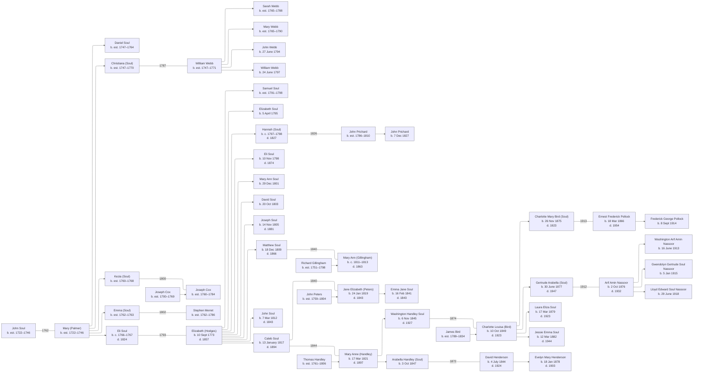

# Soul Family Tree

```mermaid
---
config:
  flowchart:
    defaultRenderer: elk
---
flowchart LR
    %% PART 6: remaining founding-family branches and Eli and Elizabeth's children.
    %% Daniel, Eli born 1798, and Joseph born 1805 are collapsed references.
    %% est. = provisional assumptions; c. = age-derived interval.
    %% Parent from child: ages 15–60; child from parent: ages 18–40.
    %% Dated-marriage fallback: M-40 to M-16. No circular estimates.
    %% Children sort by earliest birth year, then latest; ties retain source order.

    1722-1746_john_soul["John Soul<br/>b. est. 1722–1746"]:::person
    1722-1746_mary__palmer["Mary (Palmer)<br/>b. est. 1722–1746"]:::person
    1747-1764_daniel_soul["Daniel Soul<br/>b. est. 1747–1764"]:::person
    1747-1770_christiana__soul["Christiana (Soul)<br/>b. est. 1747–1770"]:::person
    1760-1768_kezia__soul["Kezia (Soul)<br/>b. est. 1760–1768"]:::person
    1762-1763_emma__soul["Emma (Soul)<br/>b. est. 1762–1763"]:::person
    1766-1767_eli_soul["Eli Soul<br/>b. c. 1766–1767<br/>d. 1824"]:::person
    %% Founders: marriage 1762 gives 1722–1746. Children's marriage fallbacks
    %% are capped by baptism years; baptisms are not births.
    %% Eli: age 57 in 1824 gives 1766–1767; baptised 4 May 1766.
    %% Marriage: 8 July 1762, Eastington.
    1722-1746_john_soul ---|1762| 1722-1746_mary__palmer
    1722-1746_mary__palmer --> 1747-1764_daniel_soul
    1722-1746_mary__palmer --> 1747-1770_christiana__soul
    1722-1746_mary__palmer --> 1760-1768_kezia__soul
    1722-1746_mary__palmer --> 1762-1763_emma__soul
    1722-1746_mary__palmer --> 1766-1767_eli_soul

    %% CHRISTIANA AND THE CORRECTED WEBB BRANCH
    %% William: marriage 1787 gives 1747–1771; sons' births do not narrow it.
    1747-1771_william_webb["William Webb<br/>b. est. 1747–1771"]:::person
    %% Marriage: 19 July 1787, Stonehouse.
    1747-1770_christiana__soul ---|1787| 1747-1771_william_webb
    %% Sarah and Mary depend on both parents' provisional intervals:
    %% Christiana +18/+40 gives 1765–1810; William gives 1765–1811.
    %% Intersection capped by baptisms: Sarah 24 July 1788; Mary 20 Sept 1790.
    %% Do not feed these dependent estimates back into the parents.
    1765-1788_sarah_webb["Sarah Webb<br/>b. est. 1765–1788"]:::person
    1765-1790_mary_webb["Mary Webb<br/>b. est. 1765–1790"]:::person
    1794_john_webb["John Webb<br/>b. 27 June 1794"]:::person
    1797_william_webb["William Webb<br/>b. 24 June 1797"]:::person
    1747-1771_william_webb --> 1765-1788_sarah_webb
    1747-1771_william_webb --> 1765-1790_mary_webb
    1747-1771_william_webb --> 1794_john_webb
    1747-1771_william_webb --> 1797_william_webb

    %% KEZIA AND JOSEPH COX
    %% Joseph: marriage 1800 gives 1760–1784. He was a widower and may
    %% have been older than the fallback assumption; earlier marriage undated.
    1760-1784_joseph_cox["Joseph Cox<br/>b. est. 1760–1784"]:::person
    %% Father depends on son's estimated interval: 1760-60 to 1784-15.
    1700-1769_joseph_cox["Joseph Cox<br/>b. est. 1700–1769"]:::person
    1700-1769_joseph_cox --> 1760-1784_joseph_cox
    %% Marriage: 17 April 1800, Stroud.
    1760-1768_kezia__soul ---|1800| 1760-1784_joseph_cox

    %% EMMA AND STEPHEN MERRET
    %% Stephen: marriage 1802 gives 1762–1786.
    1762-1786_stephen_merret["Stephen Merret<br/>b. est. 1762–1786"]:::person
    %% Marriage: 10 Dec 1802, Stonehouse.
    1762-1763_emma__soul ---|1802| 1762-1786_stephen_merret

    %% ELI AND ELIZABETH: ALL TEN CHILDREN, WITH PREVIOUS BRANCHES COLLAPSED
    1773_elizabeth__hodges["Elizabeth (Hodges)<br/>b. 10 Sept 1773<br/>d. 1857"]:::person
    %% Marriage: 12 Oct 1793, Hanwell.
    1766-1767_eli_soul ---|1793| 1773_elizabeth__hodges
    %% Samuel: mother gives 1791–1813; father gives 1784–1807.
    %% Letter dated 11 Feb 1798 establishes he was already alive: 1791–1798.
    1791-1798_samuel_soul["Samuel Soul<br/>b. est. 1791–1798"]:::person
    1795_elizabeth_soul["Elizabeth Soul<br/>b. 5 April 1795"]:::person
    %% Hannah: age 29 at death in 1827 gives 1797–1798.
    1797-1798_hannah__soul["Hannah (Soul)<br/>b. c. 1797–1798<br/>d. 1827"]:::person
    1798_eli_soul["Eli Soul<br/>b. 10 Nov 1798<br/>d. 1874"]:::person
    1801_mary_soul["Mary Ann Soul<br/>b. 29 Dec 1801"]:::person
    1803_david_soul["David Soul<br/>b. 20 Oct 1803"]:::person
    1805_joseph_soul["Joseph Soul<br/>b. 14 Nov 1805<br/>d. 1881"]:::person
    1809_matthew_soul["Matthew Soul<br/>b. 18 Dec 1809<br/>d. 1866"]:::person
    1812_john_soul["John Soul<br/>b. 7 Mar 1812<br/>d. 1843"]:::person
    1817_caleb_soul["Caleb Soul<br/>b. 13 January 1817<br/>d. 1894"]:::person
    1773_elizabeth__hodges --> 1791-1798_samuel_soul
    1773_elizabeth__hodges --> 1795_elizabeth_soul
    1773_elizabeth__hodges --> 1797-1798_hannah__soul
    1773_elizabeth__hodges --> 1798_eli_soul
    1773_elizabeth__hodges --> 1801_mary_soul
    1773_elizabeth__hodges --> 1803_david_soul
    1773_elizabeth__hodges --> 1805_joseph_soul
    1773_elizabeth__hodges --> 1809_matthew_soul
    1773_elizabeth__hodges --> 1812_john_soul
    1773_elizabeth__hodges --> 1817_caleb_soul

    %% HANNAH AND JOHN PRICHARD
    %% John: marriage 1826 gives 1786–1810; son's birth does not narrow it.
    1786-1810_john_prichard["John Prichard<br/>b. est. 1786–1810"]:::person
    %% Marriage: 1 Oct 1826, St Giles-without-Cripplegate.
    1797-1798_hannah__soul ---|1826| 1786-1810_john_prichard
    1827_john_prichard["John Prichard<br/>b. 7 Dec 1827"]:::person
    1786-1810_john_prichard --> 1827_john_prichard

    %% MATTHEW AND MARY ANN GILLINGHAM
    %% Mary: age 49 in 1861 gives 1811–1812; age 50 in 1863 gives 1812–1813.
    %% Retain covering interval 1811–1813, not an intersection.
    1811-1813_mary__gillingham["Mary Ann (Gillingham)<br/>b. c. 1811–1813<br/>d. 1863"]:::person
    %% Richard: daughter's interval minus 60 to minus 15.
    1751-1798_richard_gillingham["Richard Gillingham<br/>b. est. 1751–1798"]:::person
    1751-1798_richard_gillingham --> 1811-1813_mary__gillingham
    %% Marriage: 1 March 1840, Shoreditch Register Office.
    1809_matthew_soul ---|1840| 1811-1813_mary__gillingham

    %% CALEB: TWO MARRIAGES
    1819_jane__peters["Jane Elizabeth (Peters)<br/>b. 24 Jan 1819<br/>d. 1843"]:::person
    %% Death entry says 20 June 1843; inscription says 21 June 1843.
    %% Both support death year 1843; inscription supplies explicit birth date.
    %% John Peters: 1819-60 to 1819-15.
    1759-1804_john_peters["John Peters<br/>b. est. 1759–1804"]:::person
    1759-1804_john_peters --> 1819_jane__peters
    %% Marriage 1: 15 March 1840, St Mary's Haggerston.
    1817_caleb_soul ---|1840| 1819_jane__peters
    1841_emma_soul["Emma Jane Soul<br/>b. 16 Feb 1841<br/>d. 1843"]:::person
    1819_jane__peters --> 1841_emma_soul

    1821_mary__handley["Mary Anne (Handley)<br/>b. 17 Mar 1821<br/>d. 1897"]:::person
    %% Thomas Handley: 1821-60 to 1821-15.
    1761-1806_thomas_handley["Thomas Handley<br/>b. est. 1761–1806"]:::person
    1761-1806_thomas_handley --> 1821_mary__handley
    %% Marriage 2: 13 Aug 1844, Islington Register Office; Caleb was a widower.
    1817_caleb_soul ---|1844| 1821_mary__handley
    1845_washington_soul["Washington Handley Soul<br/>b. 6 Nov 1845<br/>d. 1927"]:::person
    1847_arabella__soul["Arabella Handley (Soul)<br/>b. 3 Oct 1847"]:::person
    1821_mary__handley --> 1845_washington_soul
    1821_mary__handley --> 1847_arabella__soul

    %% WASHINGTON HANDLEY SOUL
    1849_charlotte__bird["Charlotte Louisa (Bird)<br/>b. 10 Oct 1849<br/>d. 1923"]:::person
    %% James Bird: 1849-60 to 1849-15.
    1789-1834_james_bird["James Bird<br/>b. est. 1789–1834"]:::person
    1789-1834_james_bird --> 1849_charlotte__bird
    %% Marriage: 31 Dec 1874, St Barnabas' Sydney.
    1845_washington_soul ---|1874| 1849_charlotte__bird
    1875_charlotte__soul["Charlotte Mary Bird (Soul)<br/>b. 26 Nov 1875<br/>d. 1923"]:::person
    1877_gertrude__soul["Gertrude Arabella (Soul)<br/>b. 30 June 1877<br/>d. 1947"]:::person
    1879_laura_soul["Laura Eliza Soul<br/>b. 17 Mar 1879<br/>d. 1923"]:::person
    1882_jessie_soul["Jessie Emma Soul<br/>b. 12 Mar 1882<br/>d. 1944"]:::person
    1849_charlotte__bird --> 1875_charlotte__soul
    1849_charlotte__bird --> 1877_gertrude__soul
    1849_charlotte__bird --> 1879_laura_soul
    1849_charlotte__bird --> 1882_jessie_soul

    1866_ernest_pollock["Ernest Frederick Pollock<br/>b. 18 Mar 1866<br/>d. 1954"]:::person
    %% Marriage: 8 Nov 1913.
    1875_charlotte__soul ---|1913| 1866_ernest_pollock
    1914_frederick_pollock["Frederick George Pollock<br/>b. 8 Sept 1914"]:::person
    1866_ernest_pollock --> 1914_frederick_pollock

    1876_arif_nassoor["Arif Amin Nassoor<br/>b. 2 Oct 1876<br/>d. 1932"]:::person
    %% Marriage: 5 June 1912.
    1877_gertrude__soul ---|1912| 1876_arif_nassoor
    1913_washington_nassoor["Washington Arif Amin Nassoor<br/>b. 16 June 1913"]:::person
    1915_gwendolyn_nassoor["Gwendolyn Gertrude Soul Nassoor<br/>b. 5 Jan 1915"]:::person
    1918_lloyd_nassoor["Lloyd Edward Soul Nassoor<br/>b. 29 June 1918"]:::person
    1876_arif_nassoor --> 1913_washington_nassoor
    1876_arif_nassoor --> 1915_gwendolyn_nassoor
    1876_arif_nassoor --> 1918_lloyd_nassoor

    %% ARABELLA HANDLEY SOUL
    1844_david_henderson["David Henderson<br/>b. 4 July 1844<br/>d. 1924"]:::person
    %% Marriage: 7 Sept 1872.
    1847_arabella__soul ---|1872| 1844_david_henderson
    1878_evelyn_henderson["Evelyn Mary Henderson<br/>b. 18 Jan 1878<br/>d. 1903"]:::person
    1844_david_henderson --> 1878_evelyn_henderson

    classDef person stroke:#666666;
    linkStyle default stroke:#555
```
