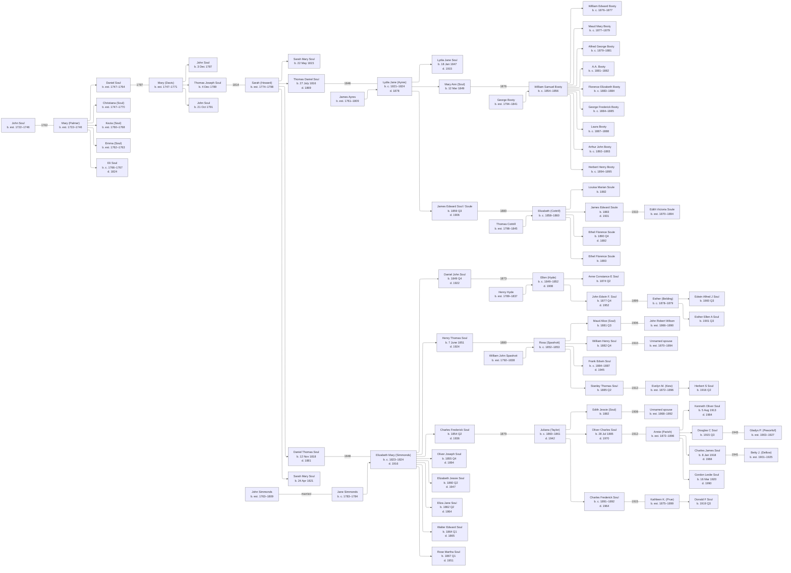

# Soul Family Tree

```mermaid
---
config:
  flowchart:
    defaultRenderer: elk
---
flowchart LR
    %% PART 1: root family and Daniel Soul's source-listed descendants.
    %% Children are declared and linked by ascending birth year.
    %% For intervals, sort by earliest year, then latest year; retain source order for ties.
    %% This is presentation order, not proof of birth order when intervals overlap.
    %% est. = provisional assumption-based interval; c. = age-derived interval.
    %% Parent from child: ages 15–60; child from parent: ages 18–40.
    %% Marriage fallback: ages 16–40. Baptisms are not birth dates.

    %% ROOT FAMILY
    %% Root marriage 1762 gives each founder 1722–1746.
    1722-1746_john_soul["John Soul<br/>b. est. 1722–1746"]:::person
    1722-1746_mary__palmer["Mary (Palmer)<br/>b. est. 1722–1746"]:::person
    %% Daniel: marriage 1787 gives 1747–1771; baptism caps at 1764.
    1747-1764_daniel_soul["Daniel Soul<br/>b. est. 1747–1764"]:::person
    %% Christiana: marriage 1787 gives 1747–1771; baptism caps at 1770.
    1747-1770_christiana__soul["Christiana (Soul)<br/>b. est. 1747–1770"]:::person
    %% Kezia: marriage 1800 gives 1760–1784; baptism caps at 1768.
    1760-1768_kezia__soul["Kezia (Soul)<br/>b. est. 1760–1768"]:::person
    %% Emma: marriage 1802 gives 1762–1786; baptism caps at 1763.
    1762-1763_emma__soul["Emma (Soul)<br/>b. est. 1762–1763"]:::person
    %% Eli: age 57 in 1824 gives 1766–1767; baptism recorded 4 May 1766.
    1766-1767_eli_soul["Eli Soul<br/>b. c. 1766–1767<br/>d. 1824"]:::person
    %% Marriage: 8 July 1762, Eastington.
    1722-1746_john_soul ---|1762| 1722-1746_mary__palmer
    1722-1746_mary__palmer --> 1747-1764_daniel_soul
    1722-1746_mary__palmer --> 1747-1770_christiana__soul
    1722-1746_mary__palmer --> 1760-1768_kezia__soul
    1722-1746_mary__palmer --> 1762-1763_emma__soul
    1722-1746_mary__palmer --> 1766-1767_eli_soul

    %% DANIEL SOUL AND MARY DAVIS
    %% Mary: marriage 1787 gives 1747–1771; children's births do not narrow it.
    %% Mary was a widow and may have been older than the marriage assumption.
    1747-1771_mary__davis["Mary (Davis)<br/>b. est. 1747–1771"]:::person
    1787_john_soul["John Soul<br/>b. 3 Dec 1787"]:::person
    %% John born 1787 died in infancy; no death year supplied.
    1789_thomas_soul["Thomas Joseph Soul<br/>b. 4 Dec 1789"]:::person
    1791_john_soul["John Soul<br/>b. 21 Oct 1791"]:::person
    %% Death reported in letter dated 20 Feb 1793; letter date is not a death date.
    %% Marriage: 1 Jan 1787, St Matthew's Bethnal Green.
    1747-1764_daniel_soul ---|1787| 1747-1771_mary__davis
    1747-1771_mary__davis --> 1787_john_soul
    1747-1771_mary__davis --> 1789_thomas_soul
    1747-1771_mary__davis --> 1791_john_soul

    %% THOMAS JOSEPH SOUL AND SARAH HOWARD
    %% Sarah: marriage 1814 gives 1774–1798; children's births do not narrow it.
    1774-1798_sarah__howard["Sarah (Howard)<br/>b. est. 1774–1798"]:::person
    1815_sarah_soul["Sarah Mary Soul<br/>b. 22 May 1815"]:::person
    %% Sarah born 1815 died in infancy; no death year supplied.
    1816_thomas_soul["Thomas Daniel Soul<br/>b. 27 July 1816<br/>d. 1869"]:::person
    1818_daniel_soul["Daniel Thomas Soul<br/>b. 12 Nov 1818<br/>d. 1881"]:::person
    %% Daniel's ages imply 1824–1825 in 1861 and 1823–1824 in 1881;
    %% retain his explicit birth date instead.
    1821_sarah_soul["Sarah Mary Soul<br/>b. 24 Apr 1821"]:::person
    %% Marriage: 11 July 1814, St Matthew's Bethnal Green.
    1789_thomas_soul ---|1814| 1774-1798_sarah__howard
    1774-1798_sarah__howard --> 1815_sarah_soul
    1774-1798_sarah__howard --> 1816_thomas_soul
    1774-1798_sarah__howard --> 1818_daniel_soul
    1774-1798_sarah__howard --> 1821_sarah_soul

    %% THOMAS DANIEL SOUL AND LYDIA JANE AYRES
    %% Lydia: census ages give 1823–1824; death age gives 1821–1822.
    %% Retain covering interval 1821–1824.
    1821-1824_lydia__ayres["Lydia Jane (Ayres)<br/>b. c. 1821–1824<br/>d. 1878"]:::person
    %% James: daughter's interval minus 60 to minus 15.
    1761-1809_james_ayres["James Ayres<br/>b. est. 1761–1809"]:::person
    1847_lydia_soul["Lydia Jane Soul<br/>b. 18 Jan 1847<br/>d. 1915"]:::person
    1849_mary__soul["Mary Ann (Soul)<br/>b. 12 Mar 1849"]:::person
    1859_james_soul["James Edward Soul / Soule<br/>b. 1859 Q3<br/>d. 1906"]:::person
    1761-1809_james_ayres --> 1821-1824_lydia__ayres
    %% Marriage: 7 Apr 1846, St Peter's Bethnal Green.
    1816_thomas_soul ---|1846| 1821-1824_lydia__ayres
    1821-1824_lydia__ayres --> 1847_lydia_soul
    1821-1824_lydia__ayres --> 1849_mary__soul
    1821-1824_lydia__ayres --> 1859_james_soul

    %% MARY ANN SOUL AND WILLIAM SAMUEL BOOTY
    %% William's ages imply 1854–1855 and 1855–1856; retain 1854–1856.
    1854-1856_william_booty["William Samuel Booty<br/>b. c. 1854–1856"]:::person
    %% George: son's interval minus 60 to minus 15 gives 1794–1841.
    1794-1841_george_booty["George Booty<br/>b. est. 1794–1841"]:::person
    %% William Edward: age 24 in 1901 gives 1876–1877.
    1876-1877_william_booty["William Edward Booty<br/>b. c. 1876–1877"]:::person
    %% Maud's ages imply 1878–1879 and 1877–1878; retain 1877–1879.
    1877-1879_maud_booty["Maud Mary Booty<br/>b. c. 1877–1879"]:::person
    %% Alfred: 4 months in 1881 suggests 1880–1881; age 21 in 1901 gives
    %% 1879–1880. Retain covering interval 1879–1881.
    1879-1881_alfred_booty["Alfred George Booty<br/>b. c. 1879–1881"]:::person
    %% Remaining Booty intervals derive from completed ages in 1901.
    1881-1882_a.a._booty["A.A. Booty<br/>b. c. 1881–1882"]:::person
    1883-1884_florence_booty["Florence Elizabeth Booty<br/>b. c. 1883–1884"]:::person
    1884-1885_george_booty["George Frederick Booty<br/>b. c. 1884–1885"]:::person
    1887-1888_laura_booty["Laura Booty<br/>b. c. 1887–1888"]:::person
    1892-1893_arthur_booty["Arthur John Booty<br/>b. c. 1892–1893"]:::person
    1894-1895_herbert_booty["Herbert Henry Booty<br/>b. c. 1894–1895"]:::person
    1794-1841_george_booty --> 1854-1856_william_booty
    %% Marriage: 25 Dec 1876, St Jude's Bethnal Green.
    1849_mary__soul ---|1876| 1854-1856_william_booty
    1854-1856_william_booty --> 1876-1877_william_booty
    1854-1856_william_booty --> 1877-1879_maud_booty
    1854-1856_william_booty --> 1879-1881_alfred_booty
    1854-1856_william_booty --> 1881-1882_a.a._booty
    1854-1856_william_booty --> 1883-1884_florence_booty
    1854-1856_william_booty --> 1884-1885_george_booty
    1854-1856_william_booty --> 1887-1888_laura_booty
    1854-1856_william_booty --> 1892-1893_arthur_booty
    1854-1856_william_booty --> 1894-1895_herbert_booty

    %% JAMES EDWARD SOUL / SOULE AND ELIZABETH COTTRILL
    %% Elizabeth's ages imply 1858–1859 and 1859–1860; retain 1858–1860.
    1858-1860_elizabeth__cottrill["Elizabeth (Cottrill)<br/>b. c. 1858–1860"]:::person
    %% Thomas: daughter's interval minus 60 to minus 15 gives 1798–1845.
    1798-1845_thomas_cottrill["Thomas Cottrill<br/>b. est. 1798–1845"]:::person
    1882_louisa_soule["Louisa Marian Soule<br/>b. 1882"]:::person
    1883_james_soule["James Edward Soule<br/>b. 1883<br/>d. 1931"]:::person
    1890_ethel_soule["Ethel Florence Soule<br/>b. 1890 Q4<br/>d. 1892"]:::person
    1893_ethel_soule["Ethel Florence Soule<br/>b. 1893"]:::person
    %% Edith: marriage 1910 gives 1870–1894; Soule explicitly documented.
    1870-1894_edith_soule["Edith Victoria Soule<br/>b. est. 1870–1894"]:::person
    1798-1845_thomas_cottrill --> 1858-1860_elizabeth__cottrill
    %% Marriage: 2 Aug 1880, St George-in-the-East.
    1859_james_soul ---|1880| 1858-1860_elizabeth__cottrill
    1858-1860_elizabeth__cottrill --> 1882_louisa_soule
    1858-1860_elizabeth__cottrill --> 1883_james_soule
    1858-1860_elizabeth__cottrill --> 1890_ethel_soule
    1858-1860_elizabeth__cottrill --> 1893_ethel_soule
    %% Marriage: 1910 Q3, St Olave.
    1883_james_soule ---|1910| 1870-1894_edith_soule

    %% DANIEL THOMAS SOUL AND ELIZABETH MARY SIMMONDS
    %% Elizabeth: age 57 in 1881 gives 1823–1824.
    1823-1824_elizabeth__simmonds["Elizabeth Mary (Simmonds)<br/>b. c. 1823–1824<br/>d. 1916"]:::person
    %% John: daughter's age-derived interval minus 60 to minus 15.
    1763-1809_john_simmonds["John Simmonds<br/>b. est. 1763–1809"]:::person
    %% Jane: age 77 in 1861 gives 1783–1784.
    1783-1784_jane_simmonds["Jane Simmonds<br/>b. c. 1783–1784"]:::person
    %% User-authorised inferred marriage, not a separately recorded event.
    %% Shared surname; Jane is Daniel's mother-in-law; Elizabeth is John's
    %% daughter; Jane shares the household with Elizabeth and Daniel.
    %% Explicit user override: John is parent1 and Jane is parent2 here.
    %% Replaces the previous John-to-child and Jane household connections.
    1763-1809_john_simmonds ---|married| 1783-1784_jane_simmonds
    1783-1784_jane_simmonds --> 1823-1824_elizabeth__simmonds

    1849_daniel_soul["Daniel John Soul<br/>b. 1849 Q4<br/>d. 1922"]:::person
    1851_henry_soul["Henry Thomas Soul<br/>b. 7 June 1851<br/>d. 1924"]:::person
    1854_charles_soul["Charles Frederick Soul<br/>b. 1854 Q2<br/>d. 1936"]:::person
    1855_oliver_soul["Oliver Joseph Soul<br/>b. 1855 Q4<br/>d. 1894"]:::person
    1860_elizabeth_soul["Elizabeth Jessie Soul<br/>b. 1860 Q2<br/>d. 1947"]:::person
    1862_eliza_soul["Eliza Jane Soul<br/>b. 1862 Q2<br/>d. 1864"]:::person
    1864_walter_soul["Walter Edward Soul<br/>b. 1864 Q1<br/>d. 1865"]:::person
    1867_rose_soul["Rose Martha Soul<br/>b. 1867 Q1<br/>d. 1951"]:::person
    %% Marriage: 9 Nov 1848, Providence Chapel, Bethnal Green.
    1818_daniel_soul ---|1848| 1823-1824_elizabeth__simmonds
    1823-1824_elizabeth__simmonds --> 1849_daniel_soul
    1823-1824_elizabeth__simmonds --> 1851_henry_soul
    1823-1824_elizabeth__simmonds --> 1854_charles_soul
    1823-1824_elizabeth__simmonds --> 1855_oliver_soul
    1823-1824_elizabeth__simmonds --> 1860_elizabeth_soul
    1823-1824_elizabeth__simmonds --> 1862_eliza_soul
    1823-1824_elizabeth__simmonds --> 1864_walter_soul
    1823-1824_elizabeth__simmonds --> 1867_rose_soul

    %% DANIEL JOHN SOUL AND ELLEN HYDE
    %% Ellen's ages imply 1849–1850 and 1851–1852; retain 1849–1852.
    1849-1852_ellen__hyde["Ellen (Hyde)<br/>b. c. 1849–1852"]:::person
    %% Preserve documented death year.
    1849-1852_ellen__hyde["Ellen (Hyde)<br/>b. c. 1849–1852<br/>d. 1908"]:::person
    %% Henry: daughter's interval minus 60 to minus 15 gives 1789–1837.
    1789-1837_henry_hyde["Henry Hyde<br/>b. est. 1789–1837"]:::person
    1874_anne_soul["Anne Constance E Soul<br/>b. 1874 Q2"]:::person
    1877_john_soul["John Edwin F. Soul<br/>b. 1877 Q4<br/>d. 1952"]:::person
    %% Esther: age 22 in 1901 gives 1878–1879.
    1878-1879_esther__belding["Esther (Belding)<br/>b. c. 1878–1879"]:::person
    1900_edwin_soul["Edwin Alfred J Soul<br/>b. 1900 Q3"]:::person
    1901_esther_soul["Esther Ellen A Soul<br/>b. 1901 Q3"]:::person
    %% Esther Ellen is also recorded aged 1 month in the 1901 census;
    %% retain explicit birth quarter and flag the discrepancy.
    1789-1837_henry_hyde --> 1849-1852_ellen__hyde
    %% Marriage: 7 Aug 1873, Congregationalist Church, Barking.
    1849_daniel_soul ---|1873| 1849-1852_ellen__hyde
    1849-1852_ellen__hyde --> 1874_anne_soul
    1849-1852_ellen__hyde --> 1877_john_soul
    %% Marriage: 1899 Q2, West Ham.
    1877_john_soul ---|1899| 1878-1879_esther__belding
    1878-1879_esther__belding --> 1900_edwin_soul
    1878-1879_esther__belding --> 1901_esther_soul

    %% HENRY THOMAS SOUL AND ROSA SPASHOTT
    %% Rosa's recorded ages give 1852–1853.
    1852-1853_rosa__spashott["Rosa (Spashott)<br/>b. c. 1852–1853"]:::person
    %% William John: daughter's interval minus 60 to minus 15.
    1792-1838_william_spashott["William John Spashott<br/>b. est. 1792–1838"]:::person
    1881_maud__soul["Maud Alice (Soul)<br/>b. 1881 Q3"]:::person
    1882_william_soul["William Henry Soul<br/>b. 1882 Q4"]:::person
    %% Frank's conflicting ages give covering interval 1884–1887.
    1884-1887_frank_soul["Frank Edwin Soul<br/>b. c. 1884–1887<br/>d. 1945"]:::person
    1885_stanley_soul["Stanley Thomas Soul<br/>b. 1885 Q2"]:::person
    %% John Robert: marriage 1906 gives 1866–1890.
    1866-1890_john_wilson["John Robert Wilson<br/>b. est. 1866–1890"]:::person
    %% Documented unnamed spouse: marriage 1910 gives 1870–1894.
    1870-1894_unnamed_unknown["Unnamed spouse<br/>b. est. 1870–1894"]:::person
    %% Evelyn: marriage 1912 gives 1872–1896; child's birth does not narrow it.
    1872-1896_evelyn__kew["Evelyn M. (Kew)<br/>b. est. 1872–1896"]:::person
    1916_herbert_soul["Herbert S Soul<br/>b. 1916 Q2"]:::person
    1792-1838_william_spashott --> 1852-1853_rosa__spashott
    %% Marriage: 27 Sep 1880, Register Office, Romford.
    1851_henry_soul ---|1880| 1852-1853_rosa__spashott
    1852-1853_rosa__spashott --> 1881_maud__soul
    1852-1853_rosa__spashott --> 1882_william_soul
    1852-1853_rosa__spashott --> 1884-1887_frank_soul
    1852-1853_rosa__spashott --> 1885_stanley_soul
    %% Marriage: 1906 Q4, West Ham.
    1881_maud__soul ---|1906| 1866-1890_john_wilson
    %% Marriage: 1910 Q4, West Ham.
    1882_william_soul ---|1910| 1870-1894_unnamed_unknown
    %% Marriage: 1912 Q2, West Ham.
    1885_stanley_soul ---|1912| 1872-1896_evelyn__kew
    1872-1896_evelyn__kew --> 1916_herbert_soul

    %% CHARLES FREDERICK SOUL AND JULIANA TAYLOR
    %% Juliana's ages give 1860–1861.
    1860-1861_juliana__taylor["Juliana (Taylor)<br/>b. c. 1860–1861<br/>d. 1942"]:::person
    1882_edith__soul["Edith Jessie (Soul)<br/>b. 1882"]:::person
    1885_oliver_soul["Oliver Charles Soul<br/>b. 28 Jul 1885<br/>d. 1970"]:::person
    %% Charles: age 9 in 1901 gives 1891–1892.
    1891-1892_charles_soul["Charles Frederick Soul<br/>b. c. 1891–1892<br/>d. 1964"]:::person
    %% Documented unnamed spouse: marriage 1908 gives 1868–1892.
    1868-1892_unnamed_unknown["Unnamed spouse<br/>b. est. 1868–1892"]:::person
    %% Annie: marriage 1912 gives 1872–1896; children's births do not narrow it.
    1872-1896_annie__parish["Annie (Parish)<br/>b. est. 1872–1896"]:::person
    %% Kathleen: marriage 1915 gives 1875–1899; child's birth does not narrow it.
    1875-1899_kathleen__prue["Kathleen K. (Prue)<br/>b. est. 1875–1899"]:::person
    1913_kenneth_soul["Kenneth Oliver Soul<br/>b. 5 Aug 1913<br/>d. 1984"]:::person
    1915_douglas_soul["Douglas C Soul<br/>b. 1915 Q3"]:::person
    1918_charles_soul["Charles James Soul<br/>b. 8 Jan 1918<br/>d. 1984"]:::person
    %% User confirmed 1984 Q1 Rotherham as a death registration.
    1920_gordon_soul["Gordon Leslie Soul<br/>b. 16 Mar 1920<br/>d. 1990"]:::person
    1919_donald_soul["Donald F Soul<br/>b. 1919 Q3"]:::person
    %% Gladys: marriage 1943 gives 1903–1927.
    1903-1927_gladys__peacefull["Gladys P. (Peacefull)<br/>b. est. 1903–1927"]:::person
    %% Betty: marriage 1941 gives 1901–1925.
    1901-1925_betty__dellow["Betty J. (Dellow)<br/>b. est. 1901–1925"]:::person
    %% Marriage: 1879 Q4, Romford.
    1854_charles_soul ---|1879| 1860-1861_juliana__taylor
    1860-1861_juliana__taylor --> 1882_edith__soul
    1860-1861_juliana__taylor --> 1885_oliver_soul
    1860-1861_juliana__taylor --> 1891-1892_charles_soul
    %% Marriage: 1908 Q3, Romford.
    1882_edith__soul ---|1908| 1868-1892_unnamed_unknown
    %% Marriage: 1912 Q4, Romford.
    1885_oliver_soul ---|1912| 1872-1896_annie__parish
    1872-1896_annie__parish --> 1913_kenneth_soul
    1872-1896_annie__parish --> 1915_douglas_soul
    1872-1896_annie__parish --> 1918_charles_soul
    1872-1896_annie__parish --> 1920_gordon_soul
    %% Marriage: 1943 Q1, Ilford.
    1915_douglas_soul ---|1943| 1903-1927_gladys__peacefull
    %% Marriage: 1941 Q1, Ilford.
    1918_charles_soul ---|1941| 1901-1925_betty__dellow
    %% Marriage: 1915 Q2, Romford.
    1891-1892_charles_soul ---|1915| 1875-1899_kathleen__prue
    1875-1899_kathleen__prue --> 1919_donald_soul

    classDef person stroke:#666666;
    linkStyle default stroke:#555
```
