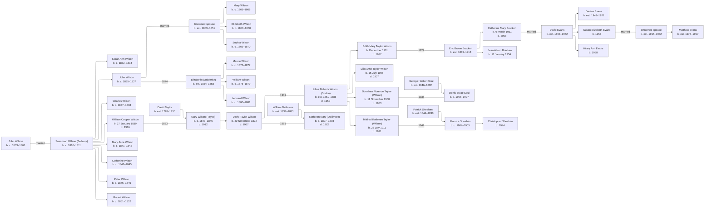

# Wilson Family Tree

```mermaid
---
config:
  flowchart:
    defaultRenderer: elk
---
flowchart LR
    classDef person stroke:#666666;

    %% Original source governs names and relationships.
    %% c. = age-derived; est. = provisional assumption-based interval.
    %% Parent estimates use ages 15-60; child estimates use ages 18-40.
    %% Marriage estimates use ages 16-40 at the earliest documented marriage.
    %% Explicit births and age-derived intervals are not constrained by these assumptions.
    %% Sibling declarations and arrows are sorted by interval start, then end.
    %% This presentation order does not establish actual birth order.

    %% John's census ages give 1805-1806, 1804-1805 and 1803-1804.
    %% Preserve their covering interval, rather than intersecting disagreements.
    1803-1806_john_wilson["John Wilson<br/>b. c. 1803–1806"]:::person
    %% Susannah's census ages 30, 50 and 60 give 1810-1811.
    %% Her surname Wilson and former surname Bellamy are explicit in William's birth record.
    1810-1811_susannah__bellamy["Susannah Wilson (Bellamy)<br/>b. c. 1810–1811"]:::person

    %% Sarah's ages give 1832-1833 and 1833-1834; retain both alternatives.
    1832-1834_sarah_wilson["Sarah Ann Wilson<br/>b. c. 1832–1834"]:::person
    %% John's ages give 1835-1836 and 1836-1837; retain their covering interval.
    1835-1837_john_wilson["John Wilson<br/>b. c. 1835–1837"]:::person
    1837-1838_charles_wilson["Charles Wilson<br/>b. c. 1837–1838"]:::person
    %% Explicit birth retained despite conflicting 1851, 1881 and 1891 ages,
    %% and age 23 at marriage on 7 November 1863.
    1839_william_wilson["William Cooper Wilson<br/>b. 27 January 1839<br/>d. 1916"]:::person
    1841-1842_mary_wilson["Mary Jane Wilson<br/>b. c. 1841–1842"]:::person
    %% Catherine's ages give 1843-1844 and 1844-1845; preserve the covering interval.
    1843-1845_catherine_wilson["Catherine Wilson<br/>b. c. 1843–1845"]:::person
    1845-1846_peter_wilson["Peter Wilson<br/>b. c. 1845–1846"]:::person
    1851-1852_robert_wilson["Robert Wilson<br/>b. c. 1851–1852"]:::person

    %% John's first spouse is documented by 1= but unnamed.
    %% Parent estimate from Mary's 1865-1866 birth interval: 1805-1851;
    %% Elizabeth's 1867-1868 interval: 1807-1853;
    %% Sophia's 1869-1870 interval: 1809-1855. Intersection: 1809-1851.
    %% All three inputs are census-age-derived, not explicit birth records.
    1809-1851_unnamed_unknown["Unnamed spouse<br/>b. est. 1809–1851"]:::person
    1865-1866_mary_wilson["Mary Wilson<br/>b. c. 1865–1866"]:::person
    1867-1868_elizabeth_wilson["Elizabeth Wilson<br/>b. c. 1867–1868"]:::person
    1869-1870_sophia_wilson["Sophia Wilson<br/>b. c. 1869–1870"]:::person

    %% Elizabeth: marriage in 1874 gives 1834-1858.
    %% Child-based parent estimates: Maude 1816-1862;
    %% William 1818-1864; Leonard 1820-1866.
    %% Intersection with marriage estimate: 1834-1858.
    1834-1858_elizabeth__sudderick["Elizabeth (Sudderick)<br/>b. est. 1834–1858"]:::person
    1876-1877_maude_wilson["Maude Wilson<br/>b. c. 1876–1877"]:::person
    1878-1879_william_wilson["William Wilson<br/>b. c. 1878–1879"]:::person
    %% Leonard was 10 months old in the 1881 census; no census date is supplied.
    1880-1881_leonard_wilson["Leonard Wilson<br/>b. c. 1880–1881"]:::person

    %% Mary: age 19 in 1863 gives 1843-1844; census ages and death
    %% in her 68th year support 1844-1845. Preserve 1843-1845.
    1843-1845_mary__taylor["Mary Wilson (Taylor)<br/>b. c. 1843–1845<br/>d. 1912"]:::person
    %% Mary's father David: 1843-60 to 1845-15 = 1783-1830.
    %% Input is Mary's age-derived birth interval.
    1783-1830_david_taylor["David Taylor<br/>b. est. 1783–1830"]:::person
    1872_david_wilson["David Taylor Wilson<br/>b. 30 November 1872<br/>d. 1967"]:::person

    %% Lilias: marriage in 1901 gives 1861-1885.
    %% Children born 1901, 1906, 1908 and 1911 give parent intervals
    %% 1841-1886, 1846-1891, 1848-1893 and 1851-1896.
    %% Combined intersection: 1861-1885.
    %% Wilson and former surname Cockin are explicitly documented.
    1861-1885_lilias__cockin["Lilias Roberts Wilson (Cockin)<br/>b. est. 1861–1885<br/>d. 1950"]:::person
    %% Kathleen: completed age 53 on 4 April 1951 gives 1897-1898.
    1897-1898_kathleen__dallimore["Kathleen Mary (Dallimore)<br/>b. c. 1897–1898<br/>d. 1962"]:::person
    %% Her father William: 1897-60 to 1898-15 = 1837-1883.
    1837-1883_william_dallimore["William Dallimore<br/>b. est. 1837–1883"]:::person

    1901_edith_wilson["Edith Mary Taylor Wilson<br/>b. December 1901<br/>d. 1937"]:::person
    1906_lilias_wilson["Lilias Ann Taylor Wilson<br/>b. 15 July 1906<br/>d. 1907"]:::person
    1908_dorothea__wilson["Dorothea Florence Taylor (Wilson)<br/>b. 11 November 1908<br/>d. 1983"]:::person
    1911_mildred__wilson["Mildred Kathleen Taylor (Wilson)<br/>b. 23 July 1911<br/>d. 1971"]:::person

    %% Eric: marriage in 1929 gives 1889-1913.
    %% Children born 1931 and 1934 give 1871-1916 and 1874-1919.
    %% Combined intersection: 1889-1913.
    1889-1913_eric_bracken["Eric Brown Bracken<br/>b. est. 1889–1913"]:::person
    1931_catherine_bracken["Catherine Mary Bracken<br/>b. 9 March 1931<br/>d. 2008"]:::person
    1934_jean_bracken["Jean Alison Bracken<br/>b. 11 January 1934"]:::person

    %% David Evans: documented children born 1957 and 1958 give
    %% parent intervals 1897-1942 and 1898-1943; intersection 1898-1942.
    %% Davina's dependent estimate is not fed back into David's estimate.
    1898-1942_david_evans["David Evans<br/>b. est. 1898–1942"]:::person
    %% Davina from Catherine's explicit 1931 birth: 1949-1971.
    %% From David's estimated 1898-1942 birth: 1916-1982.
    %% Intersection: 1949-1971. The estimated father does not tighten it.
    %% Sorted before Susan by interval start; this is not evidence of birth order.
    1949-1971_davina_evans["Davina Evans<br/>b. est. 1949–1971"]:::person
    1957_susan_evans["Susan Elizabeth Evans<br/>b. 1957"]:::person
    1958_hilary_evans["Hilary Ann Evans<br/>b. 1958"]:::person

    %% Susan's = documents an unnamed spouse and their child Matthew.
    %% Matthew from Susan's explicit 1957 birth: 1957+18 to 1957+40 = 1975-1997.
    %% The unnamed spouse is then estimated from Matthew: 1975-60 to 1997-15.
    %% Result 1915-1982 depends on Matthew's assumption-based estimate.
    %% Do not feed this dependent spouse estimate back into Matthew's estimate.
    1915-1982_unnamed_unknown["Unnamed spouse<br/>b. est. 1915–1982"]:::person
    1975-1997_matthew_evans["Matthew Evans<br/>b. est. 1975–1997"]:::person

    %% Denis: completed age 31 on 23 July 1938 gives 1906-1907.
    1906-1907_denis_soul["Denis Bruce Soul<br/>b. c. 1906–1907"]:::person
    %% His father George: 1906-60 to 1907-15 = 1846-1892.
    1846-1892_george_soul["George Herbert Soul<br/>b. est. 1846–1892"]:::person
    %% Maurice: completed age 37 on 2 March 1942 gives 1904-1905.
    1904-1905_maurice_sheehan["Maurice Sheehan<br/>b. c. 1904–1905"]:::person
    %% His father Patrick: 1904-60 to 1905-15 = 1844-1890.
    %% Deceased by 2 March 1942; no death year is supplied.
    1844-1890_patrick_sheehan["Patrick Sheehan<br/>b. est. 1844–1890"]:::person
    1944_christopher_sheehan["Christopher Sheehan<br/>b. 1944"]:::person

    %% Parent1 is first-listed in the source; only parent2 points to shared children.
    %% All spouse links below are source-documented by =; no census inference is needed.
    1803-1806_john_wilson ---|married| 1810-1811_susannah__bellamy
    1810-1811_susannah__bellamy --> 1832-1834_sarah_wilson
    1810-1811_susannah__bellamy --> 1835-1837_john_wilson
    1810-1811_susannah__bellamy --> 1837-1838_charles_wilson
    1810-1811_susannah__bellamy --> 1839_william_wilson
    1810-1811_susannah__bellamy --> 1841-1842_mary_wilson
    1810-1811_susannah__bellamy --> 1843-1845_catherine_wilson
    1810-1811_susannah__bellamy --> 1845-1846_peter_wilson
    1810-1811_susannah__bellamy --> 1851-1852_robert_wilson

    %% Younger John's marriage 1: spouse unnamed, date absent.
    1835-1837_john_wilson ---|married| 1809-1851_unnamed_unknown
    1809-1851_unnamed_unknown --> 1865-1866_mary_wilson
    1809-1851_unnamed_unknown --> 1867-1868_elizabeth_wilson
    1809-1851_unnamed_unknown --> 1869-1870_sophia_wilson
    %% Younger John's marriage 2: 1874 Q4; source-supported remarriage.
    1835-1837_john_wilson ---|1874| 1834-1858_elizabeth__sudderick
    1834-1858_elizabeth__sudderick --> 1876-1877_maude_wilson
    1834-1858_elizabeth__sudderick --> 1878-1879_william_wilson
    1834-1858_elizabeth__sudderick --> 1880-1881_leonard_wilson

    %% Marriage: 7 November 1863.
    1839_william_wilson ---|1863| 1843-1845_mary__taylor
    1783-1830_david_taylor --> 1843-1845_mary__taylor
    1843-1845_mary__taylor --> 1872_david_wilson

    %% David Taylor Wilson's marriage 1: 12 February 1901.
    1872_david_wilson ---|1901| 1861-1885_lilias__cockin
    1861-1885_lilias__cockin --> 1901_edith_wilson
    1861-1885_lilias__cockin --> 1906_lilias_wilson
    1861-1885_lilias__cockin --> 1908_dorothea__wilson
    1861-1885_lilias__cockin --> 1911_mildred__wilson
    %% David Taylor Wilson's marriage 2: 4 April 1951; widower, age 78.
    %% This documented remarriage is outside the provisional marriage-age assumption;
    %% his explicit birth date remains unchanged.
    1872_david_wilson ---|1951| 1897-1898_kathleen__dallimore
    1837-1883_william_dallimore --> 1897-1898_kathleen__dallimore

    %% Edith's first marriage, marked =1 in the source: 1929.
    1901_edith_wilson ---|1929| 1889-1913_eric_bracken
    1889-1913_eric_bracken --> 1931_catherine_bracken
    1889-1913_eric_bracken --> 1934_jean_bracken
    1931_catherine_bracken ---|married| 1898-1942_david_evans
    1898-1942_david_evans --> 1949-1971_davina_evans
    1898-1942_david_evans --> 1957_susan_evans
    1898-1942_david_evans --> 1958_hilary_evans

    %% Susan is parent1; her documented unnamed spouse is parent2.
    1957_susan_evans ---|married| 1915-1982_unnamed_unknown
    1915-1982_unnamed_unknown --> 1975-1997_matthew_evans

    %% Marriage: 23 July 1938.
    1908_dorothea__wilson ---|1938| 1906-1907_denis_soul
    1846-1892_george_soul --> 1906-1907_denis_soul
    %% Marriage: 2 March 1942.
    1911_mildred__wilson ---|1942| 1904-1905_maurice_sheehan
    1844-1890_patrick_sheehan --> 1904-1905_maurice_sheehan
    1904-1905_maurice_sheehan --> 1944_christopher_sheehan
    
    classDef person stroke:#666666;
    linkStyle default stroke:#555
```
