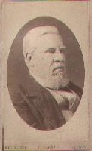

Collection of Family Trees compiled by Brendan Soul over many years, and refreshed and extended by Peter Soul from 2018

In the interests of data protection, Peter has reduced to year-only the dates relating to living people, and is attempting to get in touch with all such (or their 'responsible relatives') to check that they are happy for the remaining data to be publicly visible on this website. Visit the contact page to get in touch.

-------------------------

Here's a something for you to think about, as you look at your place in your family tree (or for that matter,
if you consider any other individuals who may have affected your life in some way): the simple biological
fact is that you are alive now only because one out of your mother's many eggs was fertilized by one of
many millions of your father's sperm.  Any other pairing of these two seeds would have combined their
genes differently, hence producing a quite different person!

So the probability that you yourself would come to life was (on this view alone) vanishingly small, and
would have been made even more so by any previous event that affected the exact moment of your
conception.  Let me offer a personal example of this: my parents produced a son before me who, sadly,
lived only two days. But it makes no sense for me to think of him as "my elder brother who I never knew",
because if he had survived, without doubt my conception would not have occurred as and when it did, and I
would not be here to have known him. Some other sibling of his in my place and even given the same name,
maybe, but not me.

You may find this hard enough to grasp -- but your probability of existence is further made infinitesimally
low by the need for your parents to have been born themselves, and then to have met and married. And
likewise their parents and, indeed, all your ancestors.  As for the "other individuals" I mentioned above,
although the society we live in may seem mostly stable and predictable, in reality it has been guided and
affected at many levels by people in power, and if any of them had not been born (by chance, as with
yourself), our lives could have been surprisingly different from what they are.

I'm indebted to Richard Dawkins and the first pages of his book "Unweaving the Rainbow" for bringing this idea
home to me (I have taken the liberty of rewriting it a little).  Typical of his illustrations of it is: "The humblest
medieval peasant had only to sneeze in order to affect something which ... led to the consequence that one of
your ancestors became someone else's instead."

Peter Soul
-------------------------

[Joseph Soul](../soul/#Josephsoul)

For an article on him, go to [Sole Society](http://sole.org.uk/) and search for Joseph Soul

## Layout of the 'essential connections' between the trees

## Sources

### British and Foreign Anti-Slavery Society Convention of 1840

[https://npg.org.uk/collections/search/portrait/mw00028/The-Anti-Slavery-Society-Convention-1840?search=sp&sText=slavery&firstRun=true&rNo=0](https://npg.org.uk/collections/search/portrait/mw00028/The-Anti-Slavery-Society-Convention-1840?search=sp&sText=slavery&firstRun=true&rNo=0)

Group portrait by Benjamin Robert Haydon (1786 - 1846), which includes [Joseph Soul](../soul/#Josephsoul), on display in the Regency Gallery, National Portrait Gallery, London.

### National Archives

[http://discovery.nationalarchives.gov.uk/results/r?_q=joseph+soul](http://discovery.nationalarchives.gov.uk/results/r?_q=joseph+soul)

Correspondence of [Joseph Soul](../soul/#Josephsoul).

### St John's College Library, Cambridge

[http://janus.lib.cam.ac.uk/db/node.xsp?id=EAD%2FGBR%2F0275%2FClarkson%2FFolder%201-5](http://janus.lib.cam.ac.uk/db/node.xsp?id=EAD%2FGBR%2F0275%2FClarkson%2FFolder%201-5)

Papers of Thomas Clarkson, including summaries of letters from [Joseph Soul](../soul/#Josephsoul) (see documents 82 - 144).

### Washington H. Soul Pattinson & Co. Ltd.

[http://soulpattinson.com.au/](http://soulpattinson.com.au/)

Chemists, New South Wales, trading as Soul Pattinson; formed in 1903 by the merger of Washington H. Soul & Co., founded in 1863 by [Caleb Soul](../soul/#CalebSoul) and his son [Washington Handley Soul](../soul/#WashingtonHSoul), with Pattinson & Co.

### Portrait by George Patten

[https://npg.org.uk/collections/search/portrait/mw03223/William-Hone?LinkID=mp02253&search=sas&sText=hone&role=sit&rNo=0](https://npg.org.uk/collections/search/portrait/mw03223/William-Hone?LinkID=mp02253&search=sas&sText=hone&role=sit&rNo=0)

Of [William Hone](../hone/#WilliamHone), National Portrait Gallery, London.

### The William Hone Biotext

[http://honearchive.org/](http://honearchive.org/)

A Web Project by Kyle Grimes, University of Alabama at Birmingham, on the life and career of [William Hone](../hone/#WilliamHone).

### State Library of Tasmania

[photograph](https://stors.tas.gov.au/AUTAS001139592703)

Of, and print of [house](https://stors.tas.gov.au/AUTAS001131820383j2k) of, [Joseph Hone](../hone/#JosephHone).

### Biographisch-Bibliographischen Kirchenlexikons

[biography](https://bbkl.de/public/index.php/frontend/lexicon?letter=H&child=Ha&article=hahn_hu.art) of [Carl Hugo Hahn 1818-1895](../hone/#CarlHugoHahn1)

[biography](https://bbkl.de/public/index.php/frontend/lexicon?letter=H&child=Ha&article=hahn_t1.art) of [Elieser Traugott Hahn](../hone/#ElieserTrHahn)

[biography](https://bbkl.de/public/index.php/frontend/lexicon?letter=H&child=Ha&article=hahn_t.art) of [Gotthilft Traugott Hahn](../hone/#GotthilftHahn)

[biography](https://bbkl.de/public/index.php/frontend/lexicon?letter=H&child=Ha&article=hahn_hu1.art) of [Carl Hugo Hahn 1886-1957](../hone/#CarlHugoHahn2)

### Eeeti Evangeelne Luterlik Kirik

[photograph and biographical notes](http://eelk.ee/%7Eelulood/hahn_eliesertraugott.html) of [Elieser Traugott Hahn](../hone/#ElieserTrHahn)

[photograph and biographical notes](http://eelk.ee/%7Eelulood/hahn_traugott.html) of [Gotthilft Traugott Hahn](../hone/#GotthilftHahn)

[biographical notes](http://eelk.ee/%7Eelulood/sielmann_woldemar.html) of [Woldemar Paul Sielmann](../hone/#WoldemarSielmann)

(For Hahn surname, see Hone Family Tree)

### Encyclopedia Titanica

[http://encyclopedia-titanica.org/](http://encyclopedia-titanica.org/)

Refers to [Alice Frances Christy](../jacobsohn_cohen/#AliceFC) (nee Jones), [Amy Frances Jacobsohn](../jacobsohn_cohen/#AmyFJ), [Sidney Samuel Jacobsohn](../jacobsohn_cohen/#SydneySJ), and [Julie Rachel Cohen](../jacobsohn_cohen/#JulieRC) (referred to as Christy), passengers on the Titanic.

### The Sole Society

[http://sole.org.uk](http://sole.org.uk)

Society promoting research into the genealogy and history of families carrying the surnames SOLE, SAUL, SEWELL, and SOLL(E)Y, and any spelling variations of these names (including SOUL).

### A Physicist Writes...

[http://petersoul.co.uk](http://petersoul.co.uk)

Website of [Peter Soul](../soul/#PeterBSoul).
